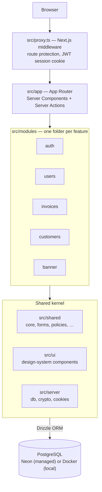

# Next.js Dashboard

[](https://github.com/andrewpetersondev/nextjs-dashboard/actions/workflows/ci.yml)

A modern dashboard application built with Next.js (App Router), TypeScript, Drizzle ORM, and Tailwind CSS. It includes
authentication, middleware-based route protection, database migrations/seeding, and end-to-end tests with Cypress.

> **Live demo:** <https://nextjs-dashboard-beige-pi-12.vercel.app/> — one-click demo buttons on the landing page (user **or admin**) &nbsp;·&nbsp; **Seeded login:** `admin@admin.com` / `AdminPassword123!`
>
> Run it yourself in one command: `docker compose up --build` → <http://localhost:3000>. See [Deployment](#deployment).

## Tech Stack

- Next.js 16 (App Router, Server/Client Components)
- React 19 + TypeScript 7 (strict)
- Drizzle ORM (PostgreSQL)
- Tailwind CSS v4
- Cypress for E2E testing (with @testing-library/cypress and cypress-axe)
- Biome for JS/TS/JSON/CSS; dprint + markdownlint-cli2 for Markdown
- Turbopack for dev/build

Note: ESLint and Prettier are not used in this project, by design.

## Architecture

One picture before the directory tree: every request passes the middleware,
lands in an App Router page or Server Action, and is handled by one of five
feature modules sitting on a small shared kernel.

<!-- Keep this overview coarse — directory names and verified facts only.
     Details belong in docs/diagrams/, not here. -->



Two details the boxes can't show: feature modules are internally layered
(presentation / application / domain / infrastructure — auth, the deepest,
keeps its application layer free of infrastructure imports, with decisions
recorded as ADRs), and sessions are stateless — a signed, httpOnly JWT cookie
with no session table behind it.

The [diagram gallery](docs/diagrams/README.md) goes deeper — eleven Mermaid
diagrams, each answering exactly one question. Good starting points:

| Diagram                                                                | The question it answers                                         |
| ---------------------------------------------------------------------- | --------------------------------------------------------------- |
| [C4 architecture](docs/diagrams/c4-architecture.md)                    | "How is the whole system carved into pieces?"                   |
| [Module layers](docs/diagrams/module-layers.md)                        | "How is a module layered, and which way do dependencies point?" |
| [Route authorization](docs/diagrams/route-authorization.md)            | "Before a page renders, what decides whether I'm allowed in?"   |
| [Request flow: update user](docs/diagrams/request-flow-update-user.md) | "How does a form submission travel through the layers?"         |
| [Branch & CI flow](docs/diagrams/branch-and-ci-flow.md)                | "How does a change reach production, and what CI runs where?"   |

## Project Structure

```text
nextjs-dashboard/
├── cypress/                # E2E specs and support
├── database/               # Drizzle schema (source of truth)
├── docs/                   # Additional documentation and guides
├── drizzle/                # Generated SQL migrations, one set per env (dev/test/prod)
├── devtools/               # cli, config, db, seed, shared, users
├── public/                 # Static assets
├── src/                    # Application source
│   ├── app/                # App router
│   ├── modules/            # auth, banner, customers, invoices, users (each internally layered)
│   ├── server/             # cookies, crypto, db (shared server infra)
│   ├── shared/             # core, forms, http, policies, primitives, routing, telemetry, time
│   ├── shell/              # dashboard composition
│   ├── ui/                 # atoms, brand, forms, hooks, molecules, navigation, skeletons, styles, utils, wrappers
│   ├── proxy.ts            # Route protection (Next.js middleware)
└── ...
```

## Requirements

- Node 24 (pinned in `.nvmrc`, `package.json` `engines`, and the `Dockerfile` — kept in sync by `pnpm node:drift`, which also checks the Node you are actually running; see [docs/getting-started.md](docs/getting-started.md#make-nvmrc-apply-automatically-recommended) for the `.nvmrc` shell hook)
- pnpm >= 11 (pinned via the `packageManager` field in `package.json`)
- PostgreSQL (local or remote)

## Getting Started

1. Install dependencies

   ```sh
   pnpm install
   ```

2. Configure environment

   Copy the tracked contract file [`.env.example.local`](.env.example.local) to each
   environment file the scripts reference, then adjust the values:

   ```sh
   cp .env.example.local .env.development.local
   cp .env.example.local .env.test.local
   ```

   (`.env.production.local` works the same way when you need the `db:*:prod` scripts.)

   Two values need real attention: `DATABASE_URL` / `DATABASE_ENV` must match the
   environment the file is for, and `SESSION_SECRET` must be **at least 32 characters** —
   the session service refuses shorter secrets at startup. The full variable contract is
   documented in the [deployment guide](docs/deployment.md).

3. Database: generate, migrate, seed

   Run against your desired environment using dotenv-powered helpers:
   - Development
     ```sh
     pnpm db:push:dev
     pnpm db:seed:dev
     ```
   - Test
     ```sh
     pnpm db:push:test
     pnpm db:seed:test
     ```
   - Production (ensure variables are set correctly)
     ```sh
     pnpm db:push:prod
     CONFIRM_PROD_DB=yes pnpm db:seed:prod
     ```

4. Start the app
   - Development server (Turbopack):
     ```sh
     pnpm next:dev
     ```
   - Build + start (standalone):
     ```sh
     pnpm serve:standalone
     # or, if already built
     pnpm next:start:standalone
     ```

## Deployment

This app runs two ways from the same codebase — a managed deploy (Vercel + Neon)
and a fully self-hosted Docker stack — with no platform lock-in. Full walkthrough,
including the environment-variable contract, is in the
**[deployment guide](docs/deployment.md)**.

Self-host the whole thing (Postgres + schema + seed + app) in one command:

```sh
docker compose up --build
# open http://localhost:3000/auth/login — sign in as admin@admin.com / AdminPassword123!
```

Seeded demo logins:

| Role  | Email             | Password            |
| ----- | ----------------- | ------------------- |
| Admin | <admin@admin.com> | `AdminPassword123!` |
| User  | <user@user.com>   | `UserPassword123!`  |
| Guest | <guest@guest.com> | `GuestPassword123!` |

A `/api/health` endpoint returns `{ "status": "ok", "db": "up" }` for uptime
checks and container health probes.

## Testing

- Unit tests (Vitest; database-free, runs anywhere):

  ```sh
  pnpm test
  ```

- One-shot E2E run (boots and tears down its own test server; needs `.env.test.local`
  and a migrated + seeded test database):

  ```sh
  pnpm e2e
  ```

- Interactive Cypress runner against a server you control:

  ```sh
  pnpm serve:test    # cleans, builds, and serves the test env — keep it running
  pnpm cy:e2e:open   # in a second terminal
  ```

CI runs the same E2E suite via `pnpm cy:e2e` (the script `e2e` aliases). Accessibility
checks via cypress-axe are integrated in tests where applicable.

## Useful Scripts

- Lint and format (Biome for code, markdownlint + dprint for Markdown):
  - `pnpm lint` — report-only, both toolchains
  - `pnpm fix` — apply safe autofixes, both toolchains
- Validation gates:
  - `pnpm check:fast` — Biome + Markdown + typegen + typecheck + Node/dependency/migration drift (the pre-merge gate)
  - `pnpm check` — everything above plus the unit, integration, and E2E lanes
- Clean builds:
  - `pnpm clean` — remove `.next` and generated `.js`/`.map`/`.tsbuildinfo` files
  - `pnpm clean:all` — the above plus `node_modules` (requires reinstall)
- Env helpers (wrap commands with specific env files): `env:dev`, `env:test`, `env:prod`

See the [package scripts guide](docs/package-json-scripts-guide.md) for the full annotated list.

## Conventions

- TypeScript: strict types everywhere; prefer inference but annotate boundaries.
- Components: prefer Server Components; use Client Components when necessary (hooks, interactivity).
- File/function sizing (project guidelines):
  - Files ≤ 200 lines where practical.
  - Functions ≤ 50 lines, ≤ 4 parameters, avoid excessive complexity.
- Secrets: never commit; use environment variables. Vault is not required.

## Troubleshooting

- Build uses Turbopack. If you hit unexpected behavior, try a clean build:
  ```sh
  pnpm clean && pnpm next:build
  ```
- Database issues: confirm DATABASE_URL and that migrations have run.
- Auth issues: ensure SESSION_SECRET is set and consistent across processes.
