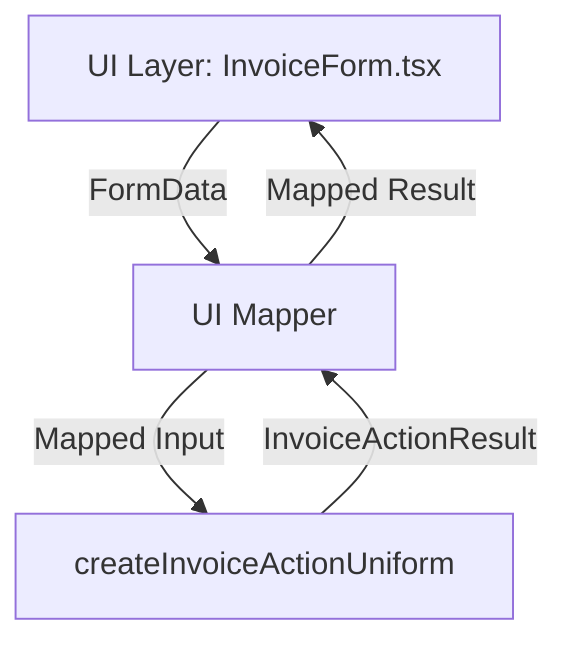

If server actions are moved out of the UI layer, a **UI Mapper** is introduced to handle form submission and result mapping. The architecture for creating an invoice via form submission with `useActionState` is as follows:

### Layered Flow

1. **UI Layer (React Component)**

- Renders the invoice form.
- Uses `useActionState` to manage form state and submission.
- Interacts with the **UI Mapper** for data transformation.

2. **UI Mapper**

- Transforms form data into the shape expected by server actions.
- Handles mapping of server responses (`InvoiceActionResult`) back to UI state.
- Decouples UI from server action implementation.

3. **Server Actions**

- Receives mapped data from the UI Mapper.
- Validates, processes, and orchestrates invoice creation.
- Returns a uniform result (`InvoiceActionResult`).

4. **Repository/DAL/DB Mapper**

- Handles business logic, data access, and entity mapping.
- Not directly exposed to UI.

### Visual Diagram



### Key Points

- **UI Mapper** replaces direct server action calls in the UI.
- `useActionState` interacts with the UI Mapper, not server actions.
- The UI only deals with mapped results, ensuring separation of concerns and maintainability.

### Example Usage

```typescript
// UI Layer: InvoiceForm.tsx
const [state, dispatch] = useActionState(uiInvoiceMapper, initialState);

function uiInvoiceMapper(formData: FormData): Promise<InvoiceActionResult> {
  // Transform FormData to server action input
  const mappedInput = mapFormDataToInvoiceInput(formData);
  // Call server action
  return createInvoiceActionUniform(mappedInput).then((result) =>
    mapServerResultToUIState(result),
  );
}
```

**Summary:**  
The UI Mapper acts as a bridge between the UI and server actions, handling all data transformations and result mapping. This enforces a clean separation, making the architecture scalable and testable.

Yes, each layer should have its own validation steps relevant to its responsibility:

- **UI Layer**: Validates user input for format, required fields, and accessibility (e.g., form constraints, client-side checks).
- **UI Mapper**: Ensures data is correctly shaped and sanitized before passing to server actions.
- **Server Actions**: Perform business logic validation, authorization, and security checks.
- **Repository/DAL**: Validates data integrity, consistency, and enforces domain rules before database operations.
- **DB Mapper**: Validates mapping between raw database data and domain entities.

This layered validation ensures robust, secure, and maintainable data flow, catching errors as early as possible and enforcing separation of concerns.
