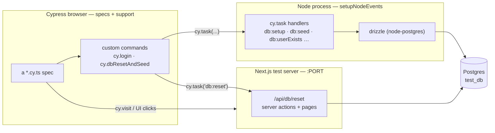
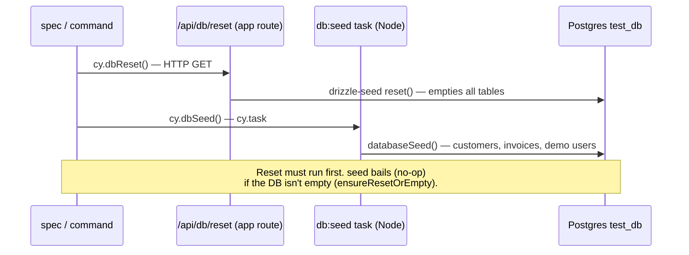

# Cypress E2E tests

End-to-end tests for the dashboard, driven through a real browser against a real
Next.js server and a real Postgres database. They cover the things unit tests
can't: that a user can actually sign up, log in, and create/edit/delete an
invoice through the rendered UI and server actions.

The suite is deliberately split across **two runtimes** — browser-side specs and
a Node-side plugin process — and most of the confusion people hit with Cypress
comes from not knowing which side a given line runs on. This README leads with
that split, then covers the directory layout, the database lifecycle, how to run
it, and the known rough edges.

---

## 📋 Table of Contents

- [Overview](#overview)
- [Architecture at a glance](#architecture-at-a-glance)
- [Directory structure](#directory-structure)
- [The database lifecycle](#the-database-lifecycle)
- [Key concepts](#key-concepts)
- [Running the tests](#running-the-tests)
- [Writing a new spec](#writing-a-new-spec)
- [Conventions & known rough edges](#conventions--known-rough-edges)
- [Related documentation](#related-documentation)

---

## Overview

|              |                                                                       |
| ------------ | --------------------------------------------------------------------- |
| **Runner**   | Cypress 15 (`e2e` testing type)                                       |
| **Specs**    | `cypress/e2e/**/*.cy.ts`                                              |
| **Helpers**  | `@testing-library/cypress` (role/text queries) + `cypress-axe` (a11y) |
| **Server**   | `next dev` in test mode, booted via `start-server-and-test`           |
| **Database** | Postgres `test_db` (local Docker `dashboard-postgres` in development) |
| **Env**      | validated from `.env.test.local` with Zod before the run starts       |

Everything is configured from [`cypress.config.ts`](../cypress.config.ts) at the
repo root, which validates the environment, wires the base URL, and registers the
Node tasks.

---

## Architecture at a glance

There are **two processes**, and a spec can reach the database through _either_ of
them:



- **Browser side** (`e2e/`, `support/`) — the specs and custom commands. This is
  where `cy.*` lives. It cannot touch the database or filesystem directly.
- **Node side** (`node/`) — registered via `setupNodeEvents`. This is where
  `cy.task(...)` handlers run, with a direct Drizzle connection for fast,
  deterministic data setup (create/seed/cleanup users). All Node-side code —
  config, db access, input mappers, and the tasks themselves — lives under here.

A spec reaches Postgres two ways: indirectly **through the app** (a real HTTP
request or server action, e.g. `/api/db/reset`), or directly **through a Node
task** (Drizzle). Knowing which you're using explains most "why can't I read
`process.env` here?" / "why can't I call `cy` there?" moments.

---

## Directory structure

```text
cypress/
├── e2e/                       # Browser-side specs + their shared constants
│   ├── auth/                  #   login, logout, signup, demo-user, access-control
│   ├── invoices/              #   create / update / delete / list via the UI
│   ├── server-actions/        #   auth + authorization action behavior
│   ├── db/                    #   DB task + route sanity checks (reset, seed, setup, …)
│   ├── smoke/                 #   genuinely fast checks: home nav + a11y, env validation
│   ├── shared/                #   constants reused across specs (no cy.* calls):
│   │   ├── paths.ts           #     app route paths (LOGIN_PATH, INVOICES_PATH, …)
│   │   ├── selectors.ts       #     data-cy selectors (COMMON / AUTH / INVOICES / CUSTOMERS)
│   │   ├── regex.ts           #     centralized UI text matchers
│   │   ├── users.ts           #     DEMO_USER + createTestUser()
│   │   ├── auth-forms.ts      #     credential types, TestUser, error regexes
│   │   ├── times.ts           #     timeout constants (DEFAULT_TIMEOUT, …)
│   │   ├── status-codes.ts    #     HTTP status code map
│   │   └── urls.ts            #     external URLs referenced in tests
│   └── checklist.md           #   E2E coverage checklist (aspirational)
│
├── support/                   # Loaded before every spec (browser-side)
│   ├── e2e.ts                 #   testing-library + cypress-axe wiring
│   └── commands.ts            #   custom commands (see "Custom commands" below)
│
├── node/                      # Node process (setupNodeEvents) — all real DB/env access
│   ├── config/
│   │   ├── cypress-env.ts     #   reads + exports validated env (throws on bad config)
│   │   └── cypress-env.schema.ts  # Zod shape for the env
│   ├── db/                    #   Node-side database access
│   │   ├── node-db.ts         #     drizzle node-postgres singleton (uses DATABASE_URL)
│   │   └── pg-result.utils.ts #     firstRow() result helper
│   ├── mappers/               #   input mappers used by the tasks (was cypress/shared/)
│   │   ├── id.mapper.ts       #     UUID validation → branded UserId / CustomerId
│   │   └── user-input.mapper.ts  # email / username / password normalization
│   └── tasks/                 #   cy.task handlers (one file per task):
│       ├── register-tasks.ts  #     maps task names → fns; wires db:reset (HTTP) + db:seed
│       ├── create-user.task.ts        # db:createUser
│       ├── upsert-e2e-user.task.ts    # db:setup (idempotent upsert)
│       ├── delete-user.task.ts        # db:deleteUser
│       ├── user-exists.task.ts        # db:userExists
│       ├── db-env.task.ts             # db:env (non-secret DB-env summary)
│       ├── cleanup-e2e-users.task.ts  # db:cleanup (deletes e2e_* users)
│       └── seed-database.task.ts      # db:seed → devtools databaseSeed()
│
├── tsconfig.json              # extends root; types: cypress, node, testing-library, axe
└── biome.json                 # cypress-scoped lint (cy / Cypress as globals)
```

---

## The database lifecycle

Tests that need data start from a clean, known state with `cy.dbResetAndSeed()`.
**Reset and seed are wired differently**, and the order matters:



- **`db:reset`** hits the app's real `GET /api/db/reset` route, which calls
  `drizzle-seed`'s `reset()` to empty every table.
- **`db:seed`** is a **Node task** that calls the same
  [`databaseSeed()`](../devtools/seed/seed.task.ts) used by `pnpm db:seed`. There
  is intentionally **no `/api/db/seed` route** — seeding lives in `devtools/`.
- Seeding only proceeds when the DB is empty, so always **reset before seed**
  (`cy.dbResetAndSeed()` does this for you).

After a seed you can rely on these demo accounts (from
[`devtools/seed/data/seed.users.ts`](../devtools/seed/data/seed.users.ts)):

| Account    | Email             | Role    |
| ---------- | ----------------- | ------- |
| Demo user  | `user@user.com`   | `user`  |
| Demo admin | `admin@admin.com` | `admin` |
| Demo guest | `guest@guest.com` | `guest` |

The login form exposes "Login as demo user / admin" buttons, surfaced as the
`cy.loginAsDemoUser()` / `cy.loginAsDemoAdmin()` commands.

---

## Key concepts

### Custom commands

Defined in [`support/commands.ts`](support/commands.ts) and typed on
`Cypress.Chainable`:

| Command                                                | Does                                              |
| ------------------------------------------------------ | ------------------------------------------------- |
| `cy.login({ email, password })`                        | fills + submits the login form, asserts dashboard |
| `cy.signup({ username, email, password })`             | fills + submits signup, asserts dashboard         |
| `cy.loginAsDemoUser()` / `cy.loginAsDemoAdmin()`       | clicks the demo-login button                      |
| `cy.logoutViaForm()`                                   | signs out via the dashboard's Sign Out button     |
| `cy.dbReset()` / `cy.dbSeed()` / `cy.dbResetAndSeed()` | database lifecycle                                |

### Selectors: prefer `data-cy`

Selectors are centralized in [`shared/selectors.ts`](e2e/shared/selectors.ts) and
target `data-cy` attributes the app renders. Server-action feedback is read via
`COMMON_SEL.serverMessageSuccess` / `serverMessageError` — the `data-cy` values
emitted by `ServerMessageMolecule`.

> **Gotcha — the invoices list renders two tables.** A mobile card list
> (`md:hidden`) and a desktop table (`hidden md:table`) **both** carry
> `data-cy="invoice-row"` and both render edit/delete buttons. At any viewport
> only one is visible, so `.first()` / `cy.contains()` can grab the _hidden_ copy.
> Scope to the visible one: `[data-cy="invoice-row"]:visible`. (See
> `invoices/delete-form.cy.ts` and `update-form.cy.ts`.)

### Test data

- **`createTestUser()`** ([users.ts](e2e/shared/users.ts)) generates a unique
  `e2e_*` user (email, password, username, `role`). The `e2e_` prefix is what
  `db:cleanup` keys off of.
- **Server-action forms revalidate, they don't always redirect.** Create and
  update an invoice stay on the page and show a `serverMessageSuccess` banner;
  delete redirects back to `/dashboard/invoices`.

### Environment, validated up front

[`node/config/cypress-env.ts`](node/config/cypress-env.ts) parses
`process.env` against a Zod schema and **throws before any test runs** if
something is missing or malformed — so a misconfigured `.env.test.local` fails
fast and loud instead of mid-suite.

---

## Running the tests

**Prerequisites**

1. **`.env.test.local`** at the repo root with `DATABASE_URL` (pointing at
   `test_db`), `SESSION_SECRET`, `PORT`, `DATABASE_ENV=test`, and
   `AUTH_BCRYPT_SALT_ROUNDS`.
2. **A running Postgres** with the `test_db` schema applied. In development this
   is the `dashboard-postgres` Docker container. Apply the schema with
   `pnpm db:migrate:test` (or `pnpm db:push:test`).

**Commands** (all load `.env.test.local` automatically):

| Script                   | What it does                                                       |
| ------------------------ | ------------------------------------------------------------------ |
| `pnpm cy:e2e`            | clean, boot the test server, run **all** specs headless, tear down |
| `pnpm cy:open`           | same, but opens the interactive Cypress runner                     |
| `pnpm cy:run`            | run specs against an **already-running** server                    |
| `pnpm cy:server`         | boot only the Next.js test server                                  |
| `pnpm typecheck:cypress` | type-check the Cypress project on its own                          |

`pnpm cy:e2e` uses `start-server-and-test` to boot `next dev` (test env), wait for
the port, run the suite, then kill the server — so it's the one command you need
for a full local run.

---

## Writing a new spec

A typical data-backed spec:

```typescript
import { INVOICES_PATH } from "@cypress/e2e/shared/paths";
import { COMMON_SEL, INVOICES_SEL } from "@cypress/e2e/shared/selectors";

describe("Invoices - something", () => {
  beforeEach(() => {
    cy.dbResetAndSeed();   // clean, known state
    cy.loginAsDemoAdmin(); // demo admin exists after seed
  });

  it("does the thing", () => {
    cy.visit(INVOICES_PATH);
    // scope to the *visible* table — see the gotcha above
    cy.get(`${INVOICES_SEL.invoiceRow}:visible`).first()...;
  });
});
```

Conventions worth following:

- Put paths in `shared/paths.ts`, selectors in `shared/selectors.ts`, text
  matchers in `shared/regex.ts` — don't inline literals.
- Reach for the custom commands before re-implementing login/signup flows.
- For data setup, prefer Node tasks (`cy.task('db:setup', …)`) over driving the
  UI — they're faster and deterministic.
- Use `@testing-library/cypress` role/text queries (`cy.findByRole`) for
  user-facing assertions; reserve `data-cy` for stable hooks.

---

## Conventions & known rough edges

Kept honest on purpose — a doc that hides the warts isn't worth much.

- **Two tests are skipped, pending an app fix.** `update-form` (invalid amount)
  and `auth-actions` (invalid credentials) are `it.skip`-ped because form **error**
  results are non-serializable `AppError` class instances, so error banners never
  render across the server-action boundary. Both have a `biome-ignore` comment
  explaining why; re-enable them once form errors are returned as plain objects.
- **Not in CI yet.** The suite runs locally only — `.github/workflows` has no
  Cypress job. Wiring it in (against a service-container Postgres) is the highest-
  value next step.
- **Secrets stay Node-side.** `DATABASE_URL` and `SESSION_SECRET` are never
  written into `config.env`, so they can't be read browser-side via
  `Cypress.env()` (and can't leak into the command log or screenshots). Specs
  that need to confirm the target DB use the Node-side `db:env` task, which
  returns only a non-secret `{ databaseEnv, databaseName }` summary (see
  `smoke/db-env-guard.cy.ts`).
- **Test-user uniqueness is timestamp-based.** `createTestUser()` uses
  `Date.now() % 99_999_999`, and a few specs call it at module scope (reused across
  retries). Collision-prone under fast/retried runs; a stronger suffix would help.
- **`db:reset` is HTTP, `db:seed` is a Node task.** Both target the same `test_db`,
  so it's correct, but the asymmetry is intentional (no seed route exists).

---

## Related documentation

- [E2E checklist](e2e/checklist.md) — the coverage checklist this suite works toward.
- [Architecture diagrams](../docs/diagrams/README.md) — system-wide mermaid diagrams.
- [Database ERD](../docs/diagrams/database-erd.md) — the tables these tests seed and assert against.
- [`AGENTS.md`](../AGENTS.md) — repository-wide conventions.
- Seeding internals: [`devtools/seed/seed.task.ts`](../devtools/seed/seed.task.ts).

---

**Last updated:** 2026-06-06
