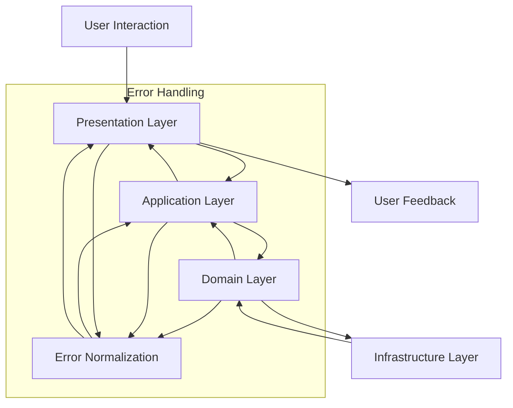
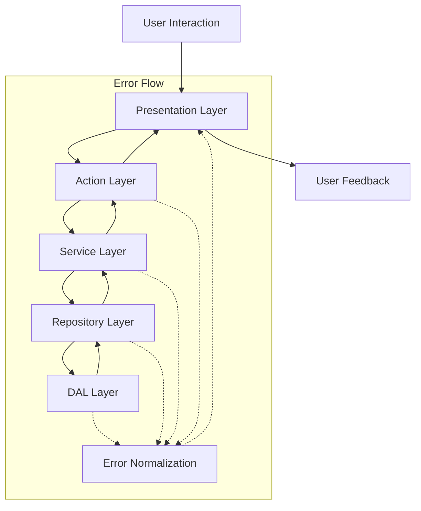
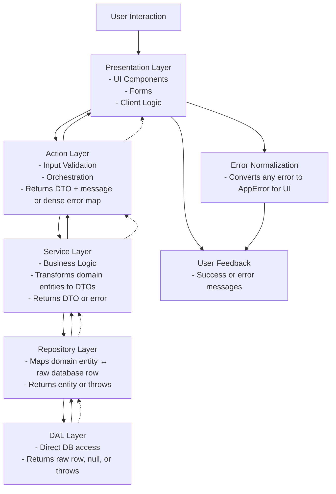

# Layer Flow Documentation

## About

This file documents the flow of data and control through the various layers of the application architecture. It serves
as a guide for developers to understand how different components interact and how to properly implement new features or
troubleshoot issues.

## Layers Overview

1. **Presentation Layer**: This is the topmost layer where user interactions occur. It includes UI components, forms,
   and any client-side logic.
2. **Application Layer**: This layer contains the business logic and orchestrates the flow of data between the
   presentation layer and the domain layer.
3. **Domain Layer**: This layer encapsulates the core business rules and domain entities. It is independent of other
   layers and focuses on the business logic.
4. **Infrastructure Layer**: This layer handles data persistence, external services, and other technical concerns. It
   provides implementations for repositories and services used by the domain layer.

Questions to Answer:

- Where does Action Layer belong?
- Where does Service Layer belong?
- Where does Repository Layer belong?
- Where does DAL Layer belong?

Answers:

- Action Layer: Typically part of the Application Layer, handling user actions and coordinating between the UI and
  business logic.
- Service Layer: Can be part of either the Application Layer or Infrastructure Layer, depending on its responsibilities.
- Repository Layer: Generally part of the Infrastructure Layer, managing data access and persistence.
- DAL Layer: Also part of the Infrastructure Layer, focusing on data access logic and database interactions.

Determine the responsibilities and interactions of each layer based on the specific architecture and design patterns
used in your application.

## Data Flow

Data flows through the layers in a structured manner:

1. User interacts with the **Presentation Layer** (e.g., submits a form).
2. The **Application Layer** processes the input, applies business rules, and coordinates with the **Domain Layer**.
3. The **Domain Layer** executes core business logic and may interact with the **Infrastructure Layer** for data access.
4. The **Infrastructure Layer** performs necessary operations (e.g., database queries) and returns results to the
   **Domain Layer**.
5. The **Domain Layer** returns processed data to the **Application Layer**, which then updates the **Presentation Layer
   **.
6. The **Presentation Layer** reflects the changes to the user (e.g., displays success or error messages).
7. Errors are handled at each layer, with normalization and mapping to ensure safe and consistent error reporting.
8. Errors are propagated back through the layers, ensuring that they are appropriately logged and communicated to the
   user
   without exposing sensitive information.
9. Use discriminated unions for result types to clearly indicate success or failure at each layer.
10. Normalize errors to a common shape (e.g., `AppError`) before surfacing them to the user interface.

create diagram for the data flow above





---

## Layer Flow Documentation (Refined)

### Layers Overview

| Layer                  | Responsibility                                                      | Notes                                                |
|------------------------|---------------------------------------------------------------------|------------------------------------------------------|
| **Presentation Layer** | UI components, forms, client-side logic                             | Only interacts with Actions.                         |
| **Action Layer**       | Orchestrates requests from UI, validates input, calls Service Layer | Returns DTOs, messages, or dense error maps.         |
| **Service Layer**      | Implements business logic, transforms domain entities to DTOs       | Returns plain serializable objects or error objects. |
| **Domain Layer**       | Core business rules, domain entities, invariants                    | Independent of infrastructure.                       |
| **Repository Layer**   | Maps between domain entities and raw database rows                  | Part of Infrastructure.                              |
| **DAL Layer**          | Direct database access, executes queries, returns raw rows          | Infrastructure responsibility.                       |

---

### Data Flow (Stepwise)

1. **User Interaction** → Presentation Layer
2. Presentation Layer → **Action Layer** (handles validation, orchestration)
3. Action Layer → **Service Layer** (executes business logic)
4. Service Layer → **Repository Layer** → **DAL Layer** (fetch/store raw data)
5. DAL Layer → Repository Layer → Service Layer → Action Layer → Presentation Layer
6. Presentation Layer → **User Feedback** (success or error messages)

**Error Handling:**

* Each layer can throw or return errors.
* Normalize errors to `AppError` at the lowest layer possible before propagating.
* Use discriminated unions (`Result<T, E>`) for safe error propagation.

---

### Layer Return Types (Summary)

| Layer      | Returns                           | Notes                              |
|------------|-----------------------------------|------------------------------------|
| DAL        | raw database row, null, or throws | Lowest level, may return DB errors |
| Repository | domain entity or throws           | Converts raw row → entity          |
| Service    | plain DTO or error                | Domain logic to API shape          |
| Action     | DTO + message OR dense error map  | Orchestrates response for UI       |

---

### Error Propagation Principles

1. **Layer-to-layer propagation:**

    * Errors usually travel **up the call stack**, meaning each layer can either:

        * Handle the error locally (e.g., transform it into a domain-specific error), or
        * Pass it upward to the next layer.

2. **Normalization:**

    * You typically **normalize errors once** at the boundary of your system (just before Presentation Layer).
    * Lower layers may wrap or convert errors but shouldn’t normalize for UI until it reaches a “top-level handler” (
      e.g., in Action Layer or a global error handler).

3. **Why not normalize at every layer:**

    * If you normalize too early, you may lose context or stack information.
    * Layers above may want to distinguish between types of errors (DB error vs domain validation vs service logic).

---

### Corrected Flow

1. **DAL Layer** → returns raw row or throws DB error.
2. **Repository Layer** → catches DAL errors if needed, converts to domain-specific error or rethrows.
3. **Service Layer** → catches repository/domain errors if needed, wraps into a service-level error or rethrows.
4. **Action Layer** → catches service errors, maps to DTO or dense error map.
5. **Presentation Layer** → receives normalized error (final transformation for UI).

✅ **Rule of Thumb:**

* Each layer should **throw or return typed errors** to the next layer.
* **Error normalization to a UI-safe shape** happens **once** at the topmost layer before sending feedback to the user.

---

### Updated Mermaid Diagram (Error Passes Layer-to-Layer)

Now, **errors flow naturally up the layers**, and **normalization only happens at the presentation boundary**, which is
the best practice.



### ✅ Key Points

* **Errors propagate naturally layer by layer**, giving each layer the chance to handle or wrap them.
* **Error normalization** happens **once** at the top (Presentation Layer) to ensure safe, user-facing messages.
* **Responsibilities** of each layer are annotated in the nodes for quick reference.
* **Data flow and error flow are now visually separate** but aligned with the layer structure.

---

```mermaid
graph TD
%% Style Definitions
    classDef dataFlow fill: #D6EAF8, stroke: #3498DB, stroke-width: 1px, color: #154360;
    classDef errorFlow fill: #FADBD8, stroke: #E74C3C, stroke-width: 1px, color: #641E16;
    classDef layer fill: #F4F6F7, stroke: #566573, stroke-width: 1px, color: #1C2833, font-weight: bold;

%% Data Flow
    A[User Interaction] -->|data| B[Presentation Layer<br/>UI & Forms]:::layer
    B -->|data| C[Action Layer<br/>Validation & Orchestration]:::layer
    C -->|data| D[Service Layer<br/>Business Logic]:::layer
    D -->|data| E[Repository Layer<br/>Domain ↔ DB]:::layer
E -->|data|F[DAL Layer<br/>Direct DB Access]:::layer
F -->|data|E
E -->|data| D
D -->|data|C
C -->|data|B
B -->|data|G[User Feedback]:::layer

%% Error Flow
F -.->|error|E
E -.->|error|D
D -.->|error|C
C -.->|error|B
B -->|normalized error|H[Error Normalization<br/>AppError for UI]:::errorFlow
H -->|error|G

%% Styling
class A, G dataFlow
```

### ✅ Features

1. **Color-Coding**

    * **Data Flow:** Blue (#D6EAF8)
    * **Error Flow:** Red (#FADBD8)
    * **Layers:** Neutral (#F4F6F7)

2. **Minimal Text**

    * Only essential responsibilities per layer.
    * Easy to read in slides or documentation.

3. **Clear Separation**

    * **Solid arrows:** data flow
    * **Dashed arrows:** error propagation

4. **Normalization Only at Top**

    * Errors are converted to `AppError` **once** before reaching the user.

### ✅ Key Features

1. **Lanes Represent Layers**

    * Each horizontal lane is a **layer**, making responsibilities clear.

2. **Data Flow Left-to-Right**

    * Solid arrows indicate normal **data flow**.

3. **Error Flow Bottom-to-Top**

    * Dashed red arrows show **errors propagating upward** through layers.
    * **Normalization occurs only once** at the Presentation Layer boundary.

4. **Action & Presentation Separation**

    * Action layer handles orchestration and validation.
    * Presentation layer only receives normalized results for UI display.

---

### ✅ Features

1. **Lanes for Layers:** Presentation → Action → Service → Repository → DAL
2. **Responsibilities inside each lane:** Developers can read each box and understand what the layer does.
3. **Data flow:** Solid arrows, left-to-right.
4. **Error flow:** Dashed red arrows, bottom-to-top, normalized only at the UI boundary.
5. **Color-coded clarity:**

    * Neutral gray lanes for layers
    * Blue arrows for data flow
    * Red dashed arrows for errors

```mermaid
flowchart LR
%% Styles
    classDef layer fill: #F4F6F7, stroke: #566573, stroke-width: 2px, color: #1C2833, font-weight: bold, font-size: 14px;
    classDef dataFlow stroke: #3498DB, stroke-width: 3px, color: #154360;
    classDef errorFlow stroke: #E74C3C, stroke-width: 3px, color: #641E16, stroke-dasharray: 5 5;

%% Presentation Layer
    subgraph L1["Presentation Layer"]
        direction LR
        A[User Interaction<br/>- Trigger events<br/>- Submit forms]:::layer
        B[UI Components & Forms<br/>- Display data<br/>- Collect input<br/>- Minimal logic]:::layer
        C[Action Layer<br/>- Orchestrates calls<br/>- Validates input<br/>- Returns DTO or dense error map]:::layer
        G[User Feedback<br/>- Show success or error messages]:::layer
        A --> B
        B --> C
        C --> G
    end

%% Service Layer
    subgraph L2["Service Layer"]
        direction LR
        C --> D[Service Layer<br/>- Implements business logic<br/>- Transforms domain entities to DTOs<br/>- Returns DTO or error]:::layer
    end

%% Repository Layer
subgraph L3["Repository Layer"]
direction LR
D --> E[Repository Layer<br/>- Maps domain entities ↔ DB<br/>- Returns entity or throws]:::layer
end

%% DAL Layer
subgraph L4["DAL Layer"]
direction LR
E --> F[DAL Layer<br/>- Direct DB access<br/>- Returns raw row, null, or throws]:::layer
F --> E
end

%% Data Flow (solid blue)
class A, B, C, D, E, F, G dataFlow

%% Error Flow (dashed red, bottom-to-top)
F -.-> E
E -.-> D
D -.-> C
C -.-> B
B --> H[Error Normalization<br/>- Converts any error to AppError for UI]:::errorFlow
H --> G
class H errorFlow
```

### ✅ Features for Slides

1. **Larger nodes with responsibilities inside** → easy to read in presentation.
2. **Color-coded arrows**

    * **Blue solid** → data flow
    * **Red dashed** → error flow
3. **Error normalization at Presentation Layer boundary only** → correct best practice.
4. **Good spacing** for slide layout → layers don’t overlap.

---

```mermaid
flowchart TD
%% Styles
    classDef layer fill: #F4F6F7, stroke: #566573, stroke-width: 2px, color: #1C2833, font-weight: bold, font-size: 14px;
    classDef dataFlow stroke: #3498DB, stroke-width: 3px, color: #154360;
    classDef errorFlow stroke: #E74C3C, stroke-width: 3px, color: #641E16, stroke-dasharray: 5 5;

%% Presentation Layer Lane
    subgraph L1["Presentation Layer"]
        direction LR
        A[User Interaction<br/>- Trigger events<br/>- Submit forms]:::layer --> B[UI Components & Forms<br/>- Display data<br/>- Collect input<br/>- Minimal logic]:::layer
        B --> C[Action Layer<br/>- Orchestrates calls<br/>- Validates input<br/>- Returns DTO or dense error map]:::layer
        C --> G[User Feedback<br/>- Show success or error messages]:::layer
    end

%% Service Layer Lane
    subgraph L2["Service Layer"]
        direction LR
        C --> D[Service Layer<br/>- Implements business logic<br/>- Transforms domain entities to DTOs<br/>- Returns DTO or error]:::layer
    end

%% Repository Layer Lane
subgraph L3["Repository Layer"]
direction LR
D --> E[Repository Layer<br/>- Maps domain entities ↔ DB<br/>- Returns entity or throws]:::layer
end

%% DAL Layer Lane
subgraph L4["DAL Layer"]
direction LR
E --> F[DAL Layer<br/>- Direct DB access<br/>- Returns raw row, null, or throws]:::layer
F --> E
end

%% Data Flow (solid blue)
class A, B, C, D, E, F, G dataFlow

%% Error Flow (dashed red, bottom-to-top)
F -.-> E
E -.-> D
D -.-> C
C -.-> B
B --> H[Error Normalization<br/>- Converts any error to AppError for UI]:::errorFlow
H --> G
class H errorFlow
```

---

```mermaid
flowchart TD
%% Styles
    classDef layer fill: #F4F6F7, stroke: #566573, stroke-width: 2px, color: #1C2833, font-weight: bold, font-size: 16px;
    classDef dataFlow stroke: #3498DB, stroke-width: 3px, color: #154360;
    classDef errorFlow stroke: #E74C3C, stroke-width: 3px, color: #641E16, stroke-dasharray: 5 5;

%% Presentation Layer
    subgraph L1["Presentation Layer"]
        direction LR
        style L1 fill: #EBF5FB, stroke: #3498DB, stroke-width: 2px
        A[User Interaction<br/>- Trigger events<br/>- Submit forms]:::layer --> B[UI Components & Forms<br/>- Display data<br/>- Collect input<br/>- Minimal logic]:::layer
        B --> C[Action Layer<br/>- Orchestrates calls<br/>- Validates input<br/>- Returns DTO or dense error map]:::layer
        C --> G[User Feedback<br/>- Show success or error messages]:::layer
    end

%% Service Layer
    subgraph L2["Service Layer"]
        direction LR
        style L2 fill: #D6EAF8, stroke: #3498DB, stroke-width: 2px
        C --> D[Service Layer<br/>- Implements business logic<br/>- Transforms domain entities to DTOs<br/>- Returns DTO or error]:::layer
    end

%% Repository Layer
subgraph L3["Repository Layer"]
direction LR
style L3 fill: #AED6F1, stroke: #2980B9, stroke-width: 2px
D --> E[Repository Layer<br/>- Maps domain entities ↔ DB<br/>- Returns entity or throws]:::layer
end

%% DAL Layer
subgraph L4["DAL Layer"]
direction LR
style L4 fill: #85C1E9,stroke: #2471A3, stroke-width: 2px
E --> F[DAL Layer<br/>- Direct DB access<br/>- Returns raw row, null, or throws]:::layer
F --> E
end

%% Data Flow (solid blue)
class A, B, C, D, E, F, G dataFlow

%% Error Flow (dashed red, bottom-to-top)
F -.-> E
E -.-> D
D -.-> C
C -.-> B
B --> H[Error Normalization<br/>- Converts any error to AppError for UI]:::errorFlow
H --> G
class H errorFlow
```

---

