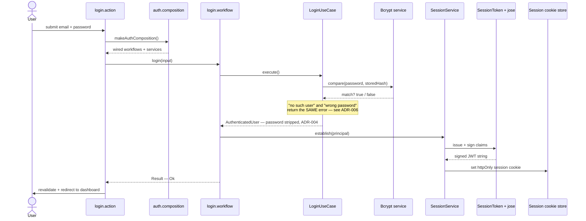
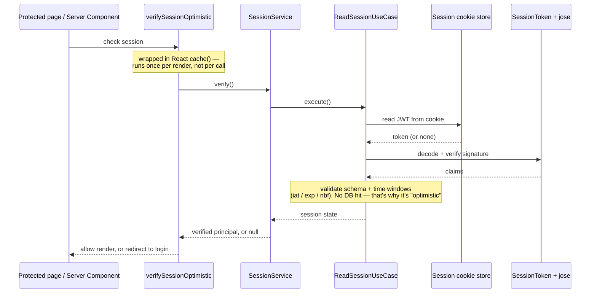

# Auth flows — login, session check, signup

> The question this answers: _"Step by step, what happens when someone logs in,
> and how does a later request know they're logged in?"_ This is the auth module
> ([`src/modules/auth/`](../../src/modules/auth)) — the most layered part of the
> codebase, so it's the best one to have a map for.

## Login

## Session verification (every protected page)

## Signup

Same shape as login, with one extra step **first**: create the user.

1. `signup.action` → `signupWorkflow`
2. `SignupUseCase.execute()` — hash the password (bcrypt), insert the user inside
   a transaction (unit of work). A duplicate email/username maps to a friendly
   field error rather than a raw database crash.
3. Then the **identical session-establishment steps** as login (issue JWT → sign
   → set cookie).

## The files behind the boxes

| Box                                 | File                                                                                                                                                          |
| ----------------------------------- | ------------------------------------------------------------------------------------------------------------------------------------------------------------- |
| login.action / signup.action        | [`presentation/authn/actions/`](../../src/modules/auth/presentation/authn/actions)                                                                            |
| verifySessionOptimistic             | [`presentation/session/actions/verify-session-optimistic.action.ts`](../../src/modules/auth/presentation/session/actions/verify-session-optimistic.action.ts) |
| auth.composition                    | [`infrastructure/composition/auth.composition.ts`](../../src/modules/auth/infrastructure/composition/auth.composition.ts)                                     |
| login.workflow / LoginUseCase       | [`application/auth-user/`](../../src/modules/auth/application/auth-user)                                                                                      |
| SessionService / ReadSessionUseCase | [`application/session/`](../../src/modules/auth/application/session) + [`infrastructure/session/`](../../src/modules/auth/infrastructure/session)             |
| Bcrypt service                      | [`infrastructure/crypto/services/bcrypt-password.service.ts`](../../src/modules/auth/infrastructure/crypto/services/bcrypt-password.service.ts)               |

## The "why" lives in the ADRs

These diagrams show _what_ happens; the decision records explain _why_. They sit
in [`src/modules/auth/notes/adr/`](../../src/modules/auth/notes/adr):

- [ADR-001](../../src/modules/auth/notes/adr/001-use-result-type-for-error-handling.md) — return `Result<T, E>` instead of throwing
- [ADR-002](../../src/modules/auth/notes/adr/002-separate-commands-and-queries.md) — separate commands from queries (CQRS)
- [ADR-003](../../src/modules/auth/notes/adr/003-use-branded-types-for-ids.md) — branded types for IDs
- [ADR-004](../../src/modules/auth/notes/adr/004-strip-passwords-at-application-boundary.md) — strip passwords at the application boundary
- [ADR-005](../../src/modules/auth/notes/adr/005-use-jwt-for-session-tokens.md) — JWT for session tokens
- [ADR-006](../../src/modules/auth/notes/adr/006-prevent-credential-enumeration.md) — prevent credential enumeration

Pairing a **diagram (what)** with an **ADR (why)** is the combo worth keeping up —
the diagram orients you fast, the ADR stops you from re-litigating an old decision.
