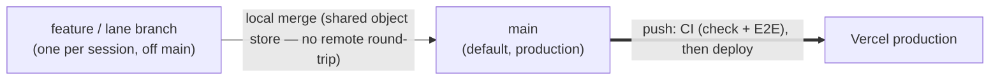

# Branch & CI flow — from a lane branch to production

> The question this answers: _"Which branch do I work on, how does a change reach
> production, and what CI gate runs?"_ The prose companion is
> [../branching-and-releases.md](../branching-and-releases.md).

## The single-branch flow

## How to read it

- **`main` is the default branch and production.** Every feature or lane branch is cut
  from `main`, worked in its own worktree, then **merged into `main` locally** in your
  primary checkout. There are no PRs and no `develop` integration branch.
- **The local `pnpm check:fast` is the gate.** It runs Biome + Markdown + type-check +
  typegen + drift + the DB-free unit lane before you merge — that's what keeps the
  `main` push green.
- **CI runs on the push to `main`,** as a safety net: the fast `Lint & type-check` job
  **and** the slow `E2E (Cypress)` suite. A red run means fix-forward, not a blocked
  merge (the merge already happened locally).
- **Vercel** builds a **production** deploy whenever `main` advances.

## Where the gate is enforced

The two CI jobs live in [`../../.github/workflows/ci.yml`](../../.github/workflows/ci.yml)
and both run on push to `main`. The `main` ruleset (`Protect Important Branches`) blocks
force-pushes and branch deletion but allows direct pushes — there is no
required-status-check or PR rule, so CI is informational, not blocking.
