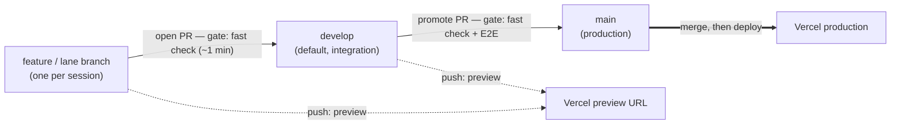

# Branch & CI flow — from a lane branch to production

> The question this answers: _"Which branch do I work on, how does a change reach
> production, and what CI gate runs at each step?"_ The prose companion is
> [../branching-and-releases.md](../branching-and-releases.md).

## The two-tier flow

## How to read it

- **`develop` is the default branch** — your day-to-day base. Every feature or
  lane branch opens a PR into `develop`, gated only by the fast
  `Lint & type-check` job (Biome + Markdown + type-check + typegen + drift + the
  DB-free unit lane). Feedback is ~1 minute.
- **`main` is production, and promote-only.** Code reaches it through a single
  `develop → main` "promote" PR, which runs the full gate — the fast check **and**
  the slow `E2E (Cypress)` suite — so the end-to-end tests run once per release
  instead of on every merge.
- **Vercel** builds a throwaway **preview** for every branch push (your live WIP
  URL) and a **production** deploy only when `main` advances. Production redeploys
  at release cadence, not on every change.

## Where the gates are enforced

The two CI jobs live in [`../../.github/workflows/ci.yml`](../../.github/workflows/ci.yml);
which ones are _required_ to merge is enforced by GitHub rulesets:

| Branch    | Required to merge                     | Vercel            |
| --------- | ------------------------------------- | ----------------- |
| `develop` | `Lint & type-check`                   | preview URL       |
| `main`    | `Lint & type-check` + `E2E (Cypress)` | production deploy |

The slow `E2E (Cypress)` job is gated in the workflow with
`if: github.base_ref == 'main' || github.ref == 'refs/heads/main'`, so it runs only
for main-targeting work. It is a _required_ check on `main` only — never on
`develop`, because a required check that gets skipped would block the merge.
