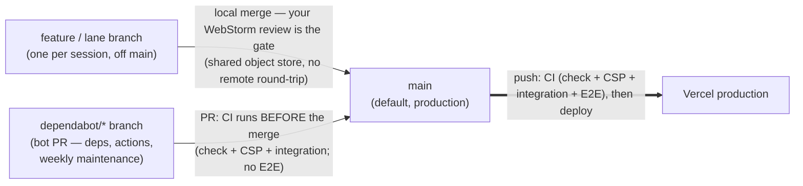

# Branch & CI flow — from a lane branch to production

> The question this answers: _"Which branch do I work on, how does a change reach
> production, and what CI gate runs?"_ The prose companion is
> [../branching-and-releases.md](../branching-and-releases.md).

## The single-branch flow

```mermaid
flowchart LR
    F["feature / lane branch<br/>(one per session, off main)"]
    BOT["dependabot/* branch<br/>(bot PR — deps, actions,<br/>weekly maintenance)"]
    MAIN["main<br/>(default, production)"]
    PROD["Vercel production"]

    F -->|"local merge — your WebStorm review is the gate<br/>(shared object store, no remote round-trip)"| MAIN
    BOT -->|"PR: CI runs BEFORE the merge<br/>(check + CSP + integration; no E2E)"| MAIN
    MAIN ==>|"push: CI (check + CSP + integration + E2E), then deploy"| PROD
```

The two inbound arrows are the whole point: human work is gated by **your review** and
CI follows the push, while bot work has no reviewer — so CI has to run before its merge
instead.

## How to read it

- **`main` is the default branch and production.** Every feature or lane branch is cut
  from `main`, worked in its own worktree, then **merged into `main` locally** in your
  primary checkout. There is no `develop` integration branch, and human work opens no PRs.
- **The local `pnpm check:fast` is the gate.** It runs Biome + Markdown + typegen +
  type-check + Node/dependency/migration drift before you merge — no tests (run the DB-free
  unit lane separately with `pnpm test:unit` when the change warrants it). That's what
  keeps the `main` push green.
- **CI runs on the push to `main`,** as a safety net: four parallel jobs —
  `Lint & type-check` (fast), `CSP guard`, `Integration (Vitest)`, and the slow
  `E2E (Cypress)` suite. A red run means fix-forward, not a blocked merge (the merge
  already happened locally).
- **Bot PRs are the exception**, and the only place CI runs _before_ a merge. Dependabot
  and the weekly-maintenance routine do open PRs, so `ci.yml` also triggers on
  `pull_request` — running `Lint & type-check`, `CSP guard` and `Integration (Vitest)`,
  but **not** `E2E (Cypress)`, which stays push-only because it costs ~15 min and the bot
  PR would pay it twice.
- **Vercel** builds a **production** deploy whenever `main` advances.

## Where the gate is enforced

The four CI jobs live in [`../../.github/workflows/ci.yml`](../../.github/workflows/ci.yml).
All four run on push to `main`; three of them also run on pull requests, which is what gates
bot dependency bumps. The `main` ruleset (`Protect Important Branches`) blocks force-pushes
and branch deletion but allows direct pushes — there is no required-status-check or PR rule,
so CI is informational, not blocking.
