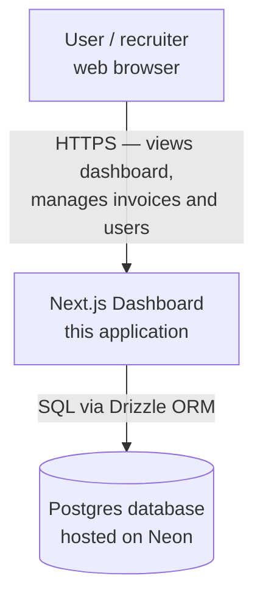
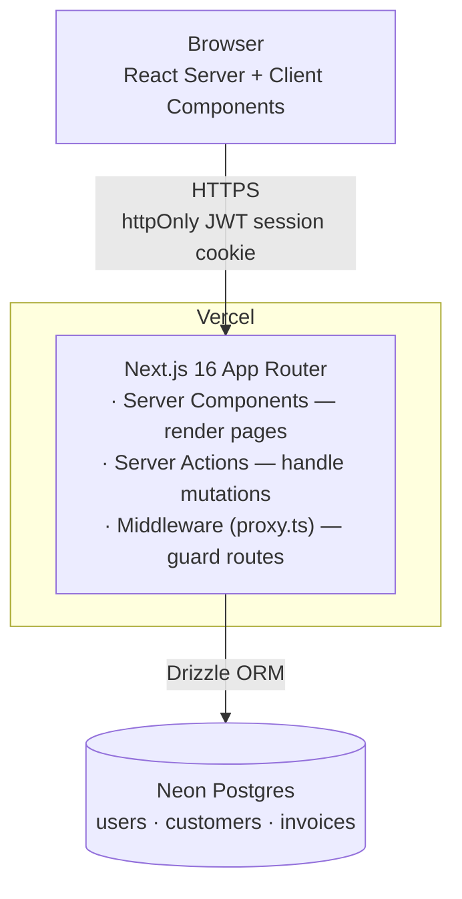
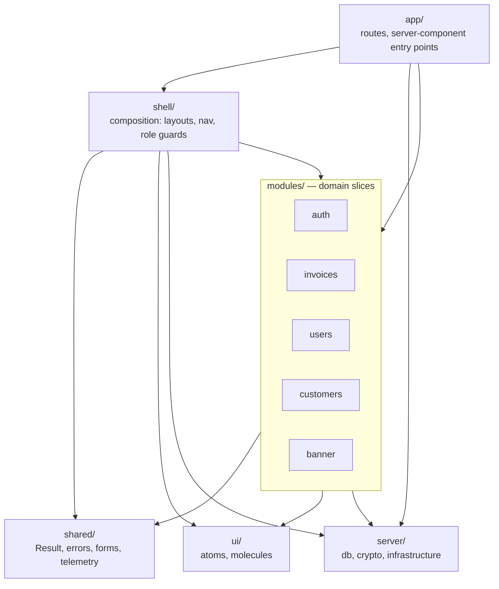

# C4 architecture — the map of the territory

Three zoom levels of the same system. Read them top to bottom: each one steps
_inside_ the main box of the previous. (What is C4? See
[README.md](README.md#the-c4-model-in-one-minute).)

---

## Level 1 — Context: who and what touches the app

> One box for the whole system, plus the people and external systems around it.
> This is the "explain it to a non-engineer" view.



The app is hosted on **Vercel**; the database is **Neon Postgres**. There are no
third-party identity providers — authentication is built in-house (see
[auth-login-flow.md](auth-login-flow.md)).

---

## Level 2 — Container: the deployable pieces

> Step inside the system box. A "container" is something that runs and can be
> deployed independently — here, the Next.js app and the database.



The session is a **signed JWT stored in an httpOnly cookie** — there is no
server-side session table. See [auth-login-flow.md](auth-login-flow.md).

---

## Level 3 — Component: inside the Next.js app

> Step inside the Next.js container. These are the top-level folders under
> `src/`. Arrows mean **"depends on / may import from."**



The **one-way dependency rule** (from
[../project-structure.md](../project-structure.md)):

```text
shared / ui  →  modules  →  shell  →  app
```

Lower layers never import from higher ones — `shared` and `ui` know nothing about
`modules`, and `modules` never import from `shell`. `server` (infrastructure) is
usable from `modules`, `shell`, and `app` as needed.

The five modules are **not** all built the same way — `auth` uses full layering
while `customers` and `banner` are simpler. That heterogeneity is intentional and
is mapped in [module-layers.md](module-layers.md).
