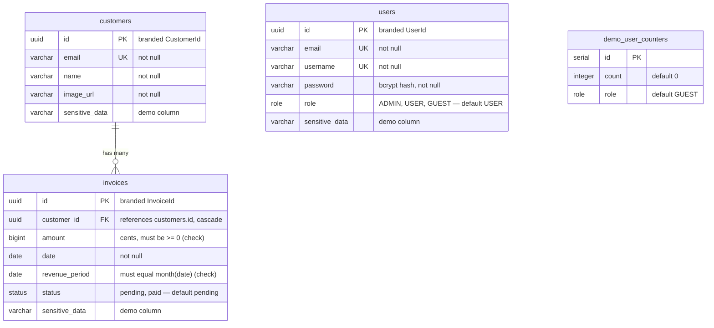

# Database ERD — tables and relationships

> The question this answers: _"What tables exist, what's in them, and how do they
> link?"_ Drawn from the Drizzle schema in [`database/schema/`](../../database/schema).

## How to read this

- `||--o{` means **one-to-many**: one `customer` has zero-or-more `invoices`;
  each `invoice` belongs to exactly one `customer`.
- `PK` = primary key, `FK` = foreign key, `UK` = unique key.
- A table with no connector (here `users`, `demo_user_counters`) has no foreign
  keys to the others — it stands alone by design.

## Things worth remembering

- **Three independent islands, not one connected graph.** Only
  `customers → invoices` are linked. `users` (authentication) is deliberately
  separate from the business data — logging in doesn't depend on invoices, and
  invoices don't reference a user. `demo_user_counters` stands alone too; it
  powers the demo-login feature.
- **Money is stored as integer cents in a `bigint`**, never a float. `amount` has
  a check constraint (`>= 0`), and `revenue_period` is constrained to the first
  day of `date`'s month. The database enforces these — they can't drift.
- **Branded IDs** (`UserId`, `CustomerId`, `InvoiceId`) are TypeScript types over
  `uuid`. They stop you from accidentally passing a `CustomerId` where an
  `InvoiceId` is expected — a compile-time error, not a runtime bug. See
  [ADR-003](../../src/modules/auth/notes/adr/003-use-branded-types-for-ids.md).
- The `sensitive_data` columns look like teaching/demo placeholders rather than
  real domain fields.

> Tip: run **Drizzle Studio** (`pnpm drizzle-kit studio`) for a live, clickable
> version of this — useful for browsing actual rows while debugging.
