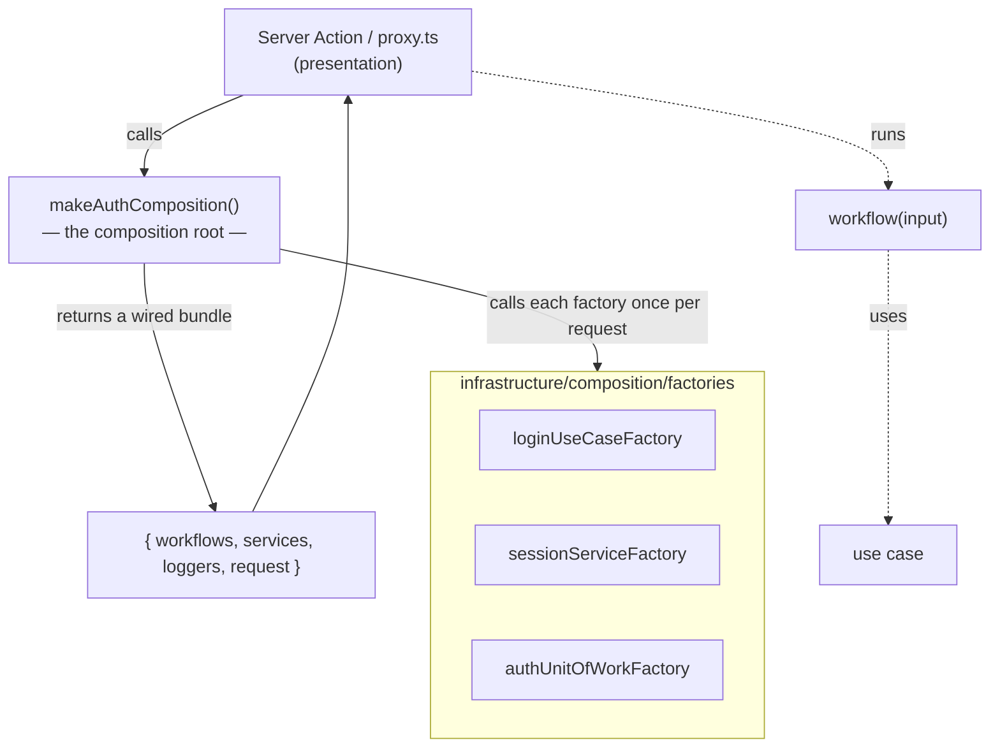
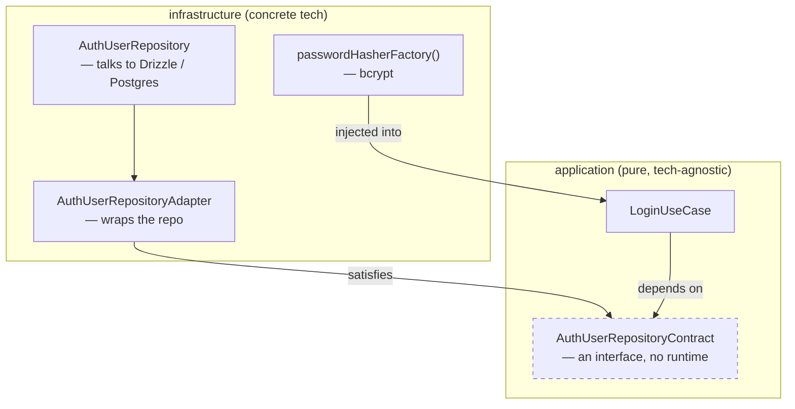

# Dependency injection — where contracts meet implementations

> The question this answers: *"The [module-layers diagram](module-layers.md) says
> 'application code never imports infrastructure directly.' So how do the two ever
> actually get connected?"* The answer is a single place called the **composition
> root** ([`auth.composition.ts`](../../src/modules/auth/infrastructure/composition/auth.composition.ts)).

This is the mechanism behind the "dependencies point inward" rule. A use case
depends on an *interface* (a contract); the concrete database/crypto class that
satisfies that interface is plugged in at runtime — and the plugging happens here,
nowhere else.

## The shape of it



`makeAuthComposition()` runs once per request. It reads request metadata, builds a
**scoped logger** (tagged with a `requestId`, IP, and user-agent so every log line
in that request is traceable), opens the DB handle, then asks the factories to
assemble the use cases and services. What comes back is a ready-to-run bundle of
workflows — the caller never sees a single `new SomeRepository(...)`.

## Inside one factory — the contract/implementation handshake

Here's `loginUseCaseFactory`, which is the whole pattern in miniature:



Read it as a sentence: **`LoginUseCase` asks for "something shaped like
`AuthUserRepositoryContract`."** The factory hands it an `AuthUserRepositoryAdapter`
wrapping a Drizzle-backed `AuthUserRepository`. The use case never learns the word
"Drizzle" — swap Postgres for anything else and only the factory changes; the use
case and all its tests stay untouched.

```typescript
// the punchline of login-use-case.factory.ts
const repo = new AuthUserRepository(db, scopedLogger, requestId);   // infra
const repoContract = new AuthUserRepositoryAdapter(repo);           // → contract
return new LoginUseCase(repoContract, passwordHasherFactory(), log); // app core
```

## Why bother with the adapter in the middle?

It looks like an extra hop, and it's a fair thing to question. The repository is
free to expose a rich, Drizzle-flavoured API; the **adapter** narrows it to exactly
the contract the application asked for. That keeps the contract small and honest,
and it's the seam where a swap or a test-double slots in. The dashed interface box
above is the only thing the application layer is allowed to know about.

## The files behind the boxes

| Box | File |
|---|---|
| composition root | [`auth.composition.ts`](../../src/modules/auth/infrastructure/composition/auth.composition.ts) |
| a use-case factory | [`login-use-case.factory.ts`](../../src/modules/auth/infrastructure/composition/factories/auth-user/login-use-case.factory.ts) |
| the contract (interface) | [`session-service.contract.ts`](../../src/modules/auth/application/session/contracts/session-service.contract.ts) |
| a concrete implementation | [`session-token.service.ts`](../../src/modules/auth/infrastructure/session/services/session-token.service.ts) |

## The payoff (and the honest cost)

- **Testability** — a use case takes its dependencies as constructor arguments, so
  a unit test passes in fakes and never touches a database. This is why `auth` has
  the most tests in the repo.
- **Swappability** — bcrypt, jose, Drizzle, the cookie store: each sits behind a
  contract and is chosen in exactly one factory.
- **The cost** — more files and one layer of indirection to trace. That's why only
  the layered modules (`auth`, `invoices`, `users`) pay for it; `customers` and
  `banner` skip composition entirely, as the [module map](module-layers.md#not-every-module-has-every-layer-and-thats-on-purpose)
  spells out. Wiring is worth it when the wiring buys you something.
