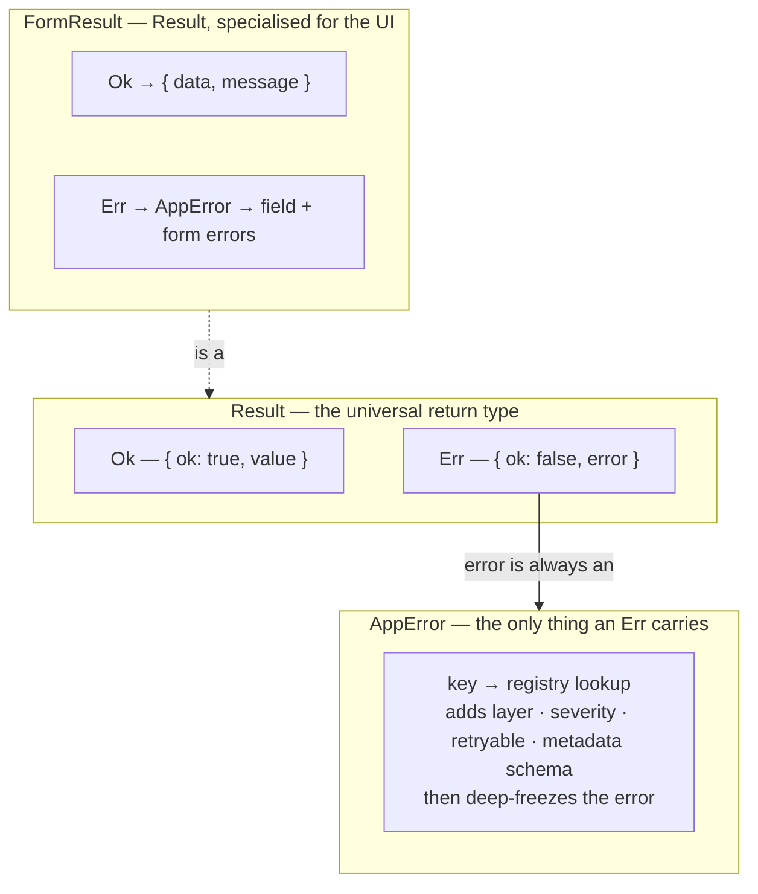
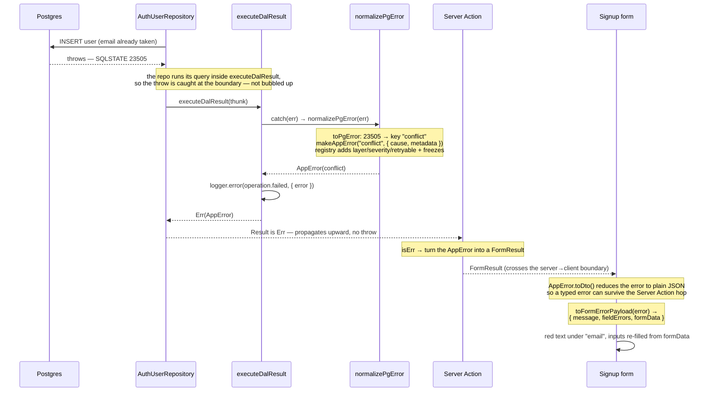
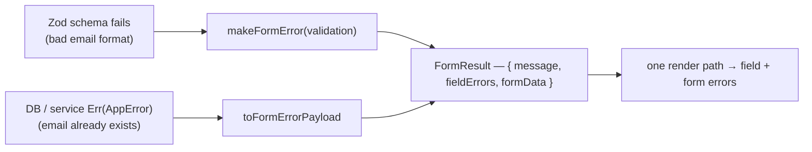

# Error handling — the failure spine

> The question this answers: *"When something goes wrong deep in the app, how
> does that failure travel — without ever being `throw`n — all the way up to a
> red message under a form field?"* This is the one flow that ties together the
> three things people ask about most: **results**, **errors**, and **forms**.

The key insight: these aren't three systems. They're **one currency for
failure**, used everywhere. The code says so literally —

```
FormResult<T>  =  Result<FormSuccessPayload<T>, AppError>
```

A form result is just a `Result` whose error is always an `AppError`. So if you
learn the spine once, every module reads the same way.

## The shapes (read this first)



- **`Result`** is a frozen discriminated union: either `Ok` (has `value`) or
  `Err` (has `error`). Nothing throws; failure is a *value you return*.
- **`AppError`** is the only error type an `Err` ever holds. Its `key` (one of 13,
  e.g. `conflict`, `validation`, `not_found`) is looked up in a **registry** that
  stamps on the layer, severity, retry-ability, and the schema its metadata must
  match. It's an `Error` subclass, so it still has a stack — but it's structured.
- **`FormResult`** is `Result` with the success side carrying `{ data, message }`.

## The life of a failure — a duplicate email on signup



The Postgres code → error-key mapping is a small, honest table (in
[`pg-error.constants.ts`](../../src/shared/core/errors/server/adapters/postgres/pg-error.constants.ts)):

| Postgres failure | SQLSTATE | becomes `AppError` key |
|---|---|---|
| unique violation (duplicate email) | `23505` | `conflict` |
| check violation (e.g. `amount >= 0`) | `23514` | `integrity` |
| foreign-key violation | `23503` | `integrity` |
| not-null violation | `23502` | `integrity` |
| anything unrecognised | — | `unexpected` |

## The other on-ramp: form validation

A *bad* email (wrong shape) and a *duplicate* email (DB conflict) come from
totally different places — but they arrive at the form in the **identical
shape**. That's the whole point.

[`validateForm`](../../src/shared/forms/server/validate-form.ts) runs the
`FormData` through a Zod schema. On failure it doesn't throw either — it calls
`makeFormError({ key: "validation", fieldErrors, formData })`, producing the same
`FormResult` an `Err` would. So the form component has exactly one branch to
handle, no matter where the failure was born:



## The files behind each hop

| Hop | File |
|---|---|
| `Result` core (`Ok` / `Err`, frozen) | [`result.ts`](../../src/shared/core/result/result.ts) |
| `AppError` entity + `toDto` | [`app-error.entity.ts`](../../src/shared/core/errors/core/app-error.entity.ts) |
| Error registry (the 13 keys) | [`app-error.registry.ts`](../../src/shared/core/errors/core/catalog/app-error.registry.ts) |
| DB boundary — catch → `Result` | [`execute-dal-result.ts`](../../src/shared/core/errors/server/adapters/dal/execute-dal-result.ts) |
| Postgres → `AppError` | [`normalize-pg-error.ts`](../../src/shared/core/errors/server/adapters/postgres/normalize-pg-error.ts) · [`to-pg-error.ts`](../../src/shared/core/errors/server/adapters/postgres/to-pg-error.ts) |
| `FormResult` type | [`form-result.dto.ts`](../../src/shared/forms/core/types/form-result.dto.ts) |
| Form validation on-ramp | [`validate-form.ts`](../../src/shared/forms/server/validate-form.ts) |
| `AppError` → UI payload | [`form-error-payload.mapper.ts`](../../src/shared/forms/presentation/mappers/form-error-payload.mapper.ts) |

## The lesson

Three rules make the whole thing hang together:

1. **Failure is a value, not an exception.** Functions return `Result`; the
   `try/catch` lives only at the edges (the DB boundary, an async refinement).
   The compiler then *forces* you to handle the `Err` case. This is recorded in
   [ADR-001](../../src/modules/auth/notes/adr/001-use-result-type-for-error-handling.md).
2. **One error currency.** Everything fails as an `AppError`, built from a single
   registry. A raw Postgres crash and a failed Zod parse become the same kind of
   thing, so the UI never has to care where a failure came from.
3. **The boundary is explicit.** An `AppError` is a class instance; it can't ride
   a Server Action to the browser as-is. `toDto()` flattens it to JSON on the way
   out — which is exactly why a typed error can show up as a typed field error in
   the client.

The everyday payoff: a new feature gets correct, consistent error handling almost
for free, just by returning `Result` and letting the spine do the rest.
