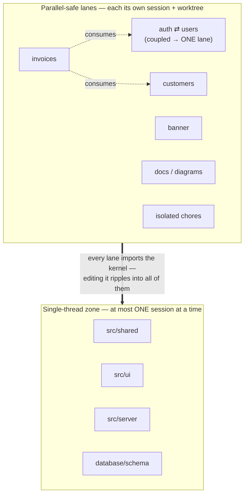

# Lane map — what can run in parallel

> The question this answers: _"Which slices of the codebase can be edited in separate sessions at the
> same time, and which must stay single-threaded?"_ The prose companion (per-lane table + BACKLOG
> mapping) is [../lane-map.md](../lane-map.md).

## Lanes vs. the single-thread kernel

## How to read it

- **Top box = parallel-safe lanes.** Each can be a separate worktree + session because their _edit_
  footprints don't overlap. `auth` and `users` import each other, so they collapse into one lane;
  `invoices` reads `auth`/`customers` but edits only itself (downstream).
- **Bottom box = the kernel.** `shared`, the `ui` design system, `server`, and the centralized
  `database/schema` are imported by everything, so a change here ripples up into every lane. Edit it in
  **one** session at a time, and don't run a kernel refactor next to a module lane it will break.
- **The rule:** lanes collide on shared _edits_, not shared _imports_. Two lanes importing the same
  kernel file is fine — until both try to change it.

See [../lane-map.md](../lane-map.md) for the per-lane table and today's BACKLOG mapped onto lanes.
