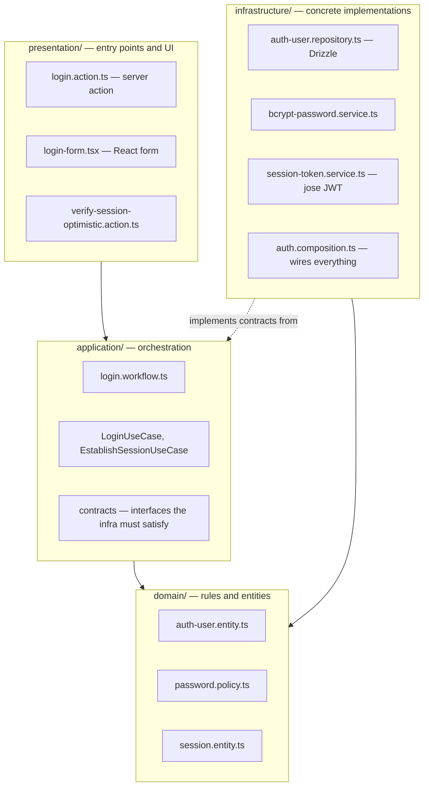

# Module layers — how a slice is built

> The question this answers: _"What are the layers inside a module, and which way
> do the dependencies point?"_ The `auth` module is the fullest example, so it's
> the one drawn here.

## The four layers (auth as the example)

## How to read it — "dependencies point inward"

This is the core idea of the layered ("clean") style:

- **`domain`** is the center. It depends on **nothing** — pure rules and types.
- **`application`** depends only on `domain`. It defines _contracts_ (interfaces)
  for the things it needs, like "something that can hash a password."
- **`infrastructure`** depends inward too: it _implements_ those contracts with
  real tech (Drizzle, bcrypt, jose). Application code never imports infrastructure
  directly — the **composition root** (`auth.composition.ts`) plugs the concrete
  pieces in at runtime.
- **`presentation`** sits on the outside: forms and server actions that call into
  `application`.

The payoff: you can read a use case without knowing whether the database is
Postgres or the hasher is bcrypt — those are swappable details behind contracts.

| Layer            | Owns                                       | Examples                                                |
| ---------------- | ------------------------------------------ | ------------------------------------------------------- |
| `presentation`   | entry points, forms, error → UI mapping    | `login.action.ts`, `login-form.tsx`                     |
| `application`    | use cases, workflows, contracts, DTOs      | `login.workflow.ts`, `LoginUseCase`                     |
| `domain`         | entities, policies, value objects — no I/O | `auth-user.entity.ts`, `password.policy.ts`             |
| `infrastructure` | DB, crypto, JWT, cookies, composition root | `auth-user.repository.ts`, `bcrypt-password.service.ts` |

## Not every module has every layer (and that's on purpose)

`auth` is the learning ground for these patterns. The other modules are
deliberately simpler — adding an `application` layer to a thin CRUD slice would
be ceremony, not value. Here's the honest map:

| Module      | presentation | application | domain | infrastructure | Notes                                    |
| ----------- | :----------: | :---------: | :----: | :------------: | ---------------------------------------- |
| `auth`      |      ✅      |     ✅      |   ✅   |       ✅       | full layering; has ADRs + the most tests |
| `invoices`  |      ✅      |     ✅      |   ✅   |       ✅       | layered                                  |
| `users`     |      ✅      |     ✅      |   ✅   |       ✅       | layered; has tests                       |
| `customers` |      ✅      |      —      |   ✅   |       ✅       | simpler CRUD — no `application` layer    |
| `banner`    |      ✅      |      —      |   ✅   |       ✅       | the thinnest slice                       |

When you open a module and it looks different from `auth`, this is why — it's a
conscious trade-off, not an inconsistency to "fix." The decisions behind auth's
shape are recorded in its [ADRs](../../src/modules/auth/notes/adr).
