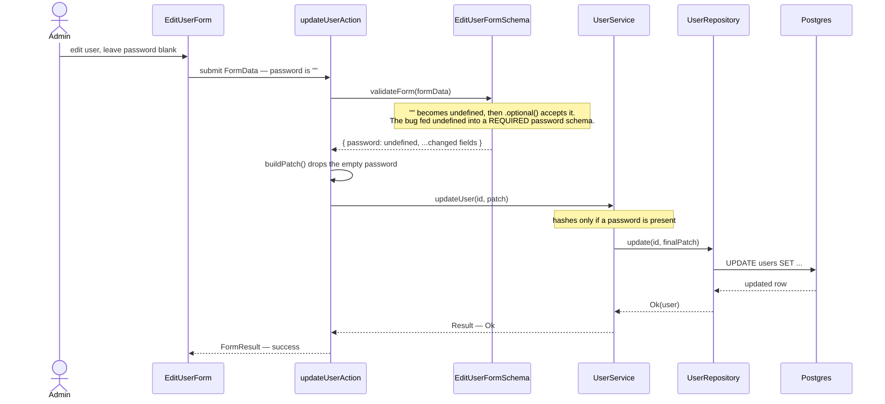

# Request flow — editing a user

> The question this answers: *"When I submit a form, what actually happens, and
> in what order?"* This traces one real path — the **edit-user** form — from the
> browser down to the database and back.
>
> It's also the flow behind a real bug: leaving the password blank used to fail
> validation. The fix lived at the **schema** hop below, and this diagram makes
> *why* obvious.

## How to read a sequence diagram

- Each vertical line is a **participant** (a file/component). Time flows **down**.
- A solid arrow (`→`) is a **call**; a dashed arrow (`⇠`) is a **return**.
- The boxes labelled *Note* say what's happening at that step — often where the
  interesting logic (or the bug) lives.

## The files behind each hop

| Step | File |
|---|---|
| Form | [`edit-user-form.tsx`](../../src/modules/users/presentation/forms/edit-user-form.tsx) |
| Server action | [`update-user.action.ts`](../../src/modules/users/presentation/actions/update-user.action.ts) |
| Validation | [`user.schema.ts`](../../src/modules/users/domain/schemas/user.schema.ts) |
| Service | [`user.service.ts`](../../src/modules/users/application/services/user.service.ts) |

## The lesson

When a bug spans layers, **draw the layers first**, then ask: *what is the data at
each hop?* Here the data was `""` at the form, should have become `undefined` at
the schema, and the schema was the one hop doing the wrong thing. Tracing the
transformation pointed straight at the fix — no guessing.

This is the everyday payoff of sequence diagrams: they turn "somewhere in this
pile of files" into "this specific arrow."
