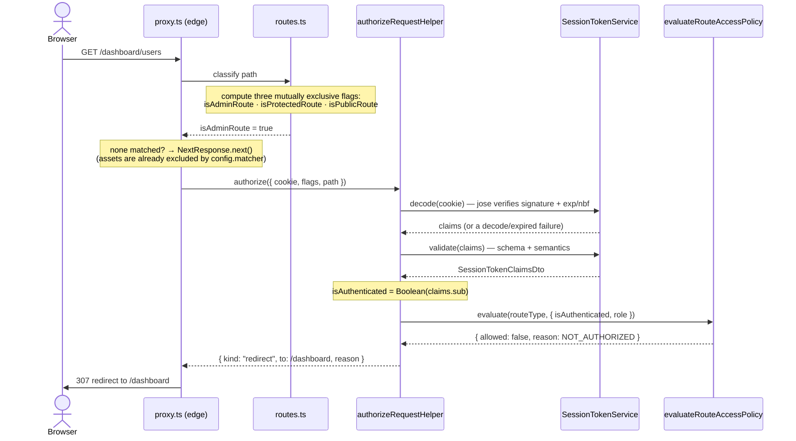
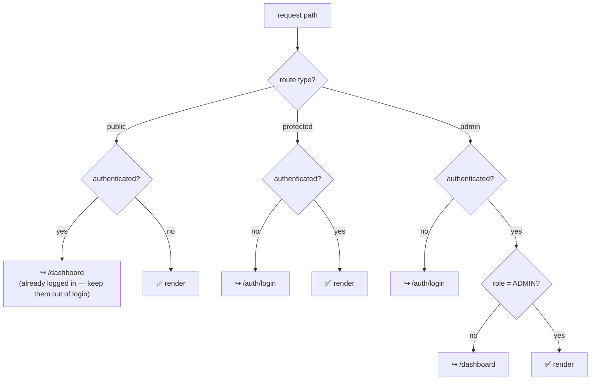

# Route authorization — the gate before the page

> The question this answers: *"Before a page even starts rendering, what decides
> whether I'm allowed to see it — and where do I get sent if I'm not?"* This is the
> **edge middleware** ([`src/proxy.ts`](../../src/proxy.ts)), the first code that
> runs on every request.

A note on the filename: Next.js 16 renamed the middleware entry point from
`middleware.ts` to **`proxy.ts`** — same job, new name. (The
[C4 container diagram](c4-architecture.md#level-2--container-the-deployable-pieces)
calls this box "Middleware"; it's this file.)

## Step by step — one request hitting the gate

## The decision, as a table

The policy ([`evaluate-route-access.policy.ts`](../../src/modules/auth/domain/session/policies/authorization/evaluate-route-access.policy.ts))
is a **pure function** — it takes the route type and who you are, and returns
allow / deny. It deliberately knows *nothing* about redirects; the middleware
turns a denial into a destination.

| Route type | Anonymous | Authenticated (USER) | Authenticated (ADMIN) |
|---|---|---|---|
| **public** (`/`, `/auth/login`, `/auth/signup`) | ✅ allow | ↪︎ redirect to `/dashboard` | ↪︎ redirect to `/dashboard` |
| **protected** (`/dashboard/**`) | ↪︎ redirect to `/auth/login` | ✅ allow | ✅ allow |
| **admin** (`/dashboard/users/**`) | ↪︎ redirect to `/auth/login` | ↪︎ redirect to `/dashboard` | ✅ allow |

Reading it as a flow:

## Three things worth noticing

- **Public routes bounce *authenticated* users away.** A logged-in user visiting
  `/auth/login` is redirected to the dashboard — the login page is "public" in the
  sense of *"for people without a session."*
- **Exactly one route flag may be true.** [`get-route-type.policy.ts`](../../src/modules/auth/domain/session/policies/authorization/get-route-type.policy.ts)
  counts the flags and treats "zero or two-plus" as a bug, not a default — a
  misclassified route fails closed (redirect to login) instead of silently
  guessing. Admin is checked first, so `/dashboard/users` is admin, not protected.
- **The gate runs on the edge, with no database.** Authorization here rests
  entirely on the **signed JWT in the cookie** — decode, verify, read `sub` and
  `role`. No DB round-trip, which is what keeps middleware fast. (The deeper
  question of *what the JWT is trusted to carry* is its own decision:
  [ADR-005 — JWT for session tokens](../../src/modules/auth/notes/adr/005-use-jwt-for-session-tokens.md).)

## The files behind the boxes

| Box | File |
|---|---|
| edge entry point | [`proxy.ts`](../../src/proxy.ts) |
| route classification | [`routes.ts`](../../src/shared/routing/routes.ts) |
| orchestration (decode → policy → outcome) | [`authorize-request.helper.ts`](../../src/modules/auth/application/shared/helpers/authorize-request.helper.ts) |
| "exactly one flag" guard | [`get-route-type.policy.ts`](../../src/modules/auth/domain/session/policies/authorization/get-route-type.policy.ts) |
| the allow/deny decision | [`evaluate-route-access.policy.ts`](../../src/modules/auth/domain/session/policies/authorization/evaluate-route-access.policy.ts) |
| token decode + validate | [`session-token.service.ts`](../../src/modules/auth/infrastructure/session/services/session-token.service.ts) |

## How this differs from the login diagram

[auth-login-flow.md](auth-login-flow.md) shows how a session gets *created* and how
a Server Component *optimistically* re-checks it during render. This diagram is the
layer **before** that: the edge gate that runs on every navigation and decides
whether the request is even allowed through. Same JWT, different moment — the gate
is the bouncer at the door; the optimistic check is the host double-checking your
wristband once you're inside.

## A second layer: server actions guard themselves

The gate above protects **navigations** — it decides whether a *page* may render.
But Next.js Server Actions are independently invocable RPC endpoints: a crafted
request can call an action without ever loading the page that hosts it, so the
gate alone doesn't protect them. Each sensitive action therefore enforces its own
authorization as a second layer (defense in depth), via two guards in
[`session-access.guard.ts`](../../src/modules/auth/presentation/session/guards/session-access.guard.ts):

- **`requireSession()`** — any valid session; used by the invoice mutations.
- **`requireAdmin()`** — an admin session; used by every user action (the
  mutations *and* the PII-exposing reads).

Both reuse the same `verifySessionOptimistic()` check the gate's optimistic
sibling uses, so there's one source of truth for the session. The reasoning — why
actions need their own check, and why a denial `redirect()`s rather than rendering
`forbidden()` — is in
[ADR-007](../../src/modules/auth/notes/adr/007-enforce-action-level-authorization.md);
the auth module's
[presentation README](../../src/modules/auth/presentation/README.md#authorization-guards)
documents the guards in detail.

> So: the **gate** stops you at the door (route), and the **guards** check your
> wristband again at each ride (action). Same session, two enforcement points.
