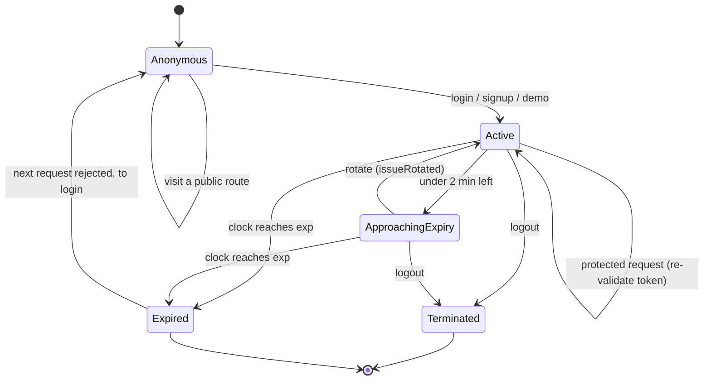
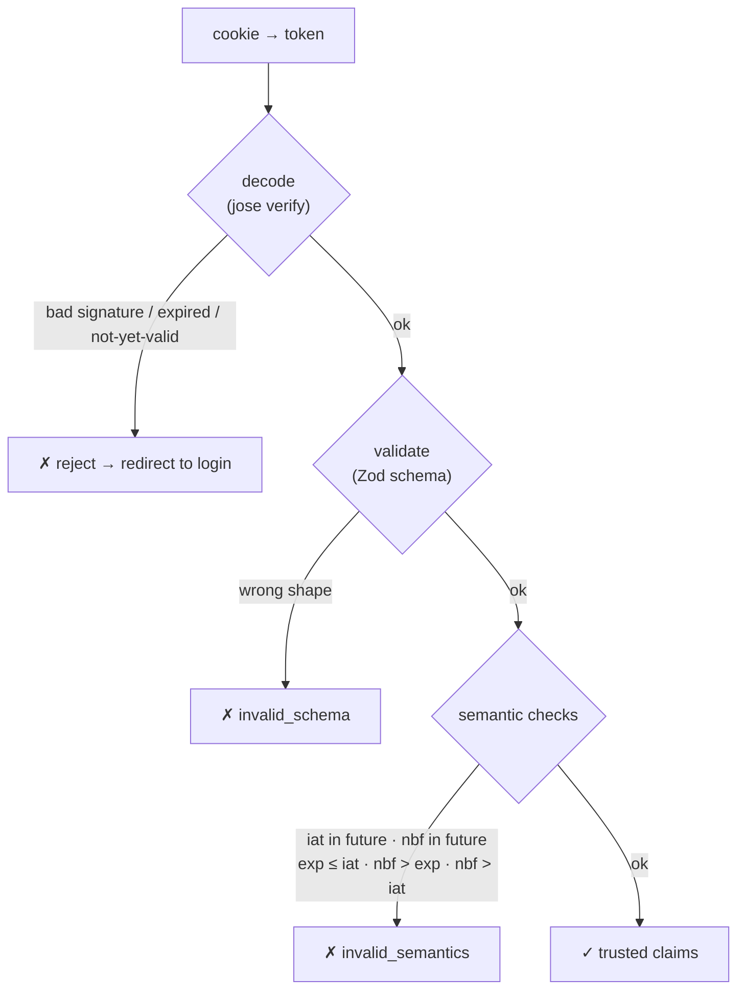

# Session lifecycle — the states a session moves through

> The question this answers: *"From the moment someone logs in to the moment their
> session is gone, what states can it be in, and what moves it between them?"* The
> [login diagram](auth-login-flow.md) shows the *sequence* of a single login; this
> shows the **state machine** that governs the session afterwards.

This is the picture (the *what*); the decision behind it — *why* sessions are
stateless JWTs — is [ADR-005](../../src/modules/auth/notes/adr/005-use-jwt-for-session-tokens.md).
The numbers below were read straight from the constants.

## The states

## What each transition really does

| From → To | Trigger | What happens in code |
|---|---|---|
| Anonymous → Active | login / signup / demo | `issue()` mints a JWT (`sid`, `jti`, `iat`, `exp = iat + 15 min`, `nbf`), signs it (jose / HS256), sets an httpOnly cookie |
| Active → Active | a protected request | cookie decoded + verified, claims validated — no new token issued |
| Active → ApproachingExpiry | ≤ 2 min remaining | `isSessionApproachingExpiry()` against the refresh threshold |
| ApproachingExpiry → Active | rotate | `issueRotated()` keeps the same `sid`, issues a fresh `jti`/`iat`/`exp` — a sliding extension |
| → Expired | wall clock passes `exp` | nothing runs *at* expiry; it's caught on the **next** decode |
| Active → Terminated | logout | `terminate("logout")` deletes the cookie (`maxAge` 0) |

## The validation gauntlet (the Active → Active self-loop)

Every protected request re-checks the token in two stages — and they fail for
different reasons, which is deliberate:

The split matters: **jose** owns cryptographic truth (signature) and time
(`exp`/`nbf`, with a ±5 s clock tolerance), so an *expired* token is rejected at
the `decode` step. **`validate()`** then owns structural and logical truth — the
right fields, and cross-field sanity like "expiry must be after issuance." A
schema failure and an expiry failure are never confused for one another.

## The numbers that govern it

From [`session-config.constants.ts`](../../src/modules/auth/domain/shared/constants/session-config.constants.ts)
and [`session-token.constants.ts`](../../src/modules/auth/infrastructure/session/config/session-token.constants.ts):

| Knob | Value | Meaning |
|---|---|---|
| `SESSION_DURATION_SEC` | **900 s — 15 minutes** | how long a freshly issued token lives |
| `SESSION_REFRESH_THRESHOLD_SEC` | **120 s — 2 minutes** | "approaching expiry" window where rotation kicks in |
| `MAX_ABSOLUTE_SESSION_SEC` | **2,592,000 s — 30 days** | hard ceiling on age via `iat`, even with rotation |
| `SESSION_TOKEN_CLOCK_TOLERANCE_SEC` | **5 s** | slack for clock skew between machines |

So a session slides forward in 15-minute leases, renewed as long as you stay
active, but can never outlive its original issuance by more than 30 days.

## Why it's stateless (and what that costs)

There is **no sessions table**. The JWT *is* the session — everything needed to
trust a request rides in the signed cookie. That's why the
[ERD](database-erd.md) has no session entity, and why the
[route gate](route-authorization.md) can authorize on the edge with no DB hit.

The honest trade-off: because state lives in the token, you can't revoke a single
session server-side without extra machinery (a denylist or a key rotation). Logout
deletes *this* browser's cookie; it doesn't reach out and kill a token copied
elsewhere. That's the classic stateless-JWT bargain — speed and simplicity now, in
exchange for weaker instant-revocation. See
[ADR-005](../../src/modules/auth/notes/adr/005-use-jwt-for-session-tokens.md).

---

> **Keep this honest.** These numbers were read straight from the constants on
> 2026-06-04 (`SESSION_DURATION_SEC` and friends). Numbers in docs rot — if you
> change a constant, change this table.
