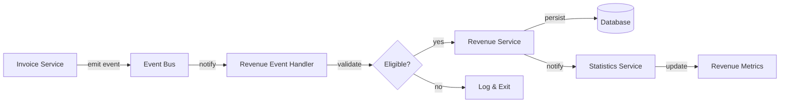

# Revenue Services Documentation

This directory contains services responsible for revenue management, event processing, and statistics calculations. The system employs an event-driven architecture to maintain consistency between invoices and revenue records.

## Directory Structure

```
services/
├── README.md                       # This documentation file
├── revenue.service.ts              # Core business logic for revenue processing
├── events/                         # Event handling subsystem
│   ├── revenue-event.handler.ts    # Event subscriptions and orchestration
│   ├── revenue-event.helpers.ts    # Helper functions for event processing
│   ├── revenue-event.utils.ts      # Utility functions for event handlers
│   └── README.md                   # Event system documentation
└── statistics/                     # Revenue statistics subsystem
    ├── revenue-statistics.service.ts # Advanced statistical calculations
    └── README.md                   # Statistics subsystem documentation
```

## Core Service (`revenue.service.ts`)

The `RevenueService` class provides the foundation for all revenue management operations.

### Primary Responsibilities

- **CRUD Operations**: Create, read, update, and delete revenue records
- **Period-Based Queries**: Find revenue by period or date range
- **Statistical Analysis**: Calculate revenue metrics (total, average, count)
- **Invoice Integration**: Update revenue records based on invoice data

### Key Features

- **Repository Pattern**: Clean separation of business logic from data access
- **Dependency Injection**: Testable design with injectable dependencies
- **Strong Validation**: Comprehensive input validation before processing
- **Error Handling**: Structured error handling with detailed context
- **Business Logic**: Encapsulated revenue calculation and aggregation rules
- **Synchronization**: Maintains consistency between invoices and revenue records

### Core Methods

| Method | Purpose | Parameters | Return |
|--------|---------|------------|--------|
| `createRevenue` | Creates a new revenue record | RevenueCreateDTO | Promise<Revenue> |
| `getRevenueById` | Retrieves a specific revenue record | string | Promise<Revenue> |
| `getRevenueByPeriod` | Finds revenue for a specific period | string or Date (first-of-month) | Promise<Revenue> |
| `updateRevenue` | Updates an existing revenue record | string, RevenueUpdateDTO | Promise<Revenue> |
| `deleteRevenue` | Removes a revenue record | string | Promise<void> |
| `calculateTotalRevenue` | Calculates total revenue for a period range | DateRange | Promise<number> |
| `syncWithInvoice` | Updates revenue based on invoice changes | Invoice | Promise<Revenue> |

## Event System (`events/`)

The event system implements an event-driven architecture that ensures revenue records stay synchronized with invoice changes.

### Event Handler (`revenue-event.handler.ts`)

The central coordinator for event-based revenue updates:

- **Event Subscription**: Listens for `invoice.created`, `invoice.updated`, and `invoice.deleted` events
- **Validation**: Ensures events contain valid data before processing
- **Routing**: Directs events to appropriate processing functions
- **Error Management**: Handles and logs errors without disrupting the event flow

### Event Helpers (`revenue-event.helpers.ts`)

Contains specialized functions for different event scenarios:

- **Invoice Addition**: Processes new invoices and adds them to revenue records
- **Invoice Deletion**: Handles removal of invoices from revenue calculations
- **Status Changes**: Updates revenue when invoice status changes (e.g., from "draft" to "paid")
- **Amount Adjustments**: Recalculates revenue when invoice amounts are modified
- **Error Handling**: Provides consistent patterns for error management across handlers

### Event Utilities (`revenue-event.utils.ts`)

Supporting utility functions for event processing:

- **Period Extraction**: Converts invoice dates to standardized Period (first-of-month DATE)
- **Validation**: Verifies invoice data completeness and integrity
- **Error Handling**: Specialized error handling for the event processing pipeline

## Statistics Service (`statistics/`)

The `RevenueStatisticsService` extends basic revenue calculations with advanced analytics:

### Advanced Capabilities

- **Trend Analysis**: Identifies patterns in revenue over time
- **Comparative Analysis**: Year-over-year and month-over-month comparisons
- **Growth Metrics**: Calculates growth rates and compound growth
- **Forecasting**: Predicts future revenue based on historical data
- **Aggregation**: Provides summary statistics across multiple dimensions

### Key Methods

| Method | Purpose | Parameters | Return |
|--------|---------|------------|--------|
| `calculateTrend` | Analyzes revenue trend over time | DateRange | Promise<TrendData> |
| `compareYearOverYear` | Compares revenue between years | number, number | Promise<ComparisonResult> |
| `calculateGrowthRate` | Determines revenue growth rate | DateRange | Promise<GrowthMetrics> |
| `forecastRevenue` | Predicts future revenue | ForecastParams | Promise<ForecastResult> |
| `getRevenueBreakdown` | Provides detailed revenue breakdown | BreakdownParams | Promise<BreakdownResult> |

## Data Flow

### Invoice-to-Revenue Flow



## Key Architectural Principles

1. **Event-Driven Design**: Loose coupling between invoice and revenue systems
2. **Single Responsibility**: Each service focuses on one aspect of the system
3. **Clean Architecture**: Clear separation between business logic and data access
4. **Dependency Injection**: Services accept dependencies through constructors
5. **Error Isolation**: Robust error handling prevents cascading failures
6. **Idempotent Processing**: Safe handling of duplicate events without side effects
7. **Structured Logging**: Rich context for operations and error conditions

## Usage Examples

### Basic Service Initialization

```typescript
// Initialize core revenue service
const revenueRepository = new RevenueRepository();
const revenueService = new RevenueService(revenueRepository);

// Initialize event handler (automatically subscribes to events)
const eventHandler = new RevenueEventHandler(revenueService);

// Initialize statistics service
const statisticsService = new RevenueStatisticsService(revenueService);
```

### Creating and Retrieving Revenue

```typescript
// Create a new revenue record
const newRevenue = await revenueService.createRevenue({
    period: '2025-08-01',
    amount: 15000,
    invoiceCount: 5,
    notes: 'Monthly revenue for August 2025'
});

// Get revenue for a specific period
const augustRevenue = await revenueService.getRevenueByPeriod('2025-08-01');

// Calculate total revenue for Q3 2025
const q3Revenue = await revenueService.calculateTotalRevenue({
    startDate: '2025-07-01',
    endDate: '2025-09-30'
});
```

### Working with Statistics

```typescript
// Calculate year-over-year growth
const yoyComparison = await statisticsService.compareYearOverYear(2024, 2025);

// Generate a 6-month revenue forecast
const forecast = await statisticsService.forecastRevenue({
    baselinePeriod: { startDate: '2025-01-01', endDate: '2025-08-31' },
    forecastMonths: 6,
    confidenceLevel: 0.95
});

// Get monthly revenue breakdown with growth rates
const breakdown = await statisticsService.getRevenueBreakdown({
    period: '2025',
    groupBy: 'month',
    includeGrowthRate: true
});
```

## Related Documentation

- [Main Revenue Documentation](../README.md)
- [Events Subsystem Documentation](./events/README.md)
- [Statistics Subsystem Documentation](./statistics/README.md)
- [Repository Documentation](../repository/README.md)
