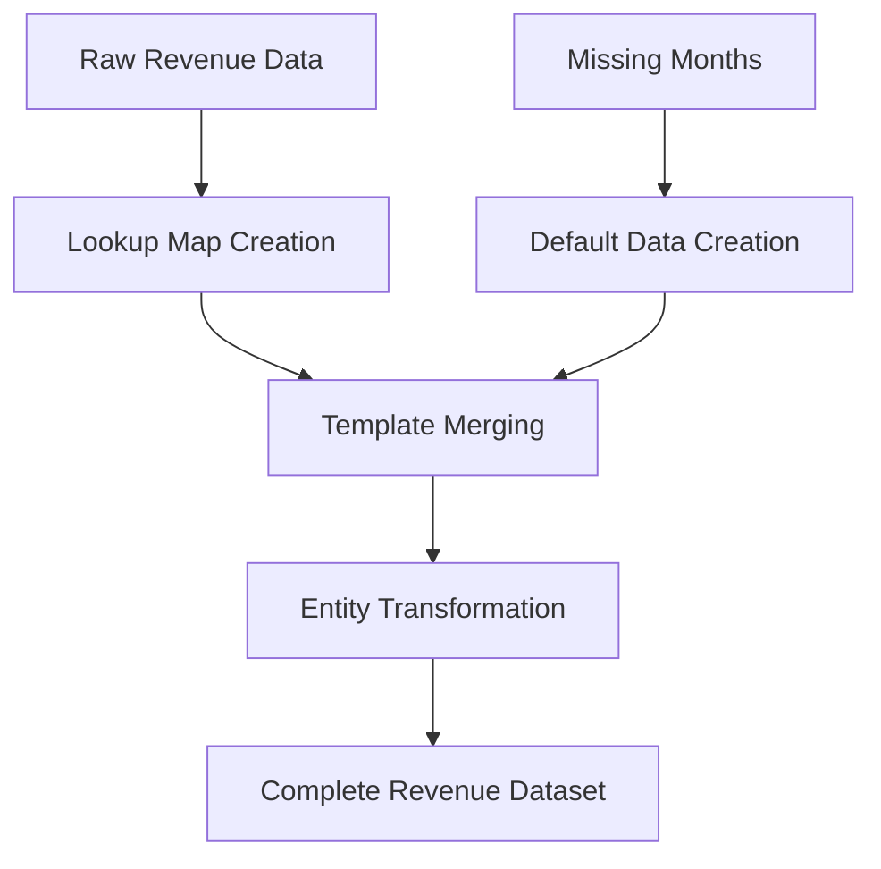

# Revenue Data Utilities

## Overview

The Data Utilities module provides a comprehensive set of functions for manipulating, transforming, and managing revenue data throughout the application. Built on principles of **type safety**, **performance optimization**, and **consistent data handling**, these utilities ensure reliable revenue calculations and reporting.

### Key Benefits
- **Consistent Data Structures**: Standardized entity creation and transformation
- **Efficient Data Lookup**: O(1) access to revenue data via optimized lookup maps
- **Complete Data Sets**: Template-based approach ensures no missing months in reports
- **Type Safety**: Strong TypeScript typing throughout the entire data pipeline

---

## 1. Core Utility Files


### b. **Lookup Utilities** (`lookup.utils.ts`)

The Lookup Utilities provide efficient data access patterns for revenue data through map-based lookups.

**Key Functions:**
- `createDataLookupMap()` - Creates an O(1) lookup map for revenue data indexed by year-month
- `generateLookupKey()` - Generates consistent lookup keys for year-month combinations

**Performance Characteristics:**
- Time Complexity: O(n) for map creation, O(1) for data retrieval
- Memory Complexity: O(n) where n is the number of revenue records

### c. **Revenue Data Utilities** (`revenue-data.utils.ts`)

The Revenue Data Utilities contain the core data manipulation functions used across the revenue feature.

**Key Functions:**
- `mergeDataWithTemplate()` - Ensures complete 12-month datasets by merging actual data with templates
- `createEmptyStatistics()` - Creates empty statistics objects when no revenue data exists

**Data Flow:**
These utilities form the backbone of the data transformation pipeline, ensuring that incomplete or missing data is properly handled with sensible defaults.

### d. **Template Utilities** (`template.utils.ts`)

The Template Utilities provide functions for creating and manipulating templates used to ensure complete data sets for revenue reporting.

**Key Functions:**
- `createDefaultMonthData()` - Creates default month data for months without revenue
- `createDefaultRevenueData()` - Creates default revenue display entities for specific periods
- `getMonthDataOrDefault()` - Retrieves existing data or creates defaults as needed
- `createMonthTemplateData()` - Creates month template data with validated month names

**Template Pattern:**
The template approach ensures that reports and visualizations always have a complete set of 12 months, even when actual data is sparse or missing.

---

## 2. Data Flow and Integration

The data utilities work together in a cohesive pipeline to transform raw revenue data into consistent, complete datasets:



### Typical Processing Flow:

1. Raw revenue data is retrieved from the database
2. `createDataLookupMap()` creates an efficient lookup structure
3. `mergeDataWithTemplate()` ensures all 12 months are represented
4. For missing months, `getMonthDataOrDefault()` creates default data
5. Entity transformations ensure consistent data structures
6. The complete dataset is used for calculations and visualization

---

## 3. Usage Examples

### Creating a Complete 12-Month Dataset

```typescript
import { mergeDataWithTemplate } from "@/features/revenues/utils/data/revenue-data.utils";
import { createMonthTemplateData } from "@/features/revenues/utils/data/template.utils";

// Create a 12-month template
const template = Array.from({ length: 12 }).map((_, index) => {
  const date = new Date(2025, index, 1);
  return createMonthTemplateData(index, date, index);
});

// Merge actual data with the template
const completeDataset = mergeDataWithTemplate(actualRevenueData, template);
```

### Creating Default Revenue Data

```typescript
import { createDefaultRevenueData } from "@/features/revenues/utils/data/template.utils";

// Create default data for a specific period
const defaultData = createDefaultRevenueData("2025-08");
```

### Efficient Data Lookup

```typescript
import { createDataLookupMap, generateLookupKey } from "@/features/revenues/utils/data/lookup.utils";

// Create a lookup map
const dataMap = createDataLookupMap(revenueData);

// Retrieve data for a specific period
const key = generateLookupKey(2025, 8);
const augustData = dataMap.get(key) || createDefaultRevenueData("2025-08");
```

---

## 4. Best Practices

### When Working with Revenue Data:

1. **Always use the utility functions** rather than creating entities manually
2. **Handle missing data** by using the template utilities
3. **Use lookup maps** for efficient data retrieval when processing multiple records
4. **Maintain type safety** by using the provided interfaces and types
5. **Follow the established patterns** for consistency across the application

---

## Related Documentation
- [Date Utilities Documentation](../date/README.md)
- [Display Utilities Documentation](../display/README.md)
- [Core Models Documentation](../../core/README.md)
- [Revenue Services Documentation](../../services/README.md)
