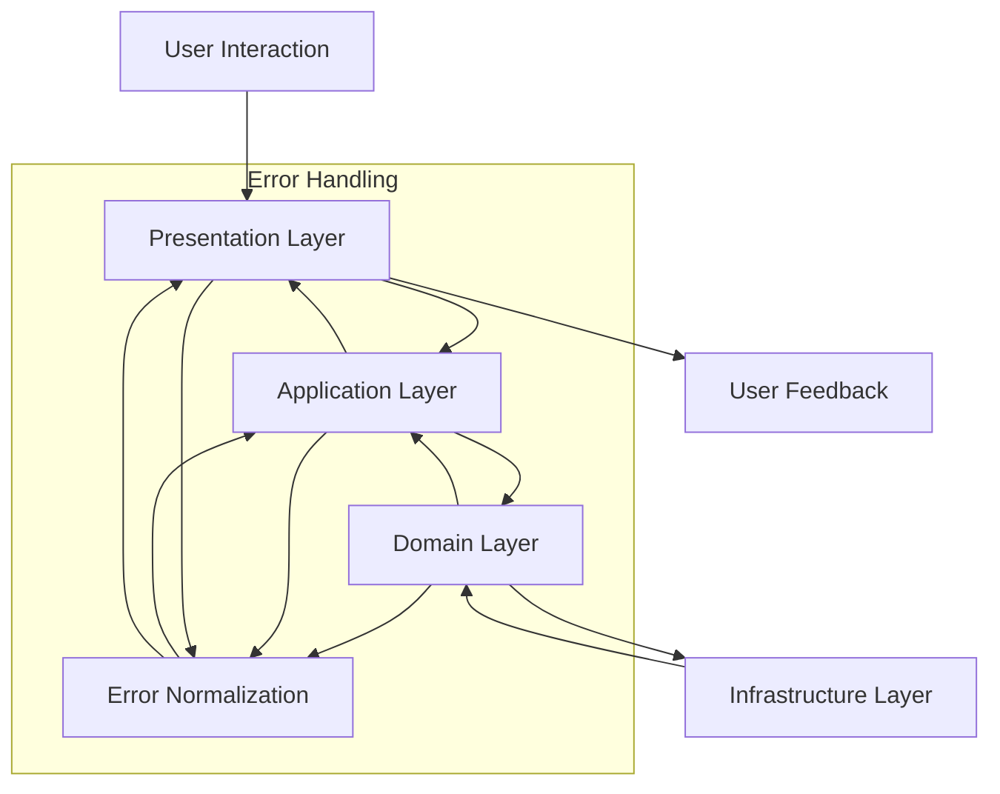
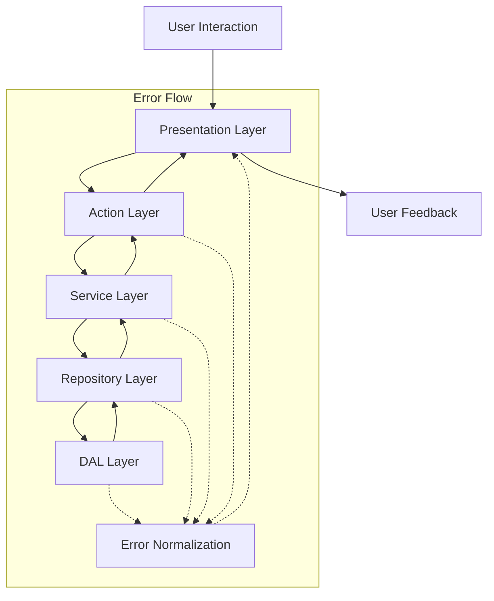

# Layer Flow Documentation

## About

This file documents the flow of data and control through the various layers of the application architecture. It serves
as a guide for developers to understand how different components interact and how to properly implement new features or
troubleshoot issues.

## Layers Overview

1. **Presentation Layer**: This is the topmost layer where user interactions occur. It includes UI components, forms,
   and any client-side logic.
2. **Application Layer**: This layer contains the business logic and orchestrates the flow of data between the
   presentation layer and the domain layer.
3. **Domain Layer**: This layer encapsulates the core business rules and domain entities. It is independent of other
   layers and focuses on the business logic.
4. **Infrastructure Layer**: This layer handles data persistence, external services, and other technical concerns. It
   provides implementations for repositories and services used by the domain layer.

Questions to Answer:

- Where does Action Layer belong?
- Where does Service Layer belong?
- Where does Repository Layer belong?
- Where does DAL Layer belong?

Answers:

- Action Layer: Typically part of the Application Layer, handling user actions and coordinating between the UI and
  business logic.
- Service Layer: Can be part of either the Application Layer or Infrastructure Layer, depending on its responsibilities.
- Repository Layer: Generally part of the Infrastructure Layer, managing data access and persistence.
- DAL Layer: Also part of the Infrastructure Layer, focusing on data access logic and database interactions.

Determine the responsibilities and interactions of each layer based on the specific architecture and design patterns
used in your application.

## Data Flow

Data flows through the layers in a structured manner:

1. User interacts with the **Presentation Layer** (e.g., submits a form).
2. The **Application Layer** processes the input, applies business rules, and coordinates with the **Domain Layer**.
3. The **Domain Layer** executes core business logic and may interact with the **Infrastructure Layer** for data access.
4. The **Infrastructure Layer** performs necessary operations (e.g., database queries) and returns results to the
   **Domain Layer**.
5. The **Domain Layer** returns processed data to the **Application Layer**, which then updates the **Presentation Layer
   **.
6. The **Presentation Layer** reflects the changes to the user (e.g., displays success or error messages).
7. Errors are handled at each layer, with normalization and mapping to ensure safe and consistent error reporting.
8. Errors are propagated back through the layers, ensuring that they are appropriately logged and communicated to the
   user
   without exposing sensitive information.
9. Use discriminated unions for result types to clearly indicate success or failure at each layer.
10. Normalize errors to a common shape (e.g., `AppError`) before surfacing them to the user interface.

create diagram for the data flow above

