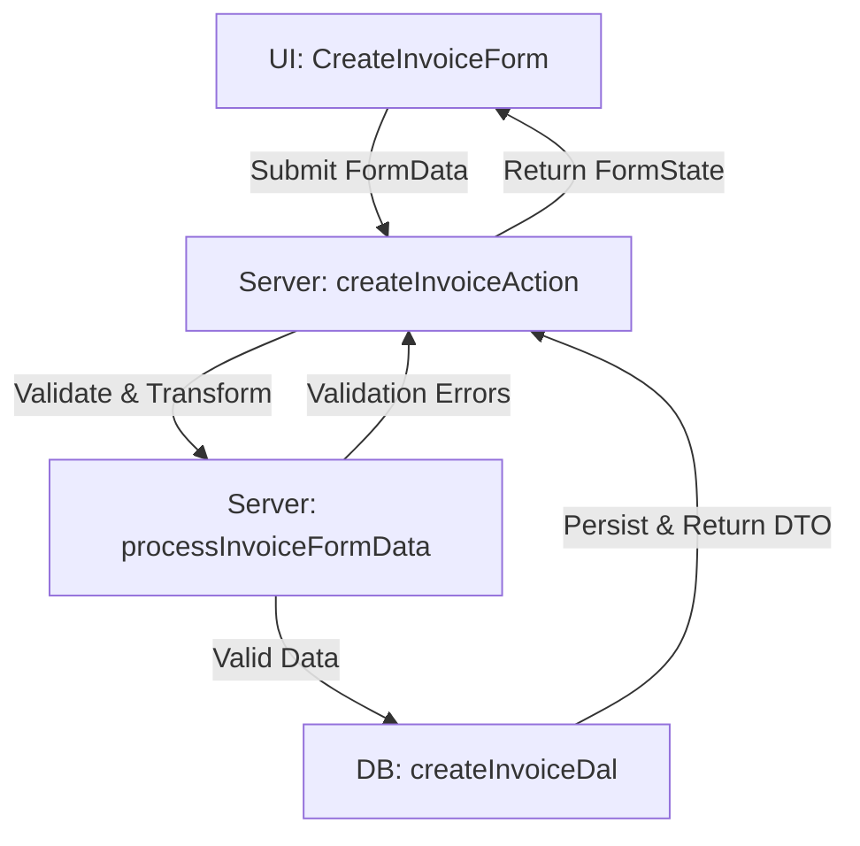

# Invoice Creation Guide

This document explains the end-to-end process for creating invoices in the project, covering type safety, error handling, form validation, and the separation of concerns across UI, server, and database layers.

---

## Table of Contents

- Overview
- UI Layer
- Server Layer
- Database Layer
- Type Safety
- Error Handling
- Form Validation
- Data Flow Diagram

---

## Overview

Invoice creation is a multi-step process involving:

1. **UI Form Submission**: User fills out and submits the invoice form.
2. **Server Validation & Transformation**: Server validates and transforms the input.
3. **Database Persistence**: Validated data is saved to the database.
4. **Error Handling**: Errors are propagated back to the UI for user feedback.

---

## UI Layer

- **Component**: `CreateInvoiceForm`
- **Type**: Uses `InvoiceFormStateCreate` for form state.
- **Error Display**: Field-level errors are shown next to inputs; general messages are shown above the form.
- **Form Submission**: Uses `useActionState` to call `createInvoiceAction`.

### Example State

```typescript
type InvoiceFormStateCreate = {
  data?: { amount: number; customerId: string; status: "pending" | "paid" };
  errors: Partial<
    Record<"amount" | "customerId" | "status", string[] | undefined>
  >;
  message: string;
  success: boolean;
};
```

---

## Server Layer

- **Action**: `createInvoiceAction`
- **Validation**: Calls `processInvoiceFormData` to validate and transform input.
- **Error Propagation**: Returns errors and messages in the same shape as `InvoiceFormStateCreate`.
- **Type Safety**: All data is strictly typed and branded before database insertion.

### Error Handling

- Validation errors are returned as a map of field names to error arrays.
- Transformation or database errors return a general message and empty error map.

---

## Database Layer

- **DAL Function**: `createInvoiceDal`
- **Type**: Accepts branded types for domain safety.
- **Persistence**: Inserts validated invoice data and returns a DTO for the UI.

---

## Type Safety

- **Types & Interfaces**: All layers use strict TypeScript types and interfaces.
- **Branding**: Domain-specific types (e.g., `CustomerId`, `InvoiceStatus`) prevent accidental misuse.
- **DTOs**: Only plain types are exposed to the UI.

---

## Error Handling

- **Field Errors**: Mapped as `FormErrors<TFieldNames>`, only present for fields with errors.
- **General Errors**: Provided as a message string for display above the form.
- **Success State**: `success: boolean` indicates operation result.

---

## Form Validation

- **Schema**: Uses Zod schemas for runtime validation.
- **Error Mapping**: Only allowed field names are included in error maps.
- **Transformation**: Input is sanitized and converted (e.g., amount to cents, date to ISO string).

---

## Data Flow Diagram



---

## Summary

- **Type Safety**: Enforced at every layer using TypeScript and branded types.
- **Error Handling**: Consistent error maps and messages for UI feedback.
- **Validation**: Zod schemas and domain logic ensure data integrity.
- **Separation of Concerns**: UI, server, and database logic are clearly separated for maintainability and scalability.

---

For further details, see the source files:

- `src/ui/invoices/create-invoice-form.tsx`
- `src/features/invoices/invoice.actions.ts`
- `src/features/invoices/invoice.utils.ts`
- `src/features/invoices/invoice.dal.ts`
- `src/lib/forms/form-validation.ts`
- `src/features/invoices/invoice.types.ts`
