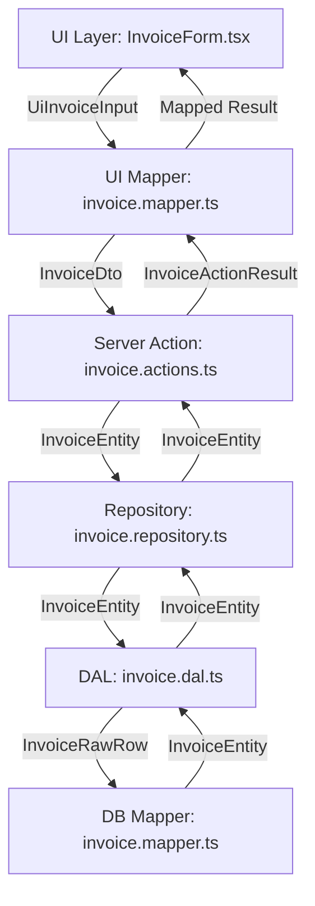
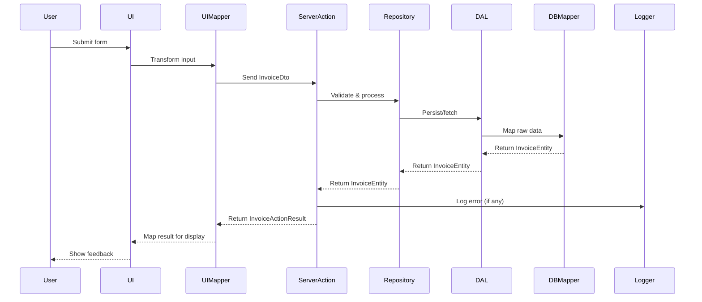

Here is a unified, comprehensive, and improved `README.md` for your invoice feature. This document consolidates all previous strategies, fixes inconsistencies, and provides a prescriptive, actionable, and maintainable architecture for a high-traffic, secure, and accessible Next.js application using TypeScript.

---

# Invoice Feature: Unified Architecture & Implementation Guide

> **Status:** Up-to-date as of 2024-06  
> This document is the single source of truth for the invoice feature’s architecture, type safety, server code, error handling, security, accessibility, and testing.

---

## Table of Contents

- Overview
- Layered Architecture & Responsibilities
- Data Flow & Type Safety
- Server Code Implementation Plan
- Error Handling & Logging
- Security & Validation
- Performance & Scalability
- Accessibility & Internationalization
- Testing & Documentation
- Visual Diagrams
- File Reference
- Summary

---

## Overview

This feature uses a strict, neighbor-only layered architecture. Each layer has a single responsibility and communicates only with its immediate neighbor, ensuring separation of concerns, maintainability, and scalability. All code is written in TypeScript with strict typing, branded types, and comprehensive validation.

---

## Layered Architecture & Responsibilities

| Layer         | Responsibility                                                                                    | Example File/Module       |
| ------------- | ------------------------------------------------------------------------------------------------- | ------------------------- |
| UI            | Renders forms, collects user input, displays feedback, ensures accessibility and localization.    | `create-invoice-form.tsx` |
| UI Mapper     | Transforms UI input to DTOs, maps server results to UI state.                                     | `invoice.mapper.ts`       |
| Server Action | Receives DTOs, validates, orchestrates business logic, returns uniform result.                    | `invoice.actions.ts`      |
| Repository    | Abstracts data access, enforces domain rules, coordinates with DAL, manages transactions/caching. | `invoice.repository.ts`   |
| DAL           | Direct database/cache access, error logging, low-level data operations.                           | `invoice.dal.ts`          |
| DB Mapper     | Maps raw DB rows to domain entities and vice versa, enforces invariants.                          | `invoice.mapper.ts`       |
| Database      | Stores and retrieves raw data, no business logic.                                                 | (DB schema)               |

**Strict Rule:**  
Each layer only communicates with its direct neighbor. No layer may skip another.

---

## Data Flow & Type Safety

- **Strict TypeScript:** All data structures use explicit interfaces/types.
- **DTOs:** Used for transport between layers.
- **Branded Types:** Used for domain safety (e.g., `InvoiceId`, `CustomerId`).
- **Immutability:** Use `readonly` and immutable types.
- **Type Guards:** Used at boundaries.

### Data Flow Example

1. UI → UI Mapper: `UiInvoiceInput`
2. UI Mapper → Server Action: `InvoiceDto`
3. Server Action → Repository: `InvoiceEntity`
4. Repository → DAL: `InvoiceEntity`
5. DAL → DB Mapper: `InvoiceRawRow`
6. DB Mapper → DAL: `InvoiceEntity`
7. DAL → Repository: `InvoiceEntity`
8. Repository → Server Action: `InvoiceEntity`
9. Server Action → UI Mapper: `InvoiceActionResult`
10. UI Mapper → UI: mapped result

### Data Shape Table

| Layer         | Data Sent      | Data Received       |
| ------------- | -------------- | ------------------- |
| UI            | UiInvoiceInput | Mapped UI result    |
| UI Mapper     | InvoiceDto     | InvoiceActionResult |
| Server Action | InvoiceDto     | InvoiceEntity       |
| Repository    | InvoiceEntity  | InvoiceRawRow       |
| DB Mapper     | InvoiceRawRow  | InvoiceEntity       |

---

## Server Code Implementation Plan

### 1. File Structure

```
src/features/invoices/
  ├── invoice.actions.ts      // Server actions (entry point for server logic)
  ├── invoice.repository.ts   // Repository (business logic, data access abstraction)
  ├── invoice.dal.ts         // DAL (raw DB access)
  ├── invoice.mapper.ts      // Mappers (UI and DB)
  ├── invoice.types.ts       // All types, interfaces, branded types
  ├── invoice.schemas.ts     // Zod schemas for validation
  └── README.md              // This documentation
```

### 2. Type Definitions

- Define all types and branded types in `invoice.types.ts`.
- Use `interface` for object shapes, `type` for unions/intersections.
- Document all types with TSDoc.
- Example:

```typescript
/**
 * Domain model for Invoice.
 * Used for database and server logic.
 * All fields are strictly typed and immutable.
 */
export interface InvoiceEntity {
  /** Invoice amount in cents */
  readonly amount: number;
  /** Customer ID (branded) */
  readonly customerId: CustomerId;
  /** Invoice date as ISO 8601 string (YYYY-MM-DD) */
  readonly date: string;
  /** Invoice ID (branded) */
  readonly id: InvoiceId;
  /** Sensitive data (internal use only) */
  readonly sensitiveData: string;
  /** Invoice status (branded) */
  readonly status: InvoiceStatus;
}
```

### 3. Validation

- Use Zod schemas in `invoice.schemas.ts` for all user input and DTO validation.
- Validate at every boundary: UI Mapper, Server Action, Repository, DAL.
- Example:

```typescript
import { z } from "zod";

/**
 * Zod schema for invoice input validation.
 */
export const invoiceInputSchema = z.object({
  amount: z.number().positive(),
  description: z.string().min(1).max(255),
  dueDate: z.string().refine((date) => !isNaN(Date.parse(date)), {
    message: "Invalid date format",
  }),
});
```

### 4. Server Actions (`invoice.actions.ts`)

- Receive only DTOs from UI Mapper.
- Validate input using Zod.
- Call repository methods.
- Return a uniform result type (`InvoiceActionResult`).
- Never interact with DAL or DB Mapper directly.

### 5. Repository (`invoice.repository.ts`)

- Accept only domain entities or branded types.
- Call DAL methods.
- Handle business/domain rules.
- Map DAL results to domain entities using DB Mapper.
- Never expose raw DB rows or DAL details to server actions.

### 6. DAL (`invoice.dal.ts`)

- Only interacts with the database.
- Accepts/returns only domain entities or raw DB rows.
- Uses DB Mapper for all transformations.
- Handles low-level errors and logging.

### 7. DB Mapper (`invoice.mapper.ts`)

- Maps raw DB rows to domain entities and vice versa.
- Enforces type safety and invariants.
- Never called directly by server actions or UI.

### 8. Error Handling

- Use structured error objects and logging at each layer.
- Never leak sensitive data.
- All errors propagate up as uniform result types.

### 9. Testing

- Mock repository and DAL in unit tests.
- Use integration tests for DAL and repository.
- Use Cypress for E2E and accessibility.

---

## Error Handling & Logging

- Use structured logging (JSON) with context at every layer.
- Use global error boundaries in React for UI errors.
- Never expose sensitive data in logs or error messages.
- Centralize error handling in middleware/server actions.
- Example:

```typescript
import { Logger } from "tslog";

/**
 * Application-wide structured logger.
 */
export const appLogger = new Logger({
  name: "nextjs-app",
  type: "json",
  minLevel: "info",
});
```

---

## Security & Validation

- Validate and sanitize all user input at every boundary.
- Use branded types for all IDs and sensitive fields.
- Store secrets in environment variables.
- Follow OWASP best practices.
- Never commit secrets or sensitive data to version control.

---

## Performance & Scalability

- Use Redis for hot data, CDN for static assets.
- Use connection pooling for DB and cache.
- Use Next.js SSR/ISR/SSG for optimal rendering.
- Monitor and optimize bundle size and server response times.
- Use APM tools (Datadog, New Relic).
- Support horizontal scaling with containers and load balancers.

---

## Accessibility & Internationalization

- All UI meets WCAG 2.1 AA accessibility standards.
- Use semantic HTML and ARIA attributes.
- Support localization with i18n libraries (e.g., next-i18next).
- Ensure all actions are accessible via keyboard navigation.

---

## Testing & Documentation

- Use Cypress for E2E/component tests.
- Mock repositories/DAL in unit tests.
- Achieve high code coverage and meaningful test cases.
- Document all files, types, and functions with TSDoc.
- Keep this README and usage guides up to date.

---

## Visual Diagrams

### Layered Architecture Flow



### Error Handling Flow



---

## File Reference

- `src/ui/invoices/create-invoice-form.tsx`: UI form component.
- `src/features/invoices/invoice.actions.ts`: Server actions for CRUD.
- `src/features/invoices/invoice.repository.ts`: Repository implementation.
- `src/features/invoices/invoice.dal.ts`: Data access layer.
- `src/features/invoices/invoice.mapper.ts`: Mapper functions for DTO/entity/raw.
- `src/features/invoices/invoice.types.ts`: Types, interfaces, and schemas.
- `src/features/invoices/invoice.schemas.ts`: Zod schemas for validation.

---

## Summary

- **Strict layering:** Each layer only communicates with its direct neighbor.
- **Type safety:** Enforced at every boundary using TypeScript and branded types.
- **Validation:** Zod schemas and domain logic at every layer.
- **Error handling:** Uniform result types and structured logging.
- **Security:** Input validation, branded types, and environment-based secrets.
- **Performance:** Caching, pooling, and monitoring for scalability.
- **Accessibility:** WCAG 2.1 AA compliance and i18n support.
- **Testing:** Unit, integration, and E2E coverage.
- **Documentation:** All code and types documented with TSDoc.

---

> For further details, see TSDoc comments in each referenced file and the visual diagrams above. This README is the canonical reference for the invoice feature’s architecture and implementation.

---

Your `README.md` is comprehensive and well-structured, but for maximum clarity, maintainability, and onboarding efficiency, consider including the following additional sections or details:

1. **Environment Setup & Prerequisites**
   - List required Node.js, npm, and database versions.
   - Mention any required environment variables and how to configure them (without exposing secrets).

2. **Installation & Local Development**
   - Step-by-step instructions for installing dependencies, running migrations, and starting the dev server.
   - How to run tests (unit, integration, E2E).

3. **Deployment & CI/CD**
   - Briefly describe the deployment process and any CI/CD pipelines.
   - Mention how secrets are managed in production.

4. **API Documentation**
   - If you have public or internal APIs, link to OpenAPI/Swagger docs or describe endpoints, request/response shapes, and authentication.

5. **Contribution Guidelines**
   - How to propose changes, coding standards, PR review process, and commit message conventions.

6. **Known Issues & Troubleshooting**
   - Common pitfalls, error messages, and how to resolve them.

7. **Changelog or Release Notes**
   - Link to a `CHANGELOG.md` or describe how releases are tracked.

8. **Contact & Support**
   - Who to contact for questions, or where to file issues.

Including these sections will make your `README.md` even more robust and helpful for new contributors and future maintainers.

---

## Questions

---

### Question 1

Error Handling Flow Diagram shows that all errors in the `Server Action` layer are sent to the `Logger`. Am I right to assume that errors in the `User` layer, `UI`, and `UI Mapper` layers are handled being returned to the user as part of the `InvoiceActionResult`? If so, how are these errors structured? When using `"exactOptionalPropertyTypes": true` in `tsconfig.json`, how do you handle optional properties in the `InvoiceActionResult`? Specifically, form field errors are the most troublesome. I need a strategy to handle these errors in a type-safe way, ensuring that the UI can display them correctly without compromising type safety.

### Answer 1

You are correct: errors in the `UI`, `UI Mapper`, and `User` layers should be returned to the user as part of the `InvoiceActionResult`. With `"exactOptionalPropertyTypes": true`, you must be explicit about when a property is present, absent, or intentionally `undefined`. This is especially important for form field errors.

**Recommended Strategy:**

1. **Define a precise error map type for form fields.**
2. **In `InvoiceActionResult`, make `errors` an explicit optional property, and always use `undefined` (not missing) when there are no errors.**
3. **In the UI, always check for property existence before accessing.**

**Example Types:**

```typescript
// src/features/invoices/invoice.types.ts

/**
 * Map of field names to error messages for form validation.
 */
export interface InvoiceErrorMap {
  readonly [field: string]: string | undefined;
}

/**
 * Uniform result shape for all invoice actions.
 * With exactOptionalPropertyTypes, properties are only present if set.
 */
export interface InvoiceActionResult {
  readonly data?: InvoiceDto | null;
  readonly errors?: InvoiceErrorMap; // present only if there are errors
  readonly message?: string;
  readonly success: boolean;
}
```

**How to Use in Server Action:**

```typescript
// src/features/invoices/invoice.actions.ts

export async function createInvoiceAction(
  dto: InvoiceDto
): Promise<InvoiceActionResult> {
  const validation = invoiceInputSchema.safeParse(dto);
  if (!validation.success) {
    // Build error map from Zod errors
    const errors: InvoiceErrorMap = {};
    for (const issue of validation.error.issues) {
      if (issue.path.length > 0) {
        errors[issue.path[0] as string] = issue.message;
      }
    }
    return {
      success: false,
      errors, // present only if there are errors
      message: "Validation failed",
    };
  }
  // ... normal processing
  return {
    success: true,
    data: /* ... */,
  };
}
```

**UI Handling Example:**

```typescript
// src/ui/invoices/create-invoice-form.tsx

if (result.errors?.amount) {
  // Show error for amount field
}
```

**Key Points:**

- Only include `errors` in `InvoiceActionResult` if there are actual errors.
- Never set `errors: undefined` explicitly; omit the property if no errors.
- In the UI, always use optional chaining (`result.errors?.fieldName`) to safely access errors.
- This approach is fully type-safe and compatible with `exactOptionalPropertyTypes`.

**Summary Table:**

| Property  | When Present?               | How to Check in UI         |
| --------- | --------------------------- | -------------------------- |
| `errors`  | Only if there are errors    | `result.errors?.fieldName` |
| `data`    | Only if success             | `result.data`              |
| `message` | Optional, for user feedback | `result.message`           |

This ensures robust, type-safe error handling and clear UI feedback.

---
