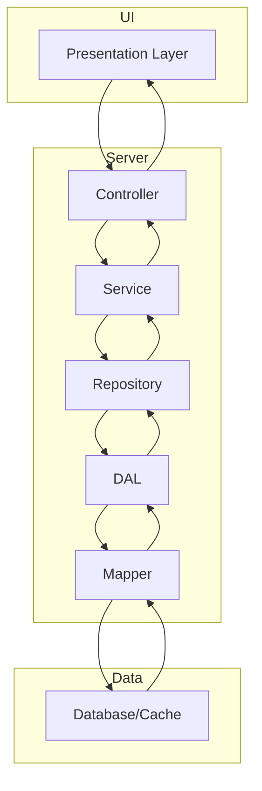
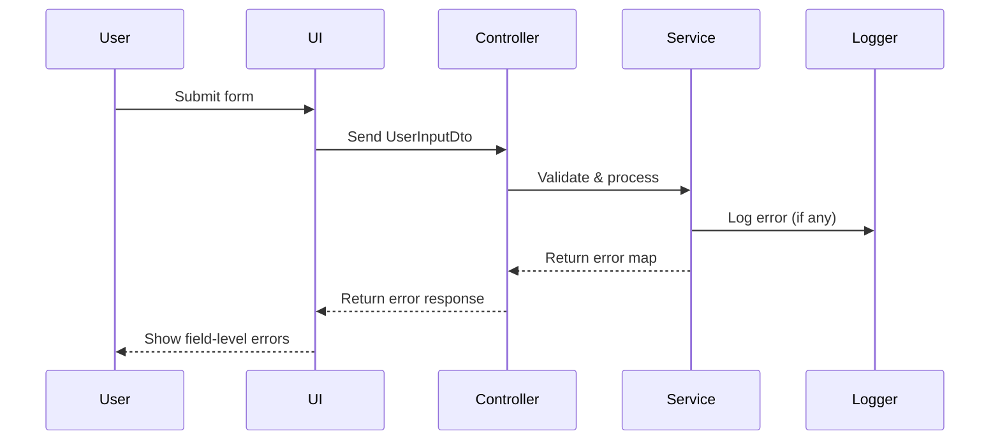

Here is a detailed, verbose strategy for a layered architecture in a high-traffic Next.js app, including expanded responsibilities, data flow, error handling, security, performance, accessibility, and testing. Visuals are provided for clarity.

---

# Next.js Layered Architecture Strategy for High-Traffic Apps

## Table of Contents

- Overview
- Layered Architecture & Expanded Responsibilities
- Data Flow & Type Safety
- Layer Responsibilities Table
- Error Handling & Logging
- Security & Validation
- Performance & Scalability
- Accessibility & Internationalization
- Testing & Documentation
- Visual Flow Diagrams
- Final Recommendations

---

## Overview

This strategy defines a robust, scalable, and maintainable layered architecture for a Next.js app expected to serve 10 million+ users daily.  
Each layer is strictly separated, with clear responsibilities, input/output types, and communication boundaries.  
All code is written in TypeScript with strict typing, security, accessibility, and performance in mind.

---

## Layered Architecture & Expanded Responsibilities

| Layer          | Responsibility                                                                                               | Example Technologies/Patterns               |
| -------------- | ------------------------------------------------------------------------------------------------------------ | ------------------------------------------- |
| Presentation   | Renders UI, handles user input, accessibility, localization, triggers actions, displays feedback/errors.     | React, Next.js Pages/Components, i18n, ARIA |
| Controller     | Receives UI events, orchestrates business logic, manages session/auth, error boundaries, request validation. | API Routes, Server Actions, Middleware      |
| Service        | Implements business/domain logic, validation, transformation, aggregates data, enforces business rules.      | Service Classes, Domain Services, Zod       |
| Repository     | Abstracts data access, enforces domain rules, coordinates with DAL, caches, manages transactions.            | Repository Pattern, DataLoader, Redis       |
| DAL            | Direct database/cache access, error logging, low-level data operations, connection pooling.                  | Prisma, TypeORM, Knex, Redis, MongoDB       |
| Mapper         | Maps raw data to domain entities and vice versa, ensures type safety, transforms between DTOs and entities.  | Mapper Functions, DTO Classes               |
| Database/Cache | Stores and retrieves raw data, no business logic, supports scaling, backup, and disaster recovery.           | PostgreSQL, MySQL, MongoDB, Redis, CDN      |

---

## Data Flow & Type Safety

- **Strict TypeScript:** All data structures use explicit interfaces/types.
- **DTOs:** Data Transfer Objects for communication between layers.
- **Branded Types:** For domain safety (e.g., `UserIdBrand`).
- **Immutability:** Use `readonly` and immutable types where possible.
- **Type Guards:** Narrow types and validate at boundaries.

**Example Data Flow:**

1. **User submits form** → `UserInputDto`
2. **Controller validates input** → passes to Service
3. **Service applies business logic** → returns `ServiceResultDto`
4. **Repository fetches/updates data** → returns `DomainDto`
5. **DAL interacts with DB/cache** → returns `RawEntity`
6. **Mapper transforms raw data** → returns `DomainEntity`
7. **Database/Cache stores/retrieves** → returns `RawRow`

---

## Layer Responsibilities Table

| Layer          | Input Type           | Output Type         | Example File/Module           |
| -------------- | -------------------- | ------------------- | ----------------------------- |
| Presentation   | AppResponseDto       | UserInputDto        | `components/InvoiceForm.tsx`  |
| Controller     | UserInputDto         | ControllerResultDto | `pages/api/invoice.ts`        |
| Service        | ServiceRequestDto    | ServiceResultDto    | `services/invoiceService.ts`  |
| Repository     | DomainModel          | DomainDto or null   | `repositories/invoiceRepo.ts` |
| DAL            | DomainDto or IdBrand | RawEntity or null   | `dal/invoiceDal.ts`           |
| Mapper         | RawRow               | DomainEntity        | `mappers/invoiceMapper.ts`    |
| Database/Cache | SQL/NoSQL Query      | RawRow              | `db/index.ts`                 |

---

## Error Handling & Logging

- **Global Error Boundaries:** Use React `ErrorBoundary` for UI errors.
- **Structured Logging:** Log errors in JSON with context (user, request, stack).
- **Field-Level Validation:** Return error maps for invalid fields.
- **Never Leak Sensitive Data:** Only show generic error messages to users.
- **Centralized Error Handling:** Use middleware for API/server errors.

**Example Error Logging:**

```typescript
// services/loggerService.ts
import { Logger } from "tslog";

/**
 * Application-wide structured logger.
 */
export const appLogger = new Logger({
  name: "nextjs-app",
  type: "json",
  minLevel: "info",
});
```

---

## Security & Validation

- **Input Validation:** Use Zod schemas for all user input.
- **Sanitization:** Clean all data before processing.
- **Authentication/Authorization:** Use JWT, OAuth, or NextAuth.
- **Environment Variables:** Store secrets securely, never commit.
- **OWASP Compliance:** Prevent XSS, CSRF, SQL Injection, etc.
- **Branded Types:** Prevent misuse of sensitive IDs.

**Example Validation:**

```typescript
// schemas/invoiceInputSchema.ts
import { z } from "zod";

/**
 * Zod schema for invoice input validation.
 */
export const invoiceInputSchema = z.object({
  amount: z.number().positive(),
  description: z.string().min(1).max(255),
  dueDate: z.string().refine((date) => !isNaN(Date.parse(date)), {
    message: "Invalid date format",
  }),
});
```

---

## Performance & Scalability

- **Caching:** Use Redis for hot data, CDN for static assets.
- **Connection Pooling:** For DB and cache.
- **SSR/ISR/SSG:** Use Next.js features for optimal rendering.
- **Bundle Optimization:** Analyze and reduce bundle size.
- **Monitoring:** Use APM tools (Datadog, New Relic).
- **Horizontal Scaling:** Use containers, load balancers.

**Example Caching:**

```typescript
// services/cacheService.ts
import Redis from "ioredis";

const redisClient = new Redis(process.env.REDIS_URL);

/**
 * Get cached invoice by ID.
 */
export async function getInvoiceCache(id: string): Promise<InvoiceDto | null> {
  const cached = await redisClient.get(`invoice:${id}`);
  return cached ? JSON.parse(cached) : null;
}
```

---

## Accessibility & Internationalization

- **WCAG 2.1 AA:** All UI meets accessibility standards.
- **Semantic HTML:** Use correct tags, ARIA attributes.
- **Localization:** Use i18n libraries (next-i18next).
- **Keyboard Navigation:** Ensure all actions are accessible.

**Example Accessible Button:**

```tsx
// components/AccessibleButton.tsx
import React from "react";

/**
 * Accessible button component.
 */
export const AccessibleButton: React.FC<
  React.ButtonHTMLAttributes<HTMLButtonElement>
> = ({ children, ...props }) => (
  <button {...props} aria-label={props["aria-label"] || "Action"}>
    {children}
  </button>
);
```

---

## Testing & Documentation

- **E2E Testing:** Use Cypress for flows and accessibility.
- **Unit Testing:** Mock repositories/DAL, test services/controllers.
- **TSDoc:** Document all types, functions, and components.
- **README:** Keep usage and architecture guides up to date.

**Example TSDoc:**

```typescript
/**
 * Maps raw invoice row to domain entity.
 * @param row - Raw database row.
 * @returns Invoice domain entity.
 */
export function mapRawRowToInvoiceEntity(row: RawRow): InvoiceEntity { ... }
```

---

## Visual Flow Diagrams

### Layered Architecture Flow



### Error Handling Flow



---

## Final Recommendations

- **Scaffold each layer as a separate module/directory.**
- **Enforce strict one-to-one communication between layers.**
- **Use DTOs and branded types for all data transfer.**
- **Centralize error handling and logging.**
- **Sanitize and validate all user input.**
- **Optimize for performance and scalability.**
- **Ensure accessibility and localization.**
- **Test thoroughly and document all code.**
- **Monitor, scale, and secure the app continuously.**

---

This strategy provides a comprehensive, detailed blueprint for building a secure, maintainable, and scalable Next.js app for massive user traffic.
