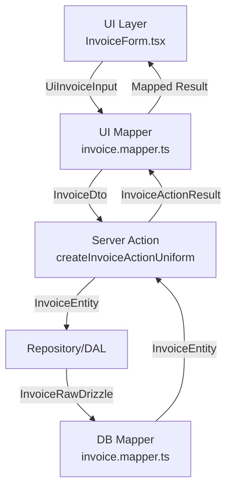

Here is a detailed documentation of each layer in your invoice creation architecture, including data shapes and visual diagrams.

---

# Invoice Creation Layered Architecture

## Overview

This architecture enforces separation of concerns, strict typing, and maintainability. Each layer transforms and validates data, ensuring robust and secure flow from UI to database.

---

## Layer Map



---

## Layer Details

### 1. UI Layer

- **File:** `InvoiceForm.tsx`
- **Responsibility:** Renders form, collects user input, manages state.
- **Data Sent:**
  ```typescript
  interface UiInvoiceInput {
    amount: number; // e.g., 123.45
    customerId: string;
    status: string; // e.g., "pending"
  }
  ```
- **Data Received:**
  - Mapped result for UI display (success/error, invoice summary).

---

### 2. UI Mapper

- **File:** `invoice.mapper.ts`
- **Responsibility:** Transforms UI input to DTO, maps server results to UI state.
- **Data Sent:**
  ```typescript
  type InvoiceDto = {
    amount: number; // in cents, e.g., 12345
    customerId: string;
    date: string; // YYYY-MM-DD
    status: string;
    id?: string;
  };
  ```
- **Data Received:**
  - Server action result, mapped to UI-friendly format.

---

### 3. Server Action

- **File:** `createInvoiceActionUniform.ts`
- **Responsibility:** Validates, orchestrates, and processes invoice creation.
- **Data Sent:**
  - Receives `InvoiceDto` (from UI Mapper).
- **Data Received:**
  - Returns `InvoiceEntity` or `InvoiceActionResult`.

---

### 4. Repository / DAL

- **File:** `invoice.repository.ts`
- **Responsibility:** Business logic, data access, domain rules.
- **Data Sent:**
  ```typescript
  interface InvoiceEntity {
    amount: number;
    customerId: CustomerIdBrand;
    date: string;
    id: InvoiceIdBrand;
    sensitiveData: string;
    status: InvoiceStatusBrand;
  }
  ```
- **Data Received:**
  - Raw DB row (`InvoiceRawDrizzle`).

---

### 5. DB Mapper

- **File:** `invoice.mapper.ts`
- **Responsibility:** Maps raw DB rows to domain entities, enforces invariants.
- **Data Sent:**
  ```typescript
  interface InvoiceRawDrizzle {
    amount: number;
    customerId: string;
    date: string;
    id: string;
    sensitiveData: string;
    status: string;
  }
  ```
- **Data Received:**
  - Returns `InvoiceEntity`.

---

## Data Shape Summary Table

| Layer         | Data Sent         | Data Received       |
| ------------- | ----------------- | ------------------- |
| UI            | UiInvoiceInput    | Mapped UI result    |
| UI Mapper     | InvoiceDto        | InvoiceActionResult |
| Server Action | InvoiceDto        | InvoiceEntity       |
| Repository    | InvoiceEntity     | InvoiceRawDrizzle   |
| DB Mapper     | InvoiceRawDrizzle | InvoiceEntity       |

---

## Validation & Transformation Points

- **UI Layer:** Basic input validation (required fields, format).
- **UI Mapper:** Strict transformation, input sanitization, conversion (e.g., amount to cents).
- **Server Action:** Business logic validation, authorization.
- **Repository/DAL:** Domain rules, data integrity.
- **DB Mapper:** Enforces domain invariants, type branding.

---

## Architectural Benefits

- **Separation of concerns:** Each layer has a single responsibility.
- **Strict typing:** Prevents runtime errors, improves maintainability.
- **Scalability:** Easy to extend or refactor layers independently.
- **Security:** Validates and sanitizes data at every boundary.

---

**Visual Reference:**

- Use the Mermaid diagram above to trace data flow and transformations.
- Refer to the table for quick data shape lookup.

---

**All types and interfaces should be documented with TSDoc in their respective files.**

The UI layer connects to the UI Mapper by passing form data (`UiInvoiceInput`) to a mapping function, which transforms it into a DTO and handles the server response.  
Here’s a TypeScript example showing this connection in a React component:

```typescript
import { useActionState } from 'react'; // Example import, adjust as needed
import { uiInvoiceMapper } from '../mappers/invoice.mapper'; // UI Mapper import

/**
 * Props for InvoiceForm component.
 */
interface InvoiceFormProps {
  initialState: UiInvoiceInput;
}

/**
 * UI-specific input type for invoice creation.
 */
interface UiInvoiceInput {
  amount: number;
  customerId: string;
  status: string;
}

/**
 * Mapped result type for UI display.
 */
interface MappedResult {
  success: boolean;
  invoiceSummary?: {
    id: string;
    amount: number;
    status: string;
  };
  error?: string;
}

/**
 * InvoiceForm component connects UI layer to UI Mapper.
 */
export const InvoiceForm: React.FC<InvoiceFormProps> = ({ initialState }) => {
  const [state, dispatch] = useActionState<MappedResult, UiInvoiceInput>(uiInvoiceMapper, initialState);

  const handleSubmit = (formData: UiInvoiceInput) => {
    dispatch(formData);
  };

  return (
    <form onSubmit={e => { e.preventDefault(); handleSubmit(state); }}>
      {/* Form fields for amount, customerId, status */}
      {/* Display state.invoiceSummary or state.error */}
    </form>
  );
};
```

**Explanation:**

- The UI layer (`InvoiceForm`) collects user input and passes it to `uiInvoiceMapper`.
- `uiInvoiceMapper` transforms the input and returns a mapped result for UI display.
- This enforces separation of concerns and strict typing between layers.
