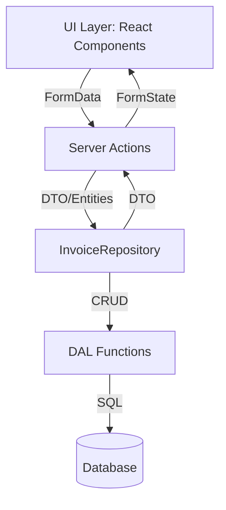

# Invoice Repository Pattern Documentation

## Overview

The repository pattern abstracts and centralizes all data access logic for the Invoice domain. It provides a clean, type-safe API for CRUD operations, decoupling business logic from database implementation. This approach improves maintainability, testability, and scalability.

---

## Architectural Diagram



---

## Key Benefits

- **Separation of Concerns**: UI, server actions, repository, and DAL are clearly separated.
- **Type Safety**: All operations use strict TypeScript types and branded domain types.
- **Error Handling**: Consistent error logging and propagation.
- **Testability**: Repository can be easily mocked for unit and integration tests.
- **Scalability**: Centralized logic simplifies future enhancements (e.g., caching, batching).

---

## Repository Interface

### `IRepository`

```typescript
/**
 * Generic repository interface for CRUD operations.
 * @template TEntity - Entity type.
 * @template TCreate - DTO for creation.
 * @template TUpdate - DTO for update.
 * @template TId - Entity ID type.
 */
export interface IRepository<TEntity, TCreate, TUpdate, TId> {
  create(data: TCreate): Promise<TEntity | null>;
  read(id: TId): Promise<TEntity | null>;
  update(id: TId, data: TUpdate): Promise<TEntity | null>;
  delete(id: TId): Promise<TEntity | null>;
  list(query?: string, page?: number): Promise<TEntity[]>;
}
```

- **Generics** ensure flexibility and strict typing for any domain entity.
- **CRUD Methods**: Each method returns a Promise, supporting async operations.

---

## Invoice Repository Implementation

### `InvoiceRepository`

```typescript
/**
 * Invoice repository implementing generic CRUD operations.
 * - Encapsulates all DAL/database logic for invoices.
 * - Accepts only branded types for safety.
 * - Returns DTOs for UI/API transport.
 */
export class InvoiceRepository
  implements
    IRepository<
      InvoiceDto,
      Omit<InvoiceEntity, "id" | "sensitiveData">,
      { amount: number; status: string; customerId: CustomerId },
      InvoiceId
    >
{
  constructor(private readonly db: Db) {}

  async create(
    data: Omit<InvoiceEntity, "id" | "sensitiveData">,
  ): Promise<InvoiceDto | null> {
    return createInvoiceDal(this.db, data);
  }

  async read(id: InvoiceId): Promise<InvoiceDto | null> {
    return readInvoiceDal(this.db, id);
  }

  async update(
    id: InvoiceId,
    data: { amount: number; status: string; customerId: CustomerId },
  ): Promise<InvoiceDto | null> {
    return updateInvoiceDal(this.db, id, data);
  }

  async delete(id: InvoiceId): Promise<InvoiceDto | null> {
    return deleteInvoiceDal(this.db, id);
  }

  async list(query: string = "", page: number = 1): Promise<InvoiceDto[]> {
    return fetchFilteredInvoices(this.db, query, page);
  }
}
```

- **Constructor**: Accepts a database instance, enabling dependency injection.
- **Methods**: Each method delegates to DAL functions, ensuring single responsibility.

---

## Usage Examples

### Creating an Invoice

```typescript
const repo = new InvoiceRepository(getDB());
const result = await repo.create({
  amount: 1500,
  customerId: toCustomerId("456e7890-e12b-34d5-a678-426614174001"),
  date: "2024-06-01",
  status: "pending",
});
if (!result) {
  // Handle error
}
```

### Reading an Invoice

```typescript
const invoice = await repo.read(
  toInvoiceId("123e4567-e89b-12d3-a456-426614174000"),
);
if (!invoice) {
  // Handle not found
}
```

### Updating an Invoice

```typescript
const updated = await repo.update(
  toInvoiceId("123e4567-e89b-12d3-a456-426614174000"),
  {
    amount: 2000,
    status: "paid",
    customerId: toCustomerId("456e7890-e12b-34d5-a678-426614174001"),
  },
);
if (!updated) {
  // Handle update failure
}
```

### Deleting an Invoice

```typescript
const deleted = await repo.delete(
  toInvoiceId("123e4567-e89b-12d3-a456-426614174000"),
);
if (!deleted) {
  // Handle delete failure
}
```

### Listing Invoices

```typescript
const invoices = await repo.list("search query", 1);
```

---

## Error Handling & Logging

- All DAL functions log errors with context and never expose sensitive data.
- Repository methods propagate errors to server actions, which handle UI feedback.
- Use structured logging for traceability.

---

## Security

- Only branded types are accepted for database operations.
- All user input is validated and transformed before reaching the repository.
- Never expose internal types or sensitive data to the UI.

---

## Testing

- Mock the repository in unit tests for server actions.
- Use integration tests to verify DAL and repository logic with a test database.

---

## Accessibility & Internationalization

- Error messages returned from repository/server actions are suitable for accessible UI components.
- All messages should be localized for internationalization.

---

## File Reference

- `src/features/invoices/invoice.repository.ts`: Repository implementation.
- `src/features/invoices/invoice.dal.ts`: Data access layer functions.
- `src/features/invoices/invoice.actions.ts`: Server actions using the repository.
- `src/features/invoices/invoice.types.ts`: Types, interfaces, and schemas.
- `src/features/invoices/invoice.utils.ts`: Validation and transformation utilities.

---

## Summary

The repository pattern provides a robust, scalable, and maintainable approach to backend logic. It enforces strict typing, separation of concerns, and consistent error handling, making your codebase easier to extend and test.

For further details, see the TSDoc comments in each referenced file.
