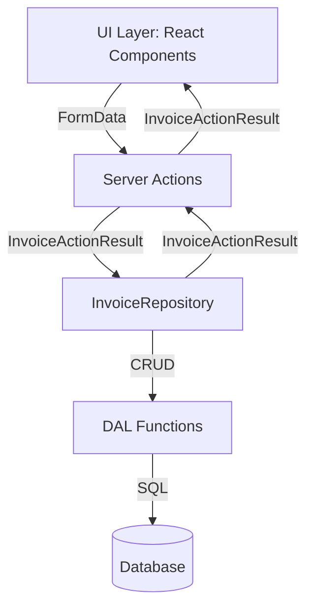

To implement uniformity in CRUD operations for invoices, use a single, strictly typed result shape (`InvoiceActionResult`) for all actions—**Create, Read, Update, Delete**. This approach improves maintainability, error handling, and UI integration.

---

## Strategy Overview

### 1. **Define a Uniform Result Type**

Create a shared result type for all invoice actions. This type should encapsulate:

- `data`: The invoice DTO or `null`
- `errors`: Field-level error map (for validation)
- `message`: Status or error message
- `success`: Boolean indicating operation result

```typescript
/**
 * Uniform result shape for all invoice actions.
 */
export interface InvoiceActionResult {
  readonly data?: InvoiceDto | null;
  readonly errors?: InvoiceErrorMap;
  readonly message?: string;
  readonly success: boolean;
}
```

---

### 2. **Update All CRUD Actions to Use the Uniform Type**

#### **Read Action Example**

```typescript
/**
 * Server action to read a single invoice by ID, returning a uniform result.
 */
export async function readInvoiceActionUniform(
  id: string,
): Promise<InvoiceActionResult> {
  try {
    const db = getDB();
    const invoice = await readInvoiceDal(db, toInvoiceId(id));
    if (!invoice) {
      return {
        data: null,
        errors: {},
        message: INVOICE_ERROR_MESSAGES.READ_FAILED,
        success: false,
      };
    }
    return {
      data: invoice,
      errors: {},
      message: INVOICE_SUCCESS_MESSAGES.READ_SUCCESS,
      success: true,
    };
  } catch (error) {
    logger.error({
      context: "readInvoiceActionUniform",
      error,
      id,
      message: INVOICE_ERROR_MESSAGES.DB_ERROR,
    });
    return {
      data: null,
      errors: {},
      message: INVOICE_ERROR_MESSAGES.DB_ERROR,
      success: false,
    };
  }
}
```

#### **Update Action Example**

```typescript
/**
 * Server action to update an invoice, returning a uniform result.
 */
export async function updateInvoiceActionUniform(
  id: string,
  formData: FormData,
): Promise<InvoiceActionResult> {
  try {
    const db = getDB();
    const validated = CreateInvoiceSchema.safeParse({
      amount: formData.get("amount"),
      customerId: formData.get("customerId"),
      status: formData.get("status"),
    });

    if (!validated.success) {
      return {
        data: null,
        errors: buildErrorMap(validated.error.flatten().fieldErrors),
        message: INVOICE_ERROR_MESSAGES.INVALID_INPUT,
        success: false,
      };
    }

    const { amount, customerId, status } = validated.data;
    const updatedInvoice = await updateInvoiceDal(db, toInvoiceId(id), {
      amount: Math.round(amount * 100),
      customerId: toCustomerId(customerId),
      status: toInvoiceStatusBrand(status),
    });

    if (!updatedInvoice) {
      return {
        data: null,
        errors: {},
        message: INVOICE_ERROR_MESSAGES.UPDATE_FAILED,
        success: false,
      };
    }

    return {
      data: updatedInvoice,
      errors: {},
      message: INVOICE_SUCCESS_MESSAGES.UPDATE_SUCCESS,
      success: true,
    };
  } catch (error) {
    logger.error({
      context: "updateInvoiceActionUniform",
      error,
      id,
      message: INVOICE_ERROR_MESSAGES.DB_ERROR,
    });
    return {
      data: null,
      errors: {},
      message: INVOICE_ERROR_MESSAGES.DB_ERROR,
      success: false,
    };
  }
}
```

#### **Delete Action Example**

```typescript
/**
 * Server action to delete an invoice, returning a uniform result.
 */
export async function deleteInvoiceActionUniform(
  id: string,
): Promise<InvoiceActionResult> {
  try {
    const db = getDB();
    const deletedInvoice = await deleteInvoiceDal(db, toInvoiceId(id));
    if (!deletedInvoice) {
      return {
        data: null,
        errors: {},
        message: INVOICE_ERROR_MESSAGES.DELETE_FAILED,
        success: false,
      };
    }
    return {
      data: deletedInvoice,
      errors: {},
      message: INVOICE_SUCCESS_MESSAGES.DELETE_SUCCESS,
      success: true,
    };
  } catch (error) {
    logger.error({
      context: "deleteInvoiceActionUniform",
      error,
      id,
      message: INVOICE_ERROR_MESSAGES.DB_ERROR,
    });
    return {
      data: null,
      errors: {},
      message: INVOICE_ERROR_MESSAGES.DB_ERROR,
      success: false,
    };
  }
}
```

---

## Architectural Diagram



---

## Common Problems & Pitfalls

- **Inconsistent Return Shapes:** Mixing raw DTOs, nulls, or error strings leads to UI bugs and unclear error handling.
- **Throwing Errors Instead of Returning:** Always return a result object; never throw errors to the UI layer.
- **Leaking Internal Details:** Never expose stack traces or internal error details in `message`.
- **Missing Field-Level Errors:** Always provide an `errors` map for validation failures.
- **Not Localizing Messages:** Ensure all `message` strings are suitable for localization.

---

## Benefits

- **UI Consistency:** UI can always expect the same result shape, simplifying rendering and error handling.
- **Type Safety:** Strict TypeScript types prevent accidental misuse.
- **Testability:** Easy to mock and assert in unit tests.
- **Scalability:** Adding new actions or fields is straightforward.

---

## Summary Table

| Action | Input Type           | Output Type         | Notes                                 |
| ------ | -------------------- | ------------------- | ------------------------------------- |
| Create | InvoiceCreateInput   | InvoiceActionResult | No `id` in input; returns created DTO |
| Read   | InvoiceId (string)   | InvoiceActionResult | Returns DTO or error                  |
| Update | InvoiceId + FormData | InvoiceActionResult | Returns updated DTO or error          |
| Delete | InvoiceId (string)   | InvoiceActionResult | Returns deleted DTO or error          |

---

## Final Recommendations

- Refactor all invoice actions to return `InvoiceActionResult`.
- Document the result type and usage in TSDoc and README.
- Update UI components to consume the uniform result.
- Localize all error and success messages.

This strategy enforces uniformity, improves maintainability, and simplifies UI integration for all invoice CRUD operations.

Here is a layered architecture diagram and a summary table to visualize the return types at each layer for your invoice CRUD flow. This follows strict TypeScript typing and separation of concerns.

---

Here is a tower architecture diagram for your invoice CRUD flow, showing each layer, its responsibility, and the desired TypeScript types for best practice. This enforces strict typing, separation of concerns, and maintainability.

---

**Invoice CRUD Tower Blueprint (Mermaid):**

```mermaid
flowchart TD
    UI[UI Layer: React Components<br/>Type: InvoiceActionResult] <--> UIMapper[UI Mapper<br/>Type: InvoiceActionResult]
    UIMapper <--> SA[Server Actions<br/>Type: InvoiceActionResult]
    SA <--> Repo[InvoiceRepository<br/>Type: InvoiceDto | null]
    Repo <--> DAL[DAL Functions<br/>Type: InvoiceEntity | InvoiceDto | null]
    DAL <--> DBMapper[DB Mapper<br/>Type: InvoiceRawDrizzle <-> InvoiceEntity]
    DBMapper <--> DB[(Database)<br/>Type: Raw Rows]
```

---

**Layer & Type Table**

| Layer          | Responsibility                        | Input Type                     | Output Type                   |
| -------------- | ------------------------------------- | ------------------------------ | ----------------------------- |
| UI             | Display, form, feedback               | FormData / InvoiceActionResult | InvoiceActionResult           |
| UI Mapper      | Transform UI state/results            | InvoiceActionResult            | InvoiceActionResult           |
| Server Actions | Validate, orchestrate, error handling | FormData / InvoiceId           | InvoiceActionResult           |
| Repository     | Business logic, domain rules          | Branded types, DTOs            | InvoiceDto \| null            |
| DAL            | DB access, error logging              | InvoiceEntity, InvoiceId       | InvoiceEntity/InvoiceDto/null |
| DB Mapper      | Transform raw rows/entities           | InvoiceRawDrizzle              | InvoiceEntity                 |
| Database       | Store raw data                        | SQL                            | Raw Rows                      |

---

**TypeScript Best Practice Highlights:**

- **UI/Server Actions:** Always use `InvoiceActionResult` for uniformity.
- **Repository:** Accepts/returns branded types and DTOs for safety.
- **DAL:** Operates on domain entities and DTOs, never raw types.
- **Mappers:** Strictly convert between raw DB rows and domain entities.
- **Database:** Only exposes raw rows, never leaks domain logic.

---

This structure ensures strict typing, clear boundaries, and maintainable code for your Next.js invoice CRUD system.
