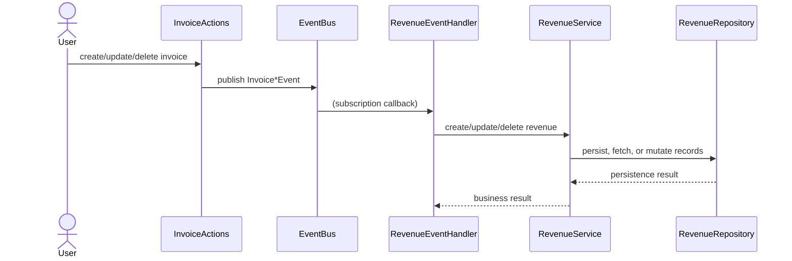

# Revenue Management System

## Overview

The Revenues feature is built on **event-driven principles**: revenue records are automatically kept in sync with invoice updates based on domain events. This ensures accurate, real-time revenue snapshots and simplifies cross-feature coordination.

### Key Benefits
- **Real-time Accuracy**: Revenue data always reflects the current state of invoices
- **Reduced Complexity**: No manual synchronization required between features
- **Scalable Architecture**: Event-driven design allows for easy extension
- **Robust Error Handling**: Graceful recovery from failures without data loss

---

## 1. Execution Pipeline: From Invoice Actions to Revenue Records

### a. **Invoice Actions Emit Events**

Whenever invoices are created, updated, or deleted via user or system actions, an event is **published** to the central `EventBus`. 

**Event Types:**
- `InvoiceCreatedEvent` - Triggered when a new invoice is created
- `InvoiceUpdatedEvent` - Triggered when an existing invoice is modified
- `InvoiceDeletedEvent` - Triggered when an invoice is removed from the system

**Event Payload Structure:**
- `id`: A unique identifier (UUID format)
- `timestamp`: ISO 8601 timestamp (e.g., `2025-08-05T19:42:00Z`)
- `data`: Complete invoice data object
- `previousState`: (Only for updates) The invoice state before changes
- `operation`: String identifier (e.g., `"invoice_created"`, `"invoice_updated"`, `"invoice_deleted"`)

### b. **Revenue Feature Subscribes to Invoice Events**

On initialization, the `RevenueEventHandler` subscribes to all relevant invoice events through the `EventBus`'s `subscribe` method.

**Subscription Process:**
1. During application startup, the `RevenueEventHandler` registers callbacks for each event type
2. The `EventBus` maintains a registry of subscribers and their associated event types
3. When events occur, the `EventBus` dispatches them to all registered handlers

**Event Processing Flow:**
- Events are processed asynchronously to prevent blocking the main application thread
- Each event type has a dedicated handler method with specialized business logic
- Failed event processing is captured, logged, and (when possible) retried automatically

---

## 2. Revenue Event Handler: Coordination & Responsibilities

**File:** `src/features/revenues/services/events/revenue-event.handler.ts`

The `RevenueEventHandler` class serves as the central coordinator for all revenue updates triggered by invoice domain events. It acts as the bridge between the event system and revenue business logic.

### Core Responsibilities

- **Event Subscription Management**: Registers and maintains callbacks for all relevant invoice events via the `EventBus`.
- **Eligibility Determination**: Applies business rules to determine if an invoice should affect revenue calculations.
- **Business Logic Orchestration**: Routes events to appropriate handlers based on event type and invoice properties.
- **Error Handling & Recovery**: Ensures system resilience through graceful error handling and logging.

### Key Methods

| Method | Purpose | Parameters | Return |
|--------|---------|------------|--------|
| `setupEventSubscriptions()` | Registers all event listeners | None | void |
| `handleInvoiceCreated(event)` | Processes new invoice events | InvoiceEvent | Promise<void> |
| `handleInvoiceUpdated(event)` | Handles changes to existing invoices | InvoiceEvent | Promise<void> |
| `handleInvoiceDeleted(event)` | Manages invoice removal | InvoiceEvent | Promise<void> |
| `isInvoiceEligibleForRevenue(invoice)` | Determines if invoice affects revenue | Invoice | boolean |

### Processing Logic

For each event type, the handler:
1. Validates invoice data completeness and integrity
2. Checks eligibility based on business rules (status, amount, dates)
3. Applies appropriate business logic (create/update/delete revenue records)
4. Triggers any necessary side effects (e.g., recomputing monthly totals)
5. Logs the outcome for auditing and debugging purposes

---

## 3. Revenue Event Helpers and Utilities

The revenue system's complex business logic is organized into specialized helper and utility modules. This separation of concerns improves maintainability, testability, and code reuse.

### a. **Utility Functions** (`src/features/revenues/services/events/revenue-event.utils.ts`)

| Function | Purpose | Input | Output |
|----------|---------|-------|--------|
| `extractPeriodFromInvoice` | Converts invoice dates to standard period format | Invoice object | String (YYYY-MM) |
| `handleEventError` | Gracefully handles errors in event processing | Error object, context | void |
| `validateInvoiceForRevenue` | Validates invoice data completeness | Invoice object | Boolean |

**Example Usage:**
```typescript
// Converting an invoice date to a period string
const period = extractPeriodFromInvoice(invoice); // Returns "2025-08"

// Validating an invoice before processing
if (validateInvoiceForRevenue(invoice)) {
  // Process the invoice for revenue
}
```

### b. **Helper Functions** (`src/features/revenues/services/events/revenue-event.helpers.ts`)

These functions handle specific business operations and provide error handling:

**Error Handling & Logging:**
- `withErrorHandling(fn)` - HOC that wraps async operations with try/catch and structured logging
- `logInfo(message, context)` - Creates standardized info log entries with context
- `logError(error, context)` - Creates standardized error log entries with context

**Business Logic:**
- `isStatusEligibleForRevenue(status)` - Determines if an invoice status (e.g., "paid", "pending") should be counted
- `processInvoiceForRevenue(invoice)` - Creates or updates revenue records for valid invoices
- `extractAndValidatePeriod(invoice)` - Extracts and validates period information from invoice
- `updateRevenueRecord(id, data)` - Updates revenue record fields with proper validation

**Event Processing:**
- `handleInvoiceEvent(event, type)` - Processes invoice events with common validation logic
- `adjustRevenueForDeletedInvoice(invoice)` - Handles revenue adjustments when invoices are deleted
- `adjustRevenueForStatusChange(oldInvoice, newInvoice)` - Manages revenue changes when invoice status changes

---

## 4. Event and Data Flow (Summary Diagram)



---

## 5. Best Practices and Architectural Notes

### Design Principles
- **Loose coupling:** The EventBus decouples features (Invoices, Revenues) for scalability/testability.
- **Testability:** Handlers/services are dependency-injected, greatly simplifying mocking and business logic validation.
- **Observability:** All steps are instrumented with structured logging for debugging and auditability.
- **Extensibility:** New event types or periods (year, quarter) can be added incrementally due to the clean separation of concerns.

### Implementation Guidelines
- Always use the event system for cross-feature communication
- Ensure all event handlers are idempotent (can safely process the same event multiple times)
- Add comprehensive logging at key points in the event processing pipeline
- Write unit tests for each handler and utility function

---

## Conclusion

By following an event-driven, modular design, this feature ensures accurate, robust, and maintainable revenue tracking that automatically reflects the evolving state of invoices. The architecture supports future extensions while maintaining a clear separation of concerns.

## Related Documentation
- [Services Documentation](./services/README.md)
- [Repository Documentation](./repository/README.md)
- [Core Models Documentation](./core/README.md)
- [Actions Documentation](./actions/README.md)
