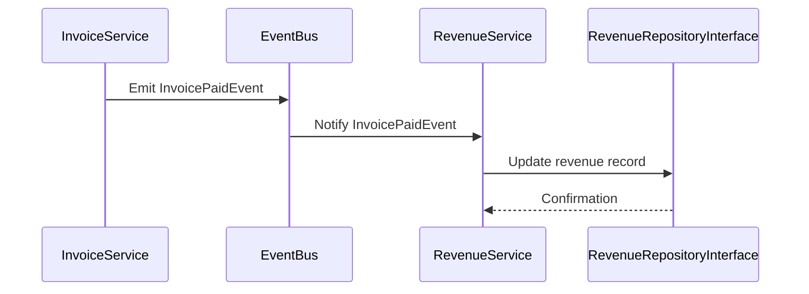

# Event-Driven Revenue Update Strategy

## Overview

This strategy describes how to implement an event-driven architecture for the `revenues` feature in the Next.js dashboard. The goal is to ensure that when an invoice is paid, the revenue data is automatically and reliably updated, following best practices for modularity, error handling, and testability.

---

## Table of Contents

1. Objectives
2. Event-Driven Architecture Overview
3. Domain Events
4. Event Flow Diagram
5. Implementation Steps
6. Error Handling & Logging
7. Testing Strategy
8. Documentation & Maintenance
9. Security Considerations
10. Accessibility & Internationalization

---

## 1. Objectives

- Automatically update revenue data when an invoice is paid.
- Decouple the `invoices` and `revenues` features for maintainability.
- Ensure reliable, scalable, and testable event handling.
- Provide clear error handling and logging.

---

## 2. Event-Driven Architecture Overview

- **Event Source:** The `invoices` feature emits a domain event (`InvoicePaidEvent`) when an invoice is paid.
- **Event Handler:** The `revenues` feature listens for this event and updates the revenue records accordingly.
- **Benefits:** Loose coupling, scalability, easier testing, and extensibility.

---

## 3. Domain Events

### Event Definition

- **Event Name:** `InvoicePaidEvent`
- **Payload:**
  - `invoiceId: InvoiceId`
  - `customerId: CustomerId`
  - `amount: number`
  - `paidAt: Date`

### Event Publisher

- Located in `src/features/invoices/invoice.actions.ts` or service layer.
- Emits event after successful invoice payment.

### Event Subscriber

- Located in `src/features/revenues/revenue.service.ts` or a dedicated event handler.
- Listens for `InvoicePaidEvent` and updates revenue data.

---

## 4. Event Flow Diagram



---

## 5. Implementation Steps

### 5.1. Define Event Types

- Create a TypeScript interface for `InvoicePaidEvent` in a shared location (e.g., `src/lib/events/invoice.events.ts`).

### 5.2. Event Publisher

- In the invoice payment logic, emit `InvoicePaidEvent` using an event bus or a simple observer pattern.
  - What is the difference between an event bus and an observer pattern?

### 5.3. Event Bus

- Implement a lightweight event bus (in-memory for now) to decouple publisher and subscriber.
- Example: `src/lib/events/eventBus.ts`

### 5.4. Event Subscriber

- In the revenues feature, subscribe to `InvoicePaidEvent`.
- On event, update the revenue record for the corresponding customer.

### 5.5. Data Access

- Use the repository pattern for updating revenue data (`revenue.repository.ts`).

### 5.6. Error Handling & Logging

- Log all event emissions and handling in structured JSON format.
- Handle errors gracefully, retry if necessary, and avoid data loss.

---

## 6. Error Handling & Logging

- Use structured logging (JSON) for all event-related actions.
- Implement error boundaries in event handlers.
- Log context: event payload, timestamp, handler name, error details.

---

## 7. Testing Strategy

- Write unit tests for event publisher and subscriber.
- Use Cypress for end-to-end tests: simulate invoice payment and verify revenue update.
- Mock event bus for isolated tests.

---

## 8. Documentation & Maintenance

- Document all event types and handlers with TSDoc.
- Update README with event-driven architecture overview.
- Maintain a changelog for event schema changes.

---

## 9. Security Considerations

- Validate all event payloads.
- Ensure no sensitive data is exposed in logs.
- Follow OWASP best practices for event data handling.

---

## 10. Accessibility & Internationalization

- Ensure all UI components reflecting revenue updates are accessible.
- Support localization for revenue-related messages.

---

## Next Steps

1. Define the `InvoicePaidEvent` interface.
2. Implement the event bus.
3. Add event publishing in invoice payment logic.
4. Add event subscription in revenue service.
5. Write tests and documentation.

---

**Dependency Injection Explanation:**
Dependency injection is a design pattern where dependencies (e.g., services, repositories) are provided to a class or function rather than being created internally. This improves testability and flexibility by allowing you to swap implementations easily.

---

For questions or clarifications, consult the project maintainer.

You're absolutely right to question this! The return type and usage pattern reveal some architectural confusion. Let me explain common event-driven patterns for user input in TypeScript applications.

## Common Event-Driven Patterns

### 1. Command/Query Separation (CQS)

Commands (actions that change state) typically return `void`, while queries return data:

```typescript
// Command - changes state, returns void
async markInvoiceAsPaid(id: string): Promise<void> {
  const invoice = await this.readInvoice(id);
  if (invoice.status === "paid") return; // Idempotent
  
  await this.updateInvoice(id, { status: "paid" });
  await this.emitInvoicePaidEvent(invoice);
}

// Query - returns data without side effects  
async getInvoice(id: string): Promise<InvoiceDto> {
  return await this.readInvoice(id);
}
```

### 2. Event-First Architecture

The UI triggers commands, services emit events, other services react:

```typescript
// UI Component
async function handleMarkAsPaid(invoiceId: string) {
  try {
    await invoiceService.markInvoiceAsPaid(invoiceId);
    // Command succeeded - UI can react to events or refetch data
    toast.success("Invoice marked as paid");
  } catch (error) {
    toast.error("Failed to mark invoice as paid");
  }
}
```

### 3. Typical User Input Flow

```
User Action → Command → Domain Event → Side Effects → UI Update
```

For your invoice scenario:

```typescript
// 1. User clicks "Mark as Paid" button
// 2. Command executes
export class InvoiceService {
  async markInvoiceAsPaid(invoiceId: string): Promise<void> {
    const invoice = await this.repo.findById(invoiceId);
    
    if (invoice.isPaid()) {
      return; // Already paid, no-op
    }
    
    // Update the aggregate
    invoice.markAsPaid();
    await this.repo.save(invoice);
    
    // 3. Emit domain event
    await this.eventBus.publish(new InvoicePaidEvent({
      invoiceId: invoice.id,
      customerId: invoice.customerId,
      amount: invoice.amount,
      paidAt: new Date()
    }));
  }
}

// 4. Side effects happen via event handlers
export class RevenueService {
  @EventHandler(InvoicePaidEvent)
  async handleInvoicePaid(event: InvoicePaidEvent): Promise<void> {
    await this.updateCustomerRevenue(event.customerId, event.amount);
  }
}

// 5. UI updates (either via refetch or optimistic updates)
```

## Better Architecture for Your Use Case

Here's how I'd structure this with proper separation:

```typescript
// Domain Service - focuses on business logic
export class InvoiceService {
  async markInvoiceAsPaid(invoiceId: string): Promise<void> {
    const invoice = await this.repo.findById(invoiceId);
    
    if (invoice.status === "paid") {
      logger.info(`Invoice ${invoiceId} already paid`);
      return;
    }

    // Business logic
    await this.repo.update(invoiceId, { 
      status: "paid",
      paidAt: new Date() 
    });

    // Emit event for other domains
    await this.eventBus.publish("InvoicePaidEvent", {
      invoiceId,
      customerId: invoice.customerId,
      amount: invoice.amount,
      paidAt: new Date().toISOString()
    });

    logger.info(`Invoice ${invoiceId} marked as paid`);
  }
}
```

```typescript
// Next.js Server Action - handles web concerns
export async function markInvoiceAsPaidAction(invoiceId: string): Promise<void> {
  try {
    const service = new InvoiceService(new InvoiceRepository(getDB()));
    await service.markInvoiceAsPaid(invoiceId);
    
    // Web-specific concerns
    revalidatePath(`/invoices/${invoiceId}`);
    revalidatePath("/invoices");
  } catch (error) {
    logger.error({ context: "markInvoiceAsPaidAction", error, invoiceId });
    throw error; // Let Next.js handle the error boundary
  }
}
```

```typescript
// React Component - handles UI concerns
export function InvoiceActions({ invoice }: { invoice: InvoiceDto }) {
  const [isPending, startTransition] = useTransition();

  const handleMarkAsPaid = () => {
    startTransition(async () => {
      try {
        await markInvoiceAsPaidAction(invoice.id);
        toast.success("Invoice marked as paid");
      } catch (error) {
        toast.error("Failed to mark invoice as paid");
      }
    });
  };

  if (invoice.status === "paid") {
    return <Badge variant="success">Paid</Badge>;
  }

  return (
    <Button 
      onClick={handleMarkAsPaid}
      disabled={isPending}
    >
      {isPending ? "Processing..." : "Mark as Paid"}
    </Button>
  );
}
```

## Key Architectural Principles

1. **Commands return `void`** - They perform actions, don't return data
2. **Separate concerns** - Service handles business logic, actions handle web concerns, components handle UI
3. **Event-driven side effects** - Other domains react to events, not direct coupling
4. **Idempotent operations** - Safe to call multiple times
5. **Clear error boundaries** - Each layer handles its own error concerns

This pattern scales well because each domain (invoices, revenues, notifications) remains decoupled while still reacting to business events.


---


exploring the Typical User Input Flow. when an invoice is created or updated there are many layers from the user action in the ui. for example ui --> server action --> service --> repo --> dal. i need my revenues to be recalculated as invoices are created or updated. therefore i think the current logic follows a bad model and the code in Better Architecture for Your Use Case still has some flaws. that code attempts to replace CRUD functionality when it probably does not need to. i think i need to place some sort of code/event/trigger/service/etc in my invoice.actions.ts in function createInvoiceAction and updateInvoiceAction after the service to create or update successfully executes. i need to put something after `   // Call service with validated DTO to retrieve complete InvoiceDto
    const invoice: InvoiceDto = await service.createInvoice(parsed.data);` so the revenues can be calculated or updated


You're absolutely correct! The current event-driven approach is over-engineering the problem. You don't need to replace CRUD operations - you just need to trigger revenue recalculation after successful invoice operations.

## The Right Pattern: Post-Operation Hooks

Place revenue recalculation directly in your server actions after successful service calls. This is simpler, more direct, and easier to reason about:

```typescript
// In createInvoiceAction - after the service call
export async function createInvoiceAction(
  prevState: InvoiceActionResult,
  formData: FormData,
): Promise<InvoiceActionResult> {
  try {
    // ... existing validation logic ...

    // Call service with validated DTO to retrieve complete InvoiceDto
    const invoice: InvoiceDto = await service.createInvoice(parsed.data);

    // Trigger revenue recalculation after successful invoice creation
    // NOTE: Why await this? I don't need it to finish before returning the action result
    // NOTE: This logic appears highly coupled.
    await this.recalculateRevenuesForInvoice(invoice);

    return {
      data: invoice,
      errors: {},
      message: INVOICE_SUCCESS_MESSAGES.CREATE_SUCCESS,
      success: true,
    };
  } catch (error) {
    // ... existing error handling ...
  }
}
```

```typescript
// In updateInvoiceAction - after the service call
export async function updateInvoiceAction(
  prevState: InvoiceActionResult,
  id: string,
  formData: FormData,
): Promise<InvoiceActionResult> {
  try {
    // ... existing validation logic ...

    // Call service to update invoice with validated DTO
    const updatedInvoice: InvoiceDto = await service.updateInvoice(id, parsed.data);

    // Trigger revenue recalculation after successful invoice update
    // NOTE: Why await this? I don't need it to finish before returning the action result
    // NOTE: This logic appears highly coupled. 
    await this.recalculateRevenuesForInvoice(updatedInvoice);

    return {
      data: updatedInvoice,
      errors: {},
      message: INVOICE_SUCCESS_MESSAGES.UPDATE_SUCCESS,
      success: true,
    };
  } catch (error) {
    // ... existing error handling ...
  }
}
```

## Revenue Recalculation Helper

Add this helper function to your invoice actions file:

```typescript
/**
 * Recalculates revenues after invoice operations.
 * @param invoice - The invoice that was created/updated
 */
async function recalculateRevenuesForInvoice(invoice: InvoiceDto): Promise<void> {
  try {
    // Import revenue service dynamically to avoid circular dependencies
    const { RevenueService } = await import("@/features/revenues/revenue.service");
    const { RevenueRepositoryInterface } = await import("@/features/revenues/revenue.repository");

    const revenueRepo = new RevenueRepositoryInterface(getDB());
    const revenueService = new RevenueService(revenueRepo);

    // Recalculate revenues for the customer
    await revenueService.recalculateCustomerRevenue(invoice.customerId);

    logger.info({
      context: "recalculateRevenuesForInvoice",
      invoiceId: invoice.id,
      customerId: invoice.customerId,
      message: "Revenue recalculated successfully",
    });
  } catch (error) {
    // Log but don't throw - revenue calculation failure shouldn't break invoice operations
    logger.error({
      context: "recalculateRevenuesForInvoice",
      error,
      invoiceId: invoice.id,
      customerId: invoice.customerId,
      message: "Failed to recalculate revenues",
    });
  }
}
```

## Revenue Service Interface

Your revenue service would need a method like this:

```typescript
// src/features/revenues/revenue.service.ts
export class RevenueService {
  constructor(private revenueRepo: RevenueRepositoryInterface) {}

  /**
   * Recalculates total revenue for a specific customer.
   * @param customerId - Customer ID to recalculate revenue for
   */
  async recalculateCustomerRevenue(customerId: string): Promise<void> {
    // Get all paid invoices for this customer
    const paidInvoices = await this.getPaidInvoicesForCustomer(customerId);
    
    // Calculate total revenue
    const totalRevenue = paidInvoices.reduce((sum, invoice) => sum + invoice.amount, 0);
    
    // Update or create revenue record
    await this.revenueRepo.upsertCustomerRevenue(customerId, totalRevenue);
  }

  private async getPaidInvoicesForCustomer(customerId: string): Promise<InvoiceDto[]> {
    // This might need to be in a shared service or you might need to query directly
    // Depends on your architecture preferences
  }
}
```

## Benefits of This Approach

1. **Simple & Direct**: Clear cause-and-effect relationship
2. **Synchronous**: Revenue updates happen immediately after invoice changes
3. **No Over-Engineering**: Uses existing CRUD operations without replacement
4. **Easy to Debug**: Linear flow is easy to trace and test
5. **Fail-Safe**: Revenue calculation failures don't break invoice operations
6. **Maintains Separation**: Invoice actions handle the orchestration, services handle domain logic

## Alternative: If You Still Want Events

NOTE: THIS MAKES MORE SENSE FOR WHAT I WANT!!!!!!

If you prefer the event-driven approach for future extensibility, keep it simple:

```typescript
// After successful service call
const invoice: InvoiceDto = await service.createInvoice(parsed.data);

// Emit simple domain event
const { EventBus } = await import("@/lib/events/eventBus");
await EventBus.publish("InvoiceChanged", { 
  invoiceId: invoice.id, 
  customerId: invoice.customerId,
  operation: "created" 
});
```

But for your current needs, the direct approach in the server actions is the most pragmatic solution.
