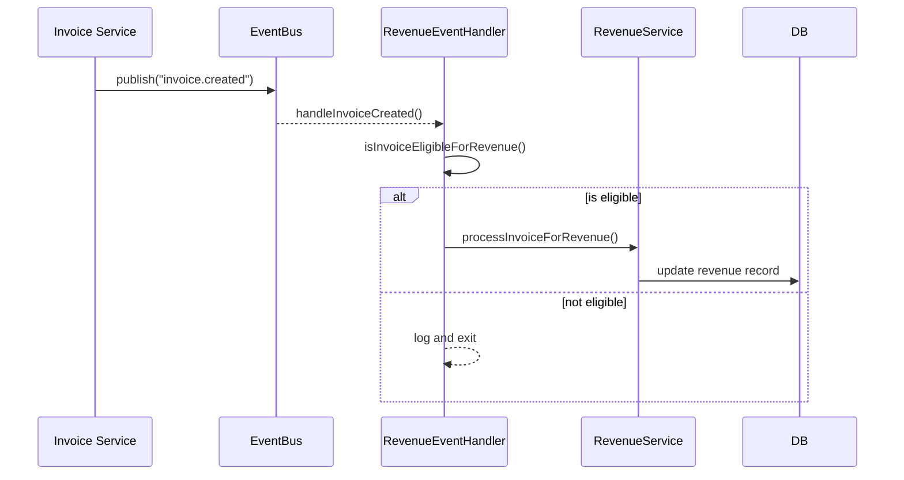
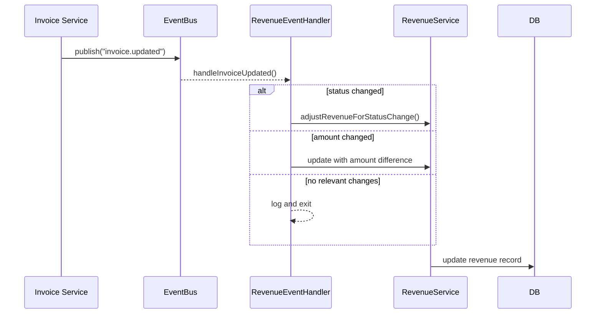
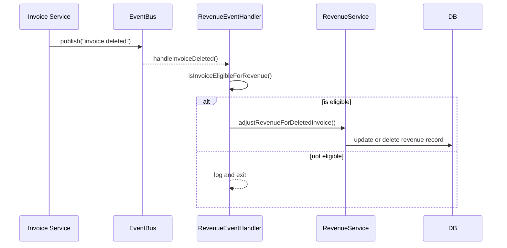

# Revenue Event System Documentation

This directory contains the event handling system for revenue calculations. The system uses an event-driven architecture to maintain consistency between invoices and revenue records.

## Core Components

### 1. Event Handler (`revenue-event.handler.ts`)

The `RevenueEventHandler` class manages the subscription to invoice events and coordinates the processing of these events to update revenue records:

- Subscribes to `invoice.created`, `invoice.updated`, and `invoice.deleted` events
- Validates incoming events for eligibility
- Delegates to specific processing functions based on event type
- Maintains idempotent processing for reliability

### 2. Helper Functions (`revenue-event.helpers.ts`)

Contains specialized functions for processing different event scenarios:

- `processInvoiceForRevenue`: Handles adding new invoices to revenue records
- `adjustRevenueForDeletedInvoice`: Updates revenue when invoices are deleted
- `adjustRevenueForStatusChange`: Manages revenue changes based on invoice status transitions
- `withErrorHandling`: Provides standardized error handling patterns
- `handleInvoiceEvent`: Common processing logic for invoice events

### 3. Utility Functions (`revenue-event.utils.ts`)

Provides supporting utilities for event processing:

- `extractPeriodFromInvoice`: Extracts YYYY-MM period from invoice dates
- `validateInvoiceForRevenue`: Checks if an invoice has all required fields for revenue calculation
- `handleEventError`: Safely processes errors without disrupting the event bus

## Event Flow

### 1. Invoice Creation


### 2. Invoice Update


### 3. Invoice Deletion


## Key Design Patterns

### 1. Event-Driven Architecture
Events drive revenue calculations, ensuring data consistency between services while maintaining loose coupling.

### 2. Idempotent Processing
The system is designed to safely handle duplicate events without side effects.

### 3. Robust Error Handling
- Errors are caught and logged without disrupting the event bus
- Structured logging with rich contextual information
- Error isolation prevents cascading failures

### 4. Eligibility Validation
Strict validation ensures only eligible invoices affect revenue calculations:
- Valid status (`paid` or `pending`)
- Positive amount
- Complete required fields (id, date, amount, status)
- Valid period extraction

## Usage

The revenue event system initializes automatically when the application starts. The `RevenueEventHandler` constructor sets up all necessary event subscriptions.

To manually initialize the event handler:

```typescript
// Create a new event handler instance
const revenueService = new RevenueService();
const eventHandler = new RevenueEventHandler(revenueService);
```

## Error Handling Strategy

The system employs a multi-layered approach to error management:

1. **Validation before processing**: Checks invoice eligibility before calculation
2. **Function-level error boundaries**: Each operation wrapped in try/catch
3. **Structured logging**: Rich context for troubleshooting
4. **Non-throwing event handlers**: Prevents event bus disruption

## Period Calculation

Periods are extracted from invoice dates in YYYY-MM format, supporting:
- ISO date strings
- Date objects
- Direct YYYY-MM strings
