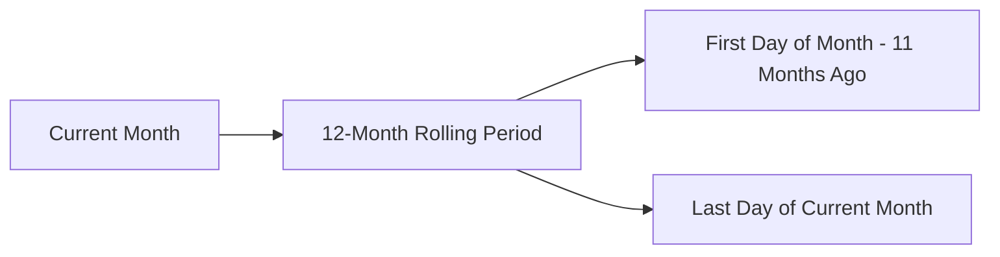

# Revenue Date Utilities

## Overview

The Date Utilities module provides a comprehensive set of functions for handling dates, periods, and time-related operations throughout the revenue management system. Built on the robust `date-fns` library, these utilities ensure **consistent date formatting**, **reliable period calculations**, and **type-safe date operations** across the application.

### Key Benefits
- **Standardized Date Handling**: Consistent date formatting and manipulation across the application
- **Period Management**: Type-safe handling of year-month periods with validation
- **Rolling Date Calculations**: Accurate generation of rolling 12-month periods
- **Template Generation**: Date-based templates for complete revenue reporting

---

## 1. Core Utility Files

### a. **Revenue Date Utilities** (`revenue-date.utils.ts`)

The Revenue Date Utilities provide functions for date calculations, formatting, and template generation specifically for revenue reporting.

**Key Functions:**
- `calculateDateRange()` - Calculates the date range for a rolling 12-month period
- `formatMonthDateRange()` - Formats start and end dates for a specific month
- `generateMonthlyPeriods()` - Generates monthly periods between start and end dates
- `generateMonthsTemplate()` - Creates a template for rolling periods based on start date
- `isValidISODate()` - Validates if a string is a properly formatted ISO date

**Usage Context:**
These utilities ensure consistent date handling across revenue calculations, reports, and visualizations, with a focus on rolling periods and monthly data.

### b. **Period Utilities** (`period.utils.ts`)

The Period Utilities provide functions for handling month periods as branded first-of-month Date values with type safety and validation.

**Key Functions:**
- `toPeriod()` - Validates and converts input (string or Date) to a branded first-of-month Date
- `dateToPeriod()` - Converts a Date object to a branded first-of-month Date
- `periodToDate()` - Returns the underlying Date for the branded Period
- `formatPeriod()` - Formats a branded Period for display (e.g., "August 2024")

**Type Safety:**
The Period utilities use TypeScript's branded types to ensure that only valid period strings are used throughout the application, preventing errors from invalid date formats.

---

## 2. Date Handling Patterns

### a. **ISO Date Standard**

All date handling in the revenue system follows the ISO 8601 standard:
- Date strings use the format `YYYY-MM-DD` (e.g., "2025-08-05")
- Periods are represented as first-of-month Date values (e.g., new Date("2025-08-01")) and can be keyed as "yyyy-MM" via periodKey()
- Full timestamps use the format `YYYY-MM-DDTHH:mm:ssZ` (e.g., "2025-08-05T19:55:00Z")

This standardization ensures consistent date handling across the application and compatibility with external systems.

### b. **Rolling Period Calculations**

The revenue system frequently works with rolling 12-month periods:



The `calculateDateRange()` function automatically determines the appropriate 12-month range based on the current date, ensuring consistent reporting periods.

---

## 3. Usage Examples

### Calculating a Rolling 12-Month Period

```typescript
import { calculateDateRange } from "@/features/revenues/utils/date/revenue-date.utils";

// Get the current rolling 12-month period
const { startDate, endDate, period } = calculateDateRange();
// If current date is 2025-08-05, returns:
// { startDate: '2024-09-01', endDate: '2025-08-31', period: 'year' }
```

### Working with Period Strings

```typescript
import { 
  toPeriod, 
  formatPeriod 
} from "@/features/revenues/utils/date/period.utils";

// Validate and create a typed period
const period = toPeriod("2025-08");

// Format for display
const displayPeriod = formatPeriod(period); // "August 2025"
```

### Generating Monthly Periods

```typescript
import { generateMonthlyPeriods } from "@/features/revenues/utils/date/revenue-date.utils";

// Generate all months between two dates
const periods = generateMonthlyPeriods("2025-01-01", "2025-12-31");
// Returns: ["2025-01", "2025-02", ..., "2025-12"]
```

### Creating Month Templates

```typescript
import { generateMonthsTemplate } from "@/features/revenues/utils/date/revenue-date.utils";

// Generate a 12-month template starting from a specific date
const template = generateMonthsTemplate("2025-01-01", "year");
// Returns an array of 12 RollingMonthData objects
```

---

## 4. Best Practices

### When Working with Dates:

1. **Always use the utility functions** rather than direct date manipulation
2. **Validate date inputs** using `isValidISODate()` for user-provided dates
3. **Use branded Period types** for type safety when working with year-month strings
4. **Format dates consistently** using the provided formatting functions
5. **Generate complete date ranges** using the template utilities for reports

### Common Pitfalls to Avoid:

1. **Manual date string manipulation** - Use the utilities instead
2. **Inconsistent date formats** - Stick to ISO 8601 formats
3. **Timezone issues** - Be aware of timezone handling in date calculations
4. **Assuming month lengths** - Use date-fns functions that handle varying month lengths

---

## Related Documentation
- [Data Utilities Documentation](../data/README.md)
- [Display Utilities Documentation](../display/README.md)
- [Core Models Documentation](../../core/README.md)
- [Revenue Services Documentation](../../services/README.md)
