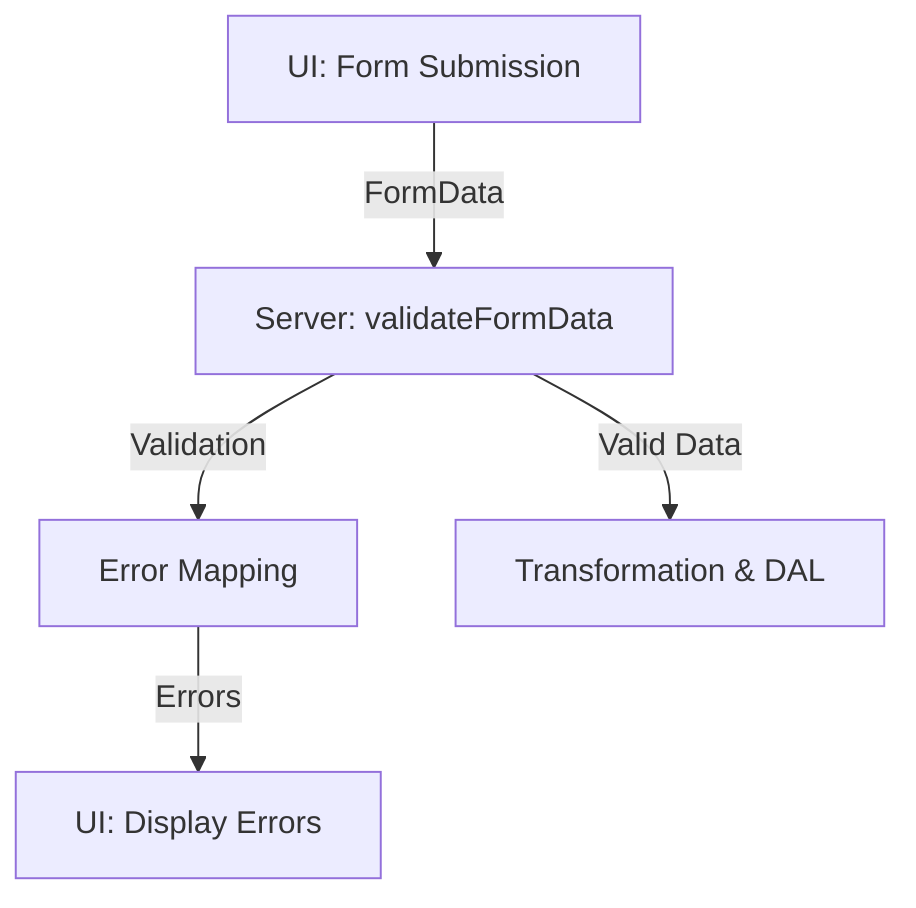

# Forms Module Documentation

## Overview

The `forms` module provides a robust, type-safe foundation for form validation, error handling, and state management in React/Next.js applications. It leverages TypeScript generics, Zod schemas, and domain-specific types to ensure data integrity, accessibility, and maintainability.

---

## Architecture

- **INTENTIONALLY ALWAYS RETURNS ERROR OBJECTS:** Errors are always returned as objects to provide a consistent shape for UI.
- **Type Safety:** All form logic uses strict TypeScript generics and branded types for domain safety.
- **Validation:** Zod schemas perform runtime validation and normalization of form data.
- **Error Handling:** Errors are mapped to domain-specific field names for precise, accessible UI feedback.
- **State Management:** Form state includes errors, messages, success status, and optionally validated data, all strictly typed.

---

## Key Files

- `form-validation.ts`: Core validation utilities, error mapping, and normalization.
- `form.types.ts`: TypeScript types for form state, errors, and field-level error representation.
- `README.md`: This documentation.

---

## Type Safety

- All types use generics for field names and data shapes.
- Field names are constrained to string literal unions for domain safety.
- Branded types prevent accidental misuse of IDs and domain values.
- Optional properties are compatible with `exactOptionalPropertyTypes: true` in `tsconfig.json`.

---

## Validation Flow

1. **Form Submission:** UI sends `FormData` to server action.
2. **Validation:** `validateFormData()` parses and validates input against a Zod schema.
3. **Error Mapping:** Only allowed field names are included in the error map.
4. **Transformation:** Validated data is sanitized and transformed for DAL/database use.
5. **Error Propagation:** Errors and messages are returned in a consistent, typed shape.

---

## Error Handling & Logging

- **Field Errors:** Mapped as `FormErrors<TFieldNames>`, only present for fields with errors.
- **General Errors:** Provided as a message string for display above the form.
- **Success State:** `success: boolean` indicates operation result.
- **Logging:** Validation errors are logged with context using structured logging (see `logger` utility).

---

## Accessibility & Internationalization

- Error messages are designed for clear, accessible UI feedback.
- Field-level errors support ARIA attributes and semantic HTML.
- All error messages should be localized for internationalization.

---

## Usage Example

```typescript
import { INVOICE_FIELD_NAMES } from "@/features/invoices/invoice.types";
import { validateFormData } from "@/lib/forms/form-validation";
import { CreateInvoiceSchema } from "@/features/invoices/invoice.types";

const result = validateFormData(
  formData,
  CreateInvoiceSchema,
  INVOICE_FIELD_NAMES,
);

if (!result.success) {
  // Display result.errors and result.message in the UI
}
```

---

## Data Flow Diagram



---

## Extending & Customizing

- Add new field name unions and schemas for each form domain.
- Use provided types and utilities for consistent error handling and validation.
- Document all new types, interfaces, and generics with TSDoc.

---

## References

- `form-validation.ts`
- `form.types.ts`
- [Zod documentation](https://zod.dev/)
- [TypeScript documentation](https://www.typescriptlang.org/docs/)
- [MDN FormData documentation](https://developer.mozilla.org/en-US/docs/Web/API/FormData)

---

## Maintainer Notes

- Review and update this documentation as new forms and validation logic are added.
- Ensure all form types and schemas are documented with TSDoc.
- Follow project coding instructions and TypeScript best practices.
