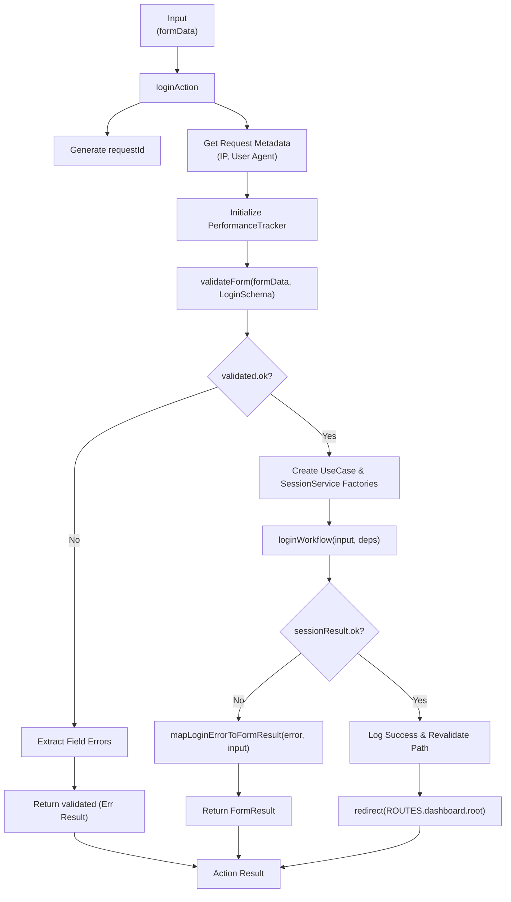
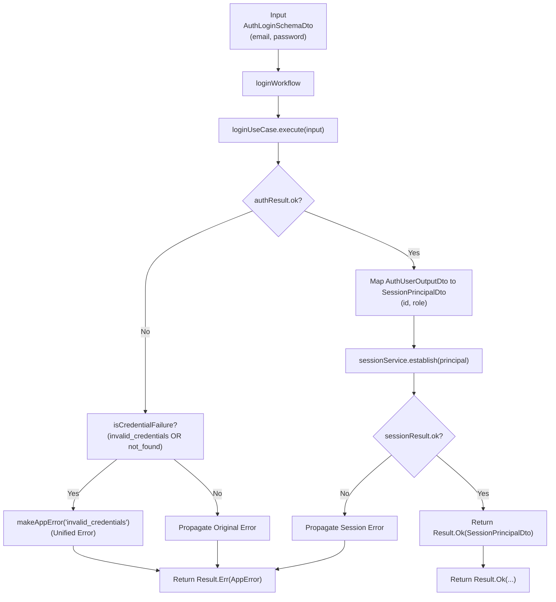
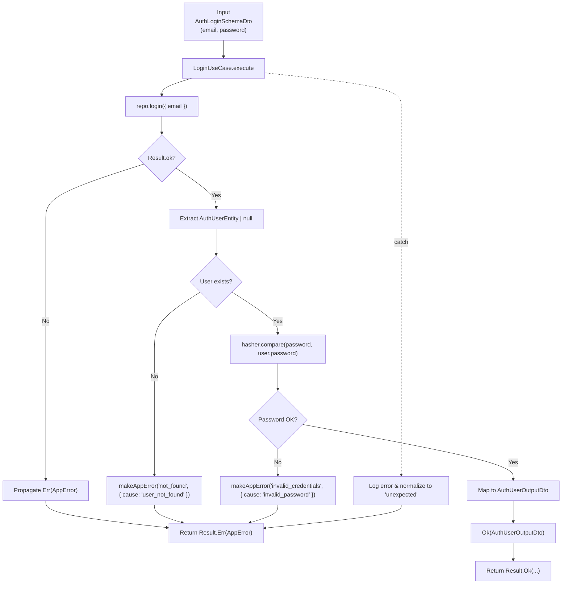
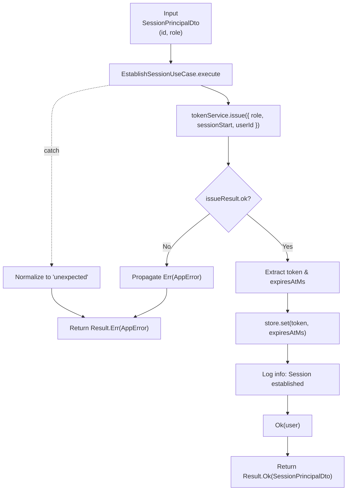
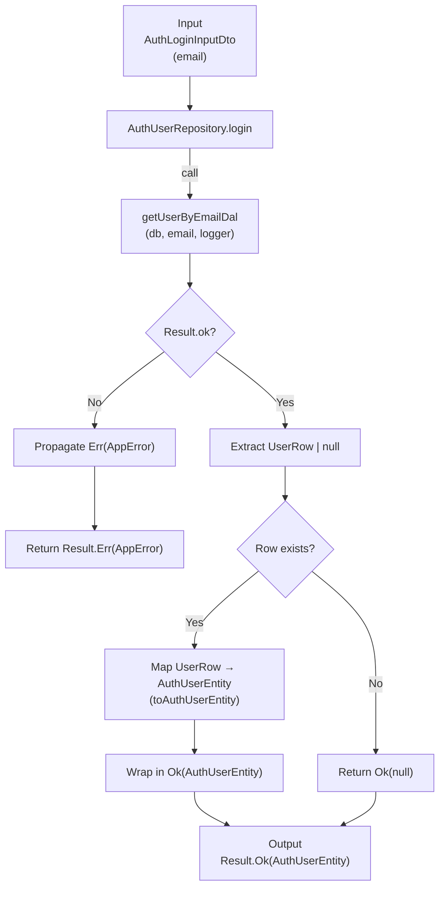
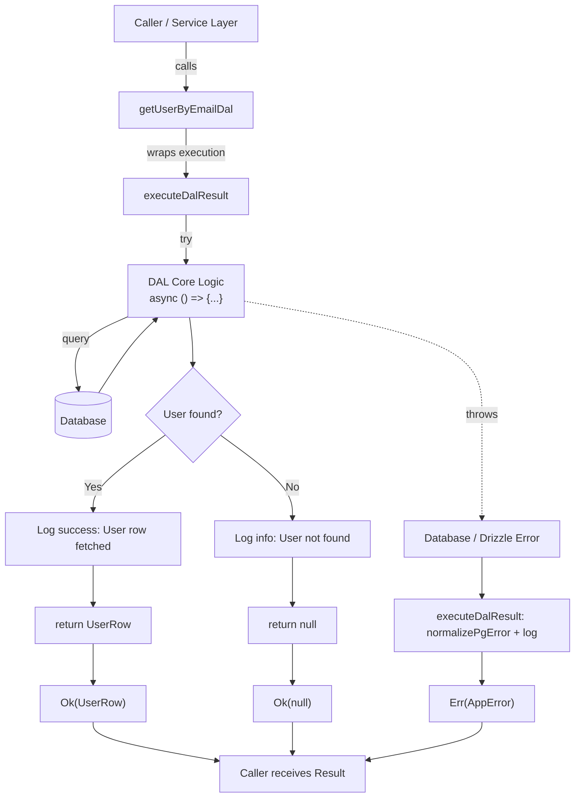

# Auth Login Flowcharts

This document details the logic flow for the user authentication process, organized from the entry point (Action) down to the data access layer (DAL).

## 1. Action Layer: `loginAction`

**Responsibility:** Next.js Server Action boundary. Handles form validation, performance tracking, and mapping results to UI feedback or redirects.

## 2. Workflow Layer: `loginWorkflow`

**Responsibility:** Orchestrates the login "story". It coordinates authentication and session establishment while providing anti-enumeration security by unifying error responses.

## 3. Application Use Cases

### 3.1. `LoginUseCase`

**Responsibility:** Executes core authentication logic by finding the user and verifying their credentials using a hashing service.

### 3.2. `EstablishSessionUseCase`

**Responsibility:** Handles session lifecycle by issuing a new token and persisting it to the session store.

## 4. Infrastructure Layer

### 4.1. Repository: `AuthUserRepository`

**Responsibility:** Provides a clean interface for auth-related data persistence, mapping raw database rows to domain entities.

### 4.2. DAL: `getUserByEmailDal`

**Responsibility:** Executes the raw database query to find a user by their email address.

