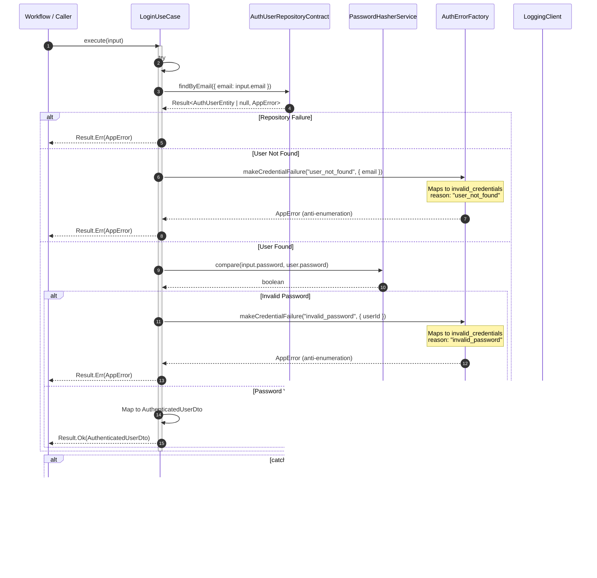

# Auth Login Sequence Diagrams

This document illustrates the interactions between components during the authentication process, organized from the user action down to the database level.

## 1. Action Layer: `loginAction`

**Interaction:** The entry point for the login process. It handles user input validation and initiates the login workflow.

## 2. Workflow Layer: `loginWorkflow`

**Interaction:** Orchestrates authentication and session establishment. Delegates both success and error cases to a shared sub-workflow.

## 3. Application Use Cases

### 3.1. `LoginUseCase`

**Interaction:** Validates user credentials by looking up the user in the repository and verifying the password hash. Implements anti-enumeration by mapping both not_found and invalid_password to a generic error.

### 3.2. `EstablishSessionUseCase` (via `SessionService`)

**Interaction:** Issues a new session token and persists it via the session store.

## 4. Infrastructure Layer

### 4.1. Repository: `AuthUserRepository`

**Interaction:** Bridges the application layer to the database via DAL functions, mapping raw data to domain entities.

### 4.2. DAL: `getUserByEmailDal`

**Interaction:** Low-level database query execution wrapped with error handling and logging.

