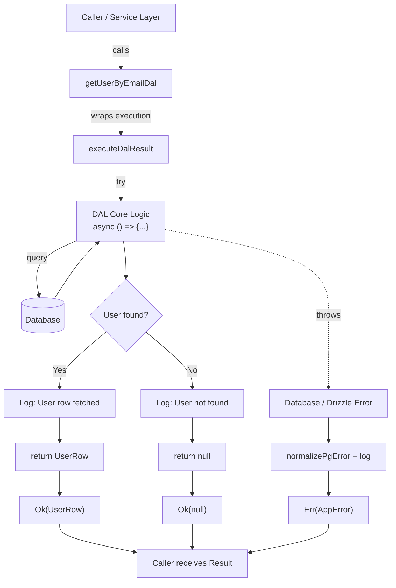

## DAL Function: getUserByEmailDal

### Flowchart

```mermaid
flowchart TD
    %% Caller Layer
    A[Caller / Service Layer] -->|calls| B[getUserByEmailDal]

    %% DAL Function
    B -->|wraps execution| C[executeDalResult]

    %% Execution Wrapper
    C -->|try| D["DAL Core Logic<br/>async () => {...}"]

    %% Database Interaction
    D -->|query| E[(Database)]
    E --> D

    %% Decision: user found?
    D --> F{User found?}

    %% Success path
    F -->|Yes| G[Log: User row fetched]
    G --> H[return UserRow]

    %% Not found path
    F -->|No| I[Log: User not found]
    I --> J[return null]

    %% Successful result
    H --> K["Ok(UserRow)"]
    J --> L["Ok(null)"]

    %% Error path
    D -. throws .-> M[Database / Drizzle Error]
    M --> N[normalizePgError + log]
    N --> O["Err(AppError)"]

    %% Return to caller
    K --> P[Caller receives Result]
    L --> P
    O --> P
```
