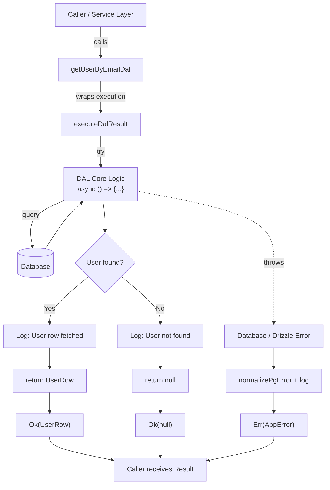
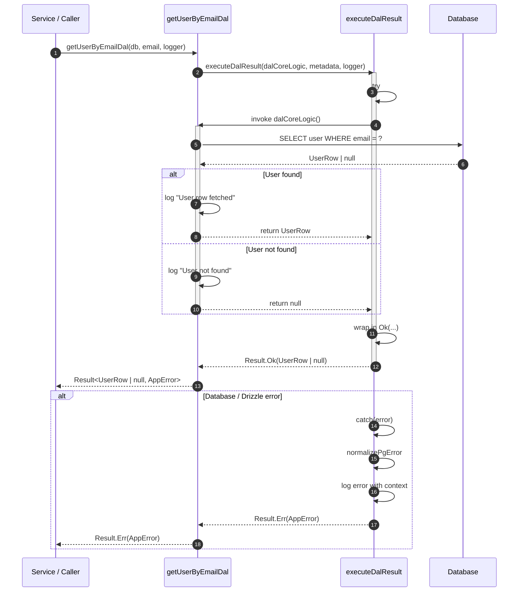
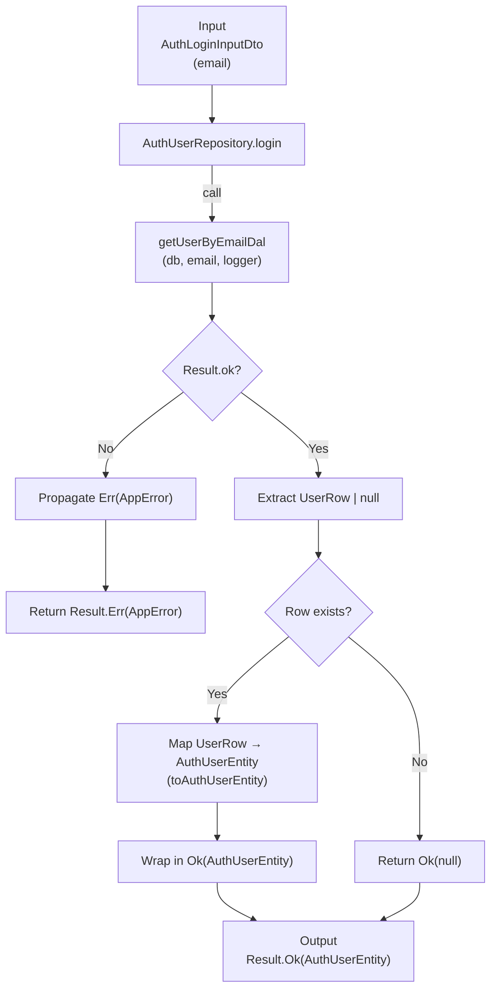
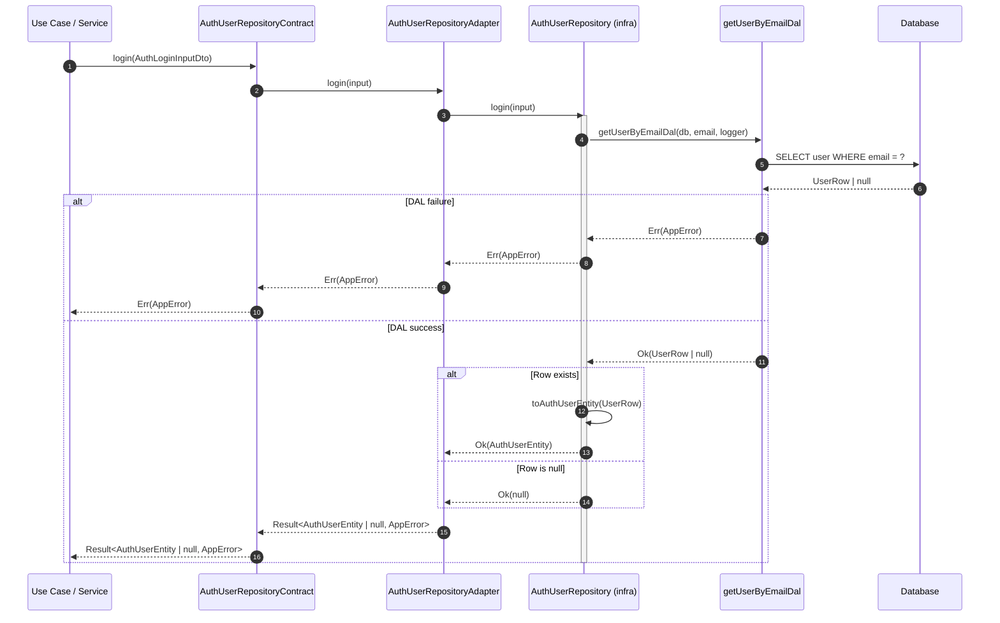

## DAL Function: getUserByEmailDal

### Flowchart

### Sequence Diagram

## Repository Class

### (input: Readonly<AuthLoginInputDto>): Promise<Result<AuthUserEntity | null, AppError>>

### Flowchart

### Sequence Diagram

