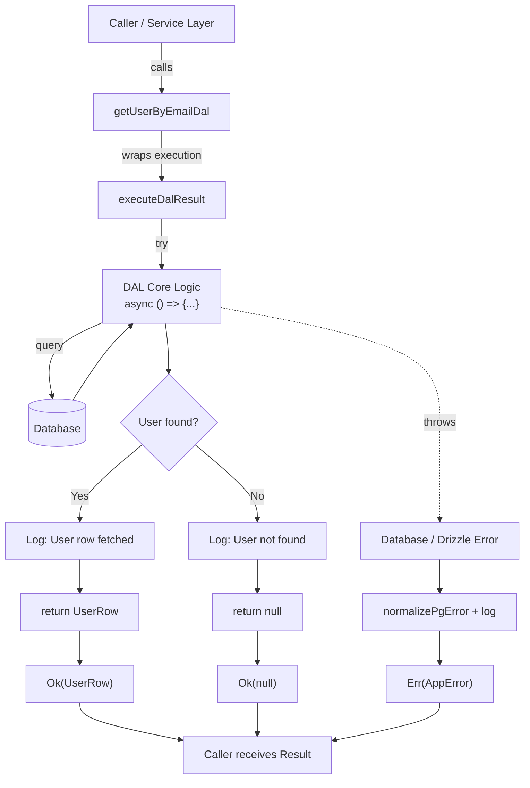
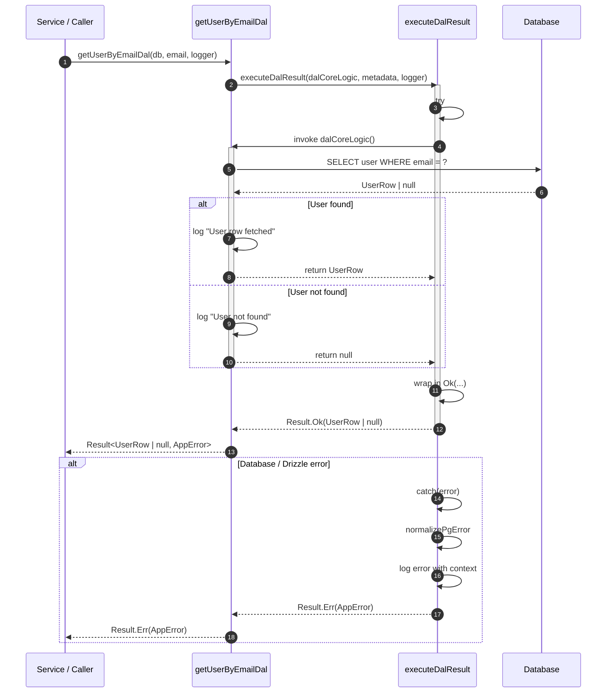
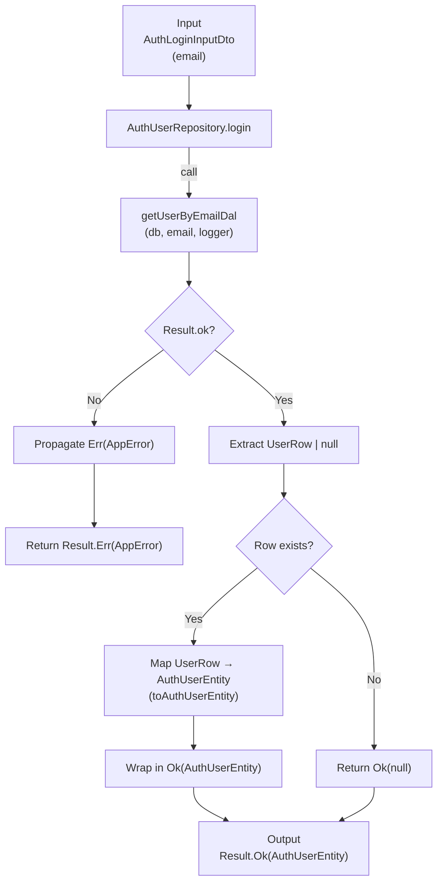
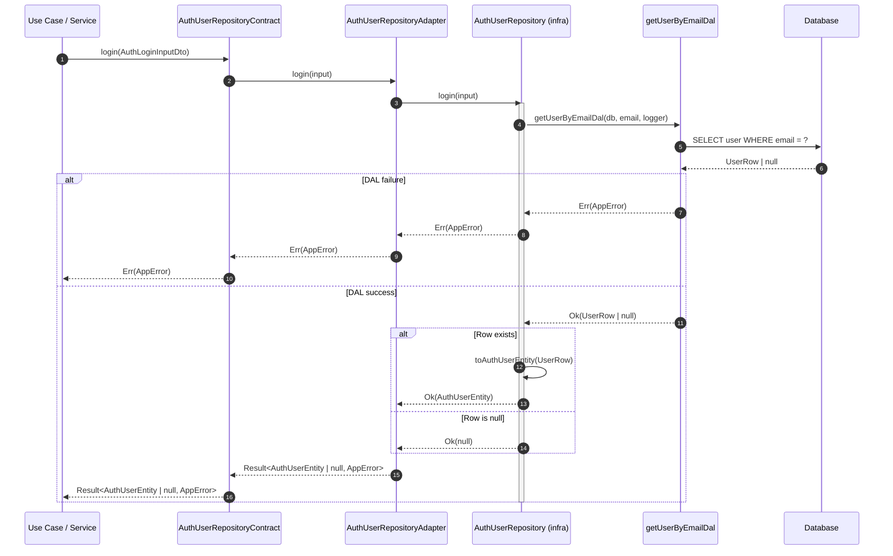
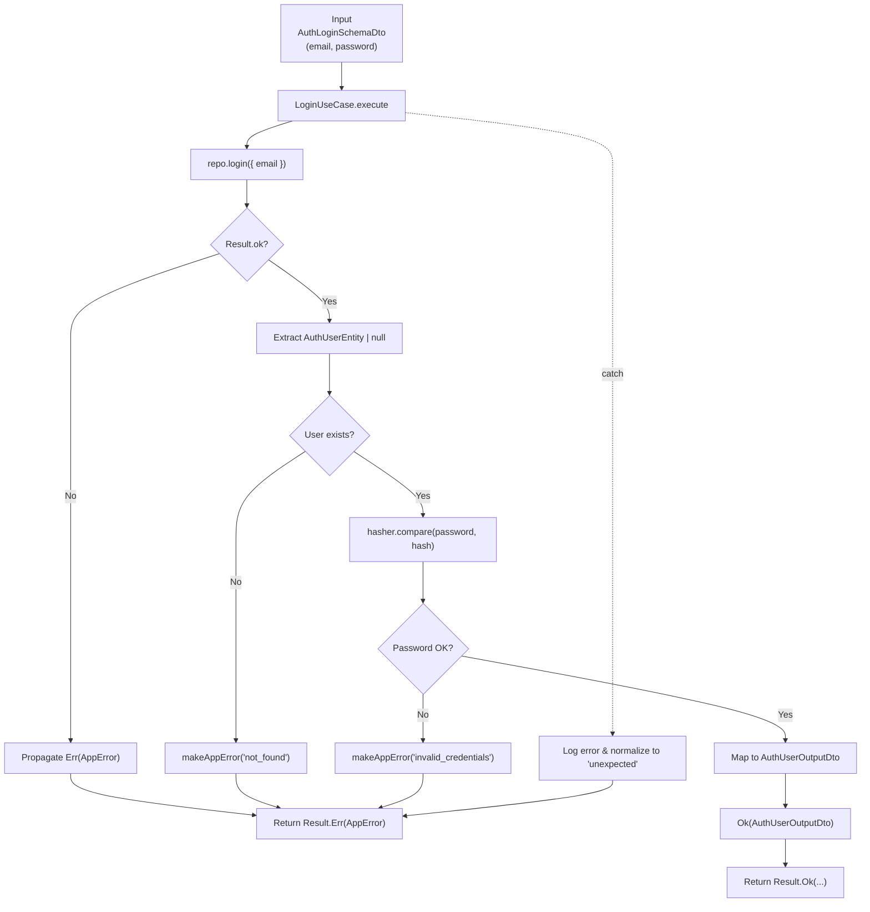
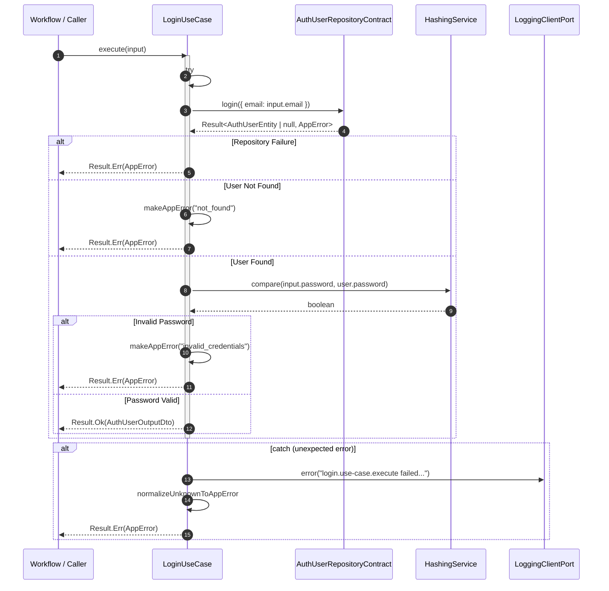

## DAL Function: getUserByEmailDal

### Flowchart

### Sequence Diagram

## Repository Class

### (input: Readonly<AuthLoginInputDto>): Promise<Result<AuthUserEntity | null, AppError>>

### Flowchart

### Sequence Diagram

## Use Case Class: LoginUseCase

### execute(input: Readonly<AuthLoginSchemaDto>): Promise<Result<AuthUserOutputDto, AppError>>

#### Flowchart

#### Sequence Diagram

