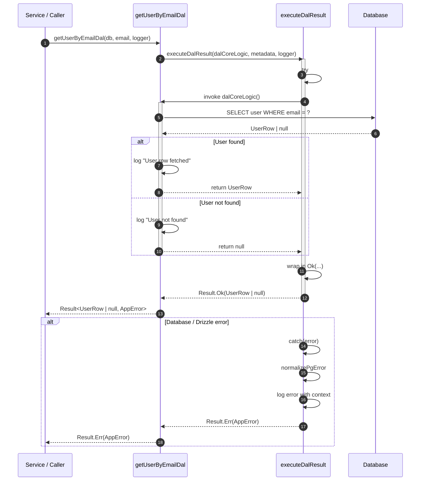

## DAL Function: getUserByEmailDal

### Sequence Diagram

```mermaid
sequenceDiagram
    autonumber

    participant S as Service / Caller
    participant DAL as getUserByEmailDal
    participant WRAP as executeDalResult
    participant DB as Database

    S->>DAL: getUserByEmailDal(db, email, logger)

    DAL->>WRAP: executeDalResult(dalCoreLogic, metadata, logger)

    activate WRAP

    WRAP->>WRAP: try

    WRAP->>DAL: invoke dalCoreLogic()
    activate DAL

    DAL->>DB: SELECT user WHERE email = ?
    DB-->>DAL: UserRow | null

    alt User found
        DAL->>DAL: log "User row fetched"
        DAL-->>WRAP: return UserRow
    else User not found
        DAL->>DAL: log "User not found"
        DAL-->>WRAP: return null
    end

    deactivate DAL

    WRAP->>WRAP: wrap in Ok(...)
    WRAP-->>DAL: Result.Ok(UserRow | null)

    deactivate WRAP

    DAL-->>S: Result<UserRow | null, AppError>

    alt Database / Drizzle error
        WRAP->>WRAP: catch(error)
        WRAP->>WRAP: normalizePgError
        WRAP->>WRAP: log error with context
        WRAP-->>DAL: Result.Err(AppError)
        DAL-->>S: Result.Err(AppError)
    end
```
