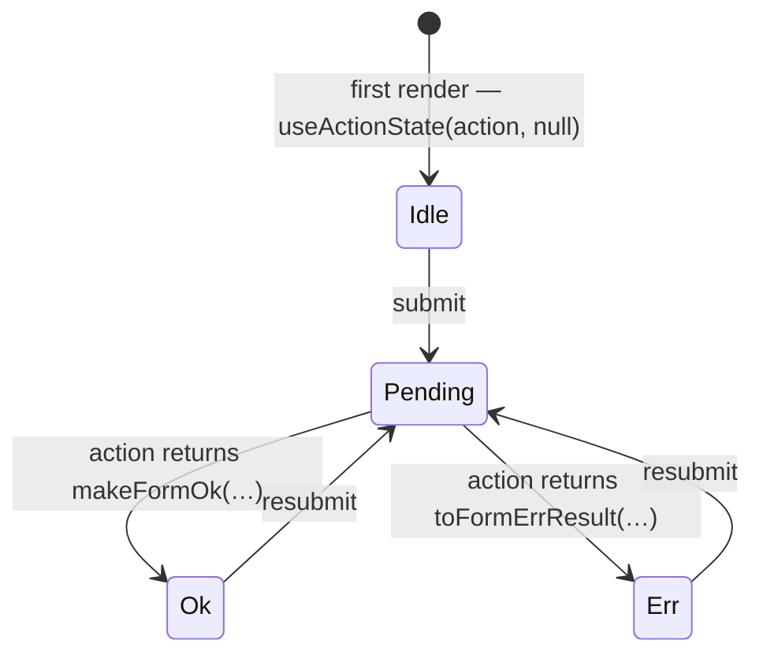

# ADR 001: Model Form State as a Boundary DTO with Null Idle

## Status

Accepted (2026-06-11) — step 3 ("decide") of the forms/error cleanup roadmap:
shrink (PRs #45–47) → lock (PR #48) → **decide** (PR #49) → reshape
(implemented by the `FormState` / null-idle slice; `form-state.factory.ts`,
linked below as context, was deleted by it).

## Context

The Server Action serialization fix (PR #41) left two questions open. They are
answered together here because they define the same thing — the type of the
state that crosses the `useActionState` boundary:

1. Is `FormResult` a variant of core `Result`, or its own type?
2. How does form state represent "no submission yet" (idle)?

### The fork (question 1)

Core `Result` constrains its error side to the rich `AppError` entity
([result.dto.ts](../../../core/result/result.dto.ts)):

```ts
export type Result<TValue, TError extends AppError> =
  | OkResult<TValue>
  | ErrResult<TError>;
```

Form state must survive Next.js serialization (progressive enhancement encodes
it into the rendered form), and class instances don't serialize. PR #41
therefore gave the form error side a plain DTO, and `FormResult` stopped being
an instantiation of `Result`
([form-result.dto.ts](../../core/types/form-result.dto.ts)):

```ts
type FormErrResult = { readonly error: AppErrorJsonDto; readonly ok: false };
export type FormResult<T> = OkResult<FormSuccessPayload<T>> | FormErrResult;
```

Note what is _already shared_: the ok side (`OkResult`) and the `ok: boolean`
discriminant, so narrowing reads the same on both sides of the boundary. Only
the error payload differs — entity in-process, DTO on the wire. The fork was
expedient at the time; nothing on record says whether it is the design or a
wart to be fixed by loosening `Result`'s constraint.

### The idle hack (question 2)

`useActionState(action, initialState)` requires an initial value of the state
type, and `FormResult` has only two members — ok and err. So
[form-state.factory.ts](../../logic/factories/form-state.factory.ts)
fabricates a fake failure: a `validation` `AppError` with
`cause: "INITIAL_STATE"`, an empty message, and an all-empty dense field-error
map.

Costs, all in production code today:

- Every `useActionState` form (7 components across auth, invoices, users)
  boots in `ok: false` — semantically "failed" before the user has done
  anything. Nothing can distinguish idle from a real failure; the
  `cause: "INITIAL_STATE"` sentinel exists but no code checks it.
- Feedback components dodge the fake error by accident. `AuthFormFeedback`
  guards `message === undefined`, which is dead code per the types
  (`message: string`); at idle the error alert renders and is only invisible
  because the message is `""` and `FormAlertMolecule` independently refuses
  to render empty messages. Two coincidental layers stand in for one honest
  state.
- `ServerMessageMolecule` carries "defensive programming" fallbacks for
  unexpected shapes — anxiety born of a state type that can't be trusted to
  mean what it says.
- [edit-invoice-form.tsx](../../../../modules/invoices/presentation/forms/edit-invoice-form.tsx)
  constructs a _second_ initial state purely to extract an empty dense error
  map from inside its fake error (`emptyErrors`), then falls back through
  three nullish coalescings.

## Decision

### 1. `FormResult` is a boundary DTO — core `Result` keeps its constraint

We will keep `Result<TValue, TError extends AppError>` as is: the
**in-process composition type**, whose constraint enforces that internal error
channels carry registry-validated `AppError` entities (cause chains, metadata
schemas, `.toDto()`). The ~90 internal `Err(AppError)` sites keep that
guarantee.

We will treat `FormResult` formally as a **boundary DTO union** — the
wire/state shape for the `useActionState` boundary — not a `Result` variant
and not a wart. It deliberately shares `OkResult` and the `ok` discriminant so
narrowing reads identically everywhere; its error side is deliberately
`AppErrorJsonDto`.

Rule of thumb: **entities in-process, DTOs at the edge** — the same verdict as
PR #41's analysis. Do not migrate internal layers to DTOs, and do not loosen
core `Result` to make the boundary type "fit".

### 2. Idle is `null` — `FormState<T> = FormResult<T> | null`

```ts
// form-result.dto.ts (alias added beside FormResult)
export type FormState<T> = FormResult<T> | null;
```

```ts
// components
const [state, action, pending] = useActionState<FormState<P>, FormData>(
  serverAction,
  null,
);
```

The boundary becomes honestly tri-state — `null | ok | err` — using the value
React's own documentation uses for "nothing yet". The fake-error factory
(`makeInitialFormState`, `makeInitialFormStateFromSchema`) is deleted.



A property worth naming: **actions cannot produce idle.** `FormAction` takes
`FormState<T>` as `prevState` but still returns `Promise<FormResult<T>>` —
the type system guarantees idle only ever comes from the initial render,
never from a submission.

The two layers, side by side:

|               | In-process                                  | `useActionState` boundary                        |
| ------------- | ------------------------------------------- | ------------------------------------------------ |
| Type          | `Result<T, AppError>`                       | `FormState<T> = FormResult<T> \| null`           |
| Error payload | `AppError` entity                           | `AppErrorJsonDto` plain object                   |
| Idle          | n/a — results exist only after an operation | `null`                                           |
| Built by      | `Ok` / `Err` factories                      | `makeFormOk` / `toFormErrResult`, `null` initial |

## Options Considered

### Question 1 — FormResult vs Result

- **A. Loosen `Result`'s generic** (`TError` unconstrained, or defaulted to
  `AppError`), making `FormResult<T> = Result<FormSuccessPayload<T>,
  AppErrorJsonDto>`. Rejected: the constraint is load-bearing documentation —
  "a `Result` means the error side is a real `AppError`" — and loosening it
  trades that global invariant for deleting ~6 local lines. The reuse would be
  nominal anyway: every helper (`Err`, `unwrapOrNull`) is entity-typed, so
  nothing but the type's _name_ gets shared.
- **B. Keep the fork, canonize it as a boundary DTO.** **Chosen** — see
  Decision.

### Question 2 — modeling idle

- **A. Status quo** (fabricated `INITIAL_STATE` error). Rejected for the
  costs listed in Context: forms boot "failed", feedback works by
  coincidence, idle is indistinguishable from failure.
- **B. Tagged idle member** — `{ status: "idle" } | FormResult<T>`, or a full
  `status: "idle" | "ok" | "err"` re-discrimination. Honest, but it
  introduces a second discriminant style beside `ok` (or rewrites the whole
  union, its guards, every consumer, and the 68 freshly-pinned
  characterization tests). It also lets actions _return_ idle, which is a
  state the server can never truthfully be in. More code in a module the
  roadmap is shrinking.
- **C. `null` idle.** **Chosen** — React-idiomatic, trivially serializable,
  deletes code instead of adding it, and makes idle unrepresentable as an
  action result.

## Consequences

### Positive

- Idle becomes an honest, distinguishable state; feedback components branch on
  `state === null` instead of relying on empty-string coincidences.
- Net code deletion: the fake-error factory and the `emptyErrors` harvesting
  disappear; no new guards or discriminants are introduced.
- The `Result`-vs-`FormResult` relationship is documented design, not an
  unexplained fork; core `Result`'s constraint (and the discipline it
  enforces) survives untouched.
- Progressive-enhancement serialization stays trivially safe (`null` is JSON).

### Negative

- `null` is less self-describing than a tagged `idle` member — mitigated by
  the `FormState` alias and its JSDoc.
- `prevState` parameters in actions must widen from `FormResult` to
  `FormState` (mechanical, compiler-guided under `strictFunctionTypes`).
- Consumers must remember the initial render is `null` — nullish-access
  mistakes (`state.ok` without a guard) are caught by the compiler, but the
  extra narrowing step is real.

### Follow-up work unlocked (the step-4 "reshape" slice)

Behind the PR #48 characterization tests:

1. Add `FormState<T>` to `form-result.dto.ts`; update `FormAction`'s
   `prevState` to `FormState<Tresult>`.
2. Replace `makeInitialFormState*` with `null` in the 7 form components;
   simplify their branching (`state === null` / `state?.ok`). Components that
   want a dense empty error map call `makeEmptyDenseFieldErrorMap` directly
   instead of harvesting one from a fake error.
3. Teach the shared feedback components (`AuthFormFeedback`,
   `ServerMessageMolecule`, `use-form-message`) to early-return on `null`
   instead of relying on empty-string messages.
4. Widen `_prevState` in the server actions' signatures.
5. Delete `form-state.factory.ts` **and its unit tests** — a deliberate
   pinned-behavior edit under the lock-step protocol, not silent drift.
6. Update `docs/standards/error-handling-and-result-pattern.md` with the
   boundary rule (entities in-process / DTOs at the edge / `null` idle) **in
   the same PR as the code**, so the standard never describes a state the
   code isn't in.
7. Fix [notes/README.md](../README.md) drift: it still calls `FormResult`
   "a standard `Result` type" and lists `presentation/components` and
   `presentation/hooks` that no longer exist.

## Out of Scope

Decided elsewhere, deliberately not here: the sensitive-field echo allowlist,
the form-error payload-mapper consolidation (since resolved — `toFormErrorPayload`
is now the single mapper), and validation-funnel unification. Each was tracked as
its own BACKLOG item under "Forms/error boundary cleanup".
