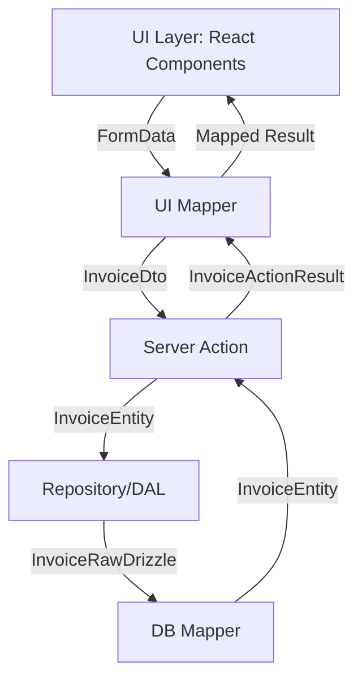
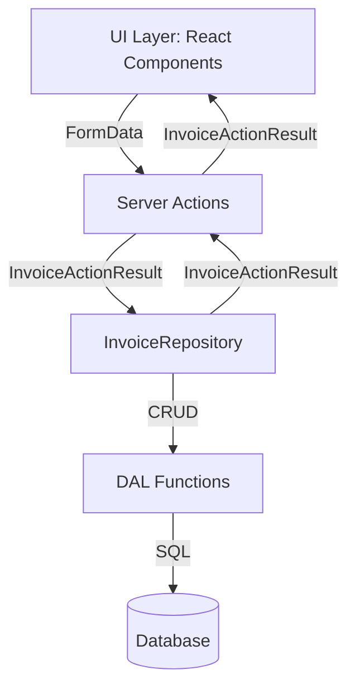

# Invoice Feature Architecture & Implementation Guide

This document provides a comprehensive, unified strategy for building, maintaining, and scaling the invoice feature in a high-traffic Next.js application. It covers layered architecture, type safety, error handling, repository pattern, uniform result types, and best practices for accessibility, security, and testing.

---

## Table of Contents

- Overview
- Layered Architecture & Responsibilities
- Data Flow & Type Safety
- Repository Pattern
- Uniform Result Types
- Error Handling & Logging
- Security & Validation
- Performance & Scalability
- Accessibility & Internationalization
- Testing & Documentation
- Visual Diagrams
- File Reference

---

## Overview

The invoice feature is designed using a strict layered architecture to ensure separation of concerns, maintainability, and scalability. Each layer is responsible for specific tasks, with clear data contracts and strict TypeScript typing enforced throughout.

---

## Layered Architecture & Responsibilities

| Layer          | Responsibility                                                                                               | Example Technologies/Patterns               |
| -------------- | ------------------------------------------------------------------------------------------------------------ | ------------------------------------------- |
| Presentation   | Renders UI, handles user input, accessibility, localization, triggers actions, displays feedback/errors.     | React, Next.js Pages/Components, i18n, ARIA |
| Controller     | Receives UI events, orchestrates business logic, manages session/auth, error boundaries, request validation. | API Routes, Server Actions, Middleware      |
| Service        | Implements business/domain logic, validation, transformation, aggregates data, enforces business rules.      | Service Classes, Domain Services, Zod       |
| Repository     | Abstracts data access, enforces domain rules, coordinates with DAL, caches, manages transactions.            | Repository Pattern, DataLoader, Redis       |
| DAL            | Direct database/cache access, error logging, low-level data operations, connection pooling.                  | Prisma, TypeORM, Knex, Redis, MongoDB       |
| Mapper         | Maps raw data to domain entities and vice versa, ensures type safety, transforms between DTOs and entities.  | Mapper Functions, DTO Classes               |
| Database/Cache | Stores and retrieves raw data, no business logic, supports scaling, backup, and disaster recovery.           | PostgreSQL, MySQL, MongoDB, Redis, CDN      |

---

## Data Flow & Type Safety

- **Strict TypeScript:** All data structures use explicit interfaces/types.
- **DTOs:** Data Transfer Objects for communication between layers.
- **Branded Types:** For domain safety (e.g., `UserIdBrand`, `InvoiceIdBrand`).
- **Immutability:** Use `readonly` and immutable types where possible.
- **Type Guards:** Narrow types and validate at boundaries.

### Example Data Flow

1. **User submits form** → `UiInvoiceInput`
2. **UI Mapper transforms input** → `InvoiceDto`
3. **Server Action validates/transforms** → `InvoiceEntity`
4. **Repository persists/fetches** → `InvoiceRawDrizzle`
5. **DB Mapper transforms raw data** → `InvoiceEntity`
6. **Server Action returns** → `InvoiceActionResult`
7. **UI Mapper maps result** → UI state

---

## Repository Pattern

The repository pattern abstracts and centralizes all data access logic for the Invoice domain, providing a clean, type-safe API for CRUD operations.

### Generic Repository Interface

```typescript
/**
 * Generic repository interface for CRUD operations.
 * @template TEntity - Entity type.
 * @template TCreate - DTO for creation.
 * @template TUpdate - DTO for update.
 * @template TId - Entity ID type.
 */
export interface IRepository<TEntity, TCreate, TUpdate, TId> {
  create(data: TCreate): Promise<TEntity | null>;
  read(id: TId): Promise<TEntity | null>;
  update(id: TId, data: TUpdate): Promise<TEntity | null>;
  delete(id: TId): Promise<TEntity | null>;
  list(query?: string, page?: number): Promise<TEntity[]>;
}
```

### Invoice Repository Implementation

```typescript
/**
 * Invoice repository implementing generic CRUD operations.
 */
export class InvoiceRepository
  implements
    IRepository<
      InvoiceDto,
      Omit<InvoiceEntity, "id" | "sensitiveData">,
      { amount: number; status: string; customerId: CustomerId },
      InvoiceId
    >
{
  constructor(private readonly db: Database) {}

  async create(
    data: Omit<InvoiceEntity, "id" | "sensitiveData">,
  ): Promise<InvoiceDto | null> {
    return createInvoiceDal(this.db, data);
  }

  async read(id: InvoiceId): Promise<InvoiceDto | null> {
    return readInvoiceDal(this.db, id);
  }

  async update(
    id: InvoiceId,
    data: { amount: number; status: string; customerId: CustomerId },
  ): Promise<InvoiceDto | null> {
    return updateInvoiceDal(this.db, id, data);
  }

  async delete(id: InvoiceId): Promise<InvoiceDto | null> {
    return deleteInvoiceDal(this.db, id);
  }

  async list(query: string = "", page: number = 1): Promise<InvoiceDto[]> {
    return fetchFilteredInvoices(this.db, query, page);
  }
}
```

---

## Uniform Result Types

All invoice CRUD actions return a single, strictly typed result shape (`InvoiceActionResult`) for consistency and maintainability.

```typescript
/**
 * Uniform result shape for all invoice actions.
 */
export interface InvoiceActionResult {
  readonly data?: InvoiceDto | null;
  readonly errors?: InvoiceErrorMap;
  readonly message?: string;
  readonly success: boolean;
}
```

- **UI, server actions, and repository** all use this result type for predictable integration and error handling.

---

## Error Handling & Logging

- **Global Error Boundaries:** Use React `ErrorBoundary` for UI errors.
- **Structured Logging:** Log errors in JSON with context (user, request, stack).
- **Field-Level Validation:** Return error maps for invalid fields.
- **Never Leak Sensitive Data:** Only show generic error messages to users.
- **Centralized Error Handling:** Use middleware for API/server errors.

### Example Logger

```typescript
import { Logger } from "tslog";

/**
 * Application-wide structured logger.
 */
export const appLogger = new Logger({
  name: "nextjs-app",
  type: "json",
  minLevel: "info",
});
```

---

## Security & Validation

- **Input Validation:** Use Zod schemas for all user input.
- **Sanitization:** Clean all data before processing.
- **Authentication/Authorization:** Use JWT, OAuth, or NextAuth.
- **Environment Variables:** Store secrets securely, never commit.
- **OWASP Compliance:** Prevent XSS, CSRF, SQL Injection, etc.
- **Branded Types:** Prevent misuse of sensitive IDs.

### Example Validation

```typescript
import { z } from "zod";

/**
 * Zod schema for invoice input validation.
 */
export const invoiceInputSchema = z.object({
  amount: z.number().positive(),
  description: z.string().min(1).max(255),
  dueDate: z.string().refine((date) => !isNaN(Date.parse(date)), {
    message: "Invalid date format",
  }),
});
```

---

## Performance & Scalability

- **Caching:** Use Redis for hot data, CDN for static assets.
- **Connection Pooling:** For DB and cache.
- **SSR/ISR/SSG:** Use Next.js features for optimal rendering.
- **Bundle Optimization:** Analyze and reduce bundle size.
- **Monitoring:** Use APM tools (Datadog, New Relic).
- **Horizontal Scaling:** Use containers, load balancers.

### Example Caching

```typescript
import Redis from "ioredis";

const redisClient = new Redis(process.env.REDIS_URL);

/**
 * Get cached invoice by ID.
 */
export async function getInvoiceCache(id: string): Promise<InvoiceDto | null> {
  const cached = await redisClient.get(`invoice:${id}`);
  return cached ? JSON.parse(cached) : null;
}
```

---

## Accessibility & Internationalization

- **WCAG 2.1 AA:** All UI meets accessibility standards.
- **Semantic HTML:** Use correct tags, ARIA attributes.
- **Localization:** Use i18n libraries (next-i18next).
- **Keyboard Navigation:** Ensure all actions are accessible.

### Example Accessible Button

```tsx
import React from "react";

/**
 * Accessible button component.
 */
export const AccessibleButton: React.FC<
  React.ButtonHTMLAttributes<HTMLButtonElement>
> = ({ children, ...props }) => (
  <button {...props} aria-label={props["aria-label"] || "Action"}>
    {children}
  </button>
);
```

---

## Testing & Documentation

- **E2E Testing:** Use Cypress for flows and accessibility.
- **Unit Testing:** Mock repositories/DAL, test services/controllers.
- **TSDoc:** Document all types, functions, and components.
- **README:** Keep usage and architecture guides up to date.

---

## Visual Diagrams

### Layered Architecture Flow



### Uniform Result Type Flow



---

## File Reference

- `src/ui/invoices/create-invoice-form.tsx`: UI form component.
- `src/features/invoices/invoice.actions.ts`: Server actions for CRUD.
- `src/features/invoices/invoice.utils.ts`: Validation and transformation utilities.
- `src/features/invoices/invoice.dal.ts`: Data access layer.
- `src/features/invoices/invoice.repository.ts`: Repository implementation.
- `src/features/invoices/invoice.mapper.ts`: Mapper functions for DTO/entity/raw.
- `src/features/invoices/invoice.types.ts`: Types, interfaces, and schemas.
- `src/features/invoices/invoice.branding.ts`: Branded types for domain safety.
- `src/lib/forms/form-validation.ts`: Form validation utilities.

---

## Summary

- **Type Safety:** Enforced at every layer using TypeScript and branded types.
- **Error Handling:** Consistent error maps and messages for UI feedback.
- **Validation:** Zod schemas and domain logic ensure data integrity.
- **Separation of Concerns:** UI, server, and database logic are clearly separated.
- **Documentation:** All files and types are documented with TSDoc.
- **Scalability & Security:** Architecture supports high-traffic, secure, and maintainable growth.

---

**For further details, see the TSDoc comments in each referenced file.**
